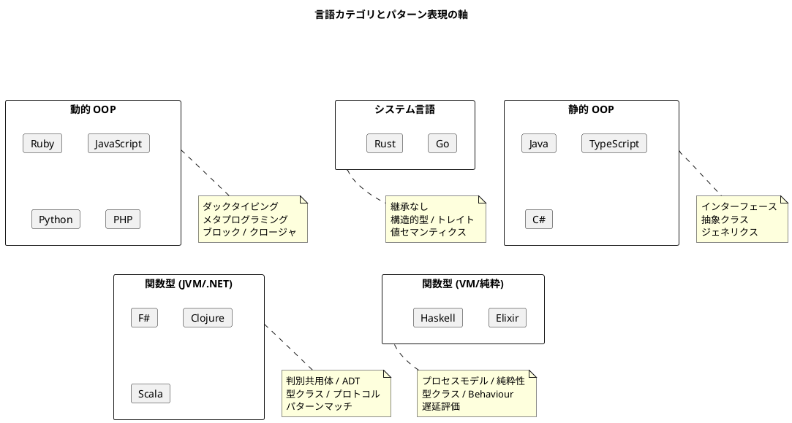
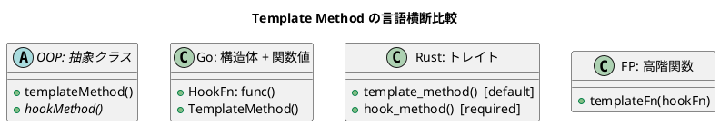
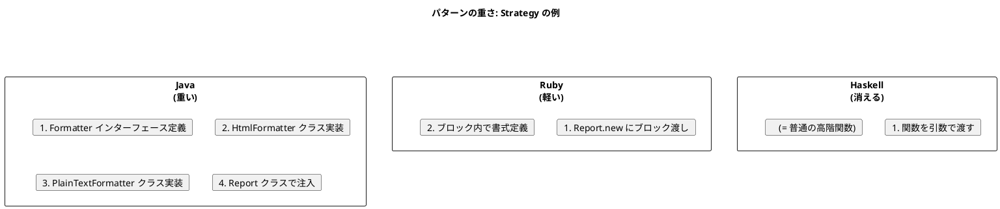

# 第 1 章: パターン思考の言語横断比較

## はじめに

デザインパターンとは「繰り返し現れる設計上の問題に対する、検証済みの解決策」です。GoF が 1994 年に整理した 23 のパターンは、C++ と Smalltalk を念頭に置いて記述されました。しかし、パターンが解こうとしている問題 --- 変更コストの削減、責務の分離、拡張性の確保 --- は言語に依存しません。

変わるのは「解決策の表現方法」です。

本章では、13 のデザインパターンが 14 言語 / 5 カテゴリでどのように表現されるかを俯瞰し、パターンの本質と言語固有の表現を切り分けて理解するための地図を提供します。

---

## 言語カテゴリと設計思想

### 型システムとパターン表現の関係

パターンの表現方法を最も強く規定するのは、言語の型システムです。

**動的型付け** の言語では、インターフェースを明示的に宣言する必要がありません。ダックタイピングにより「同じメソッドを持っていれば同じ型として扱える」ため、パターンの実装はしばしば軽量になります。Ruby のブロックや Python のデコレータのように、言語機能がパターンを直接吸収するケースも多くあります。

**静的型付け OOP** の言語では、GoF 本の記述がほぼそのまま適用できます。インターフェースと抽象クラスによる明示的な契約が、パターンの構造を型レベルで保証します。

**継承なしの静的型付け**（Go / Rust）では、パターンの表現に工夫が必要です。Go は暗黙的インターフェースと構造体埋め込みで、Rust はトレイトと enum で、それぞれ独自のイディオムを発展させています。

**関数型** の言語では、多くの GoF パターンが「不要」になります。高階関数、代数的データ型、パターンマッチといった言語機能が、パターンが解こうとした問題を直接解決するためです。

---

## 13 パターン × 5 カテゴリ: 実現手段の全体マップ

### 第 2 部: 振る舞いの取り扱い

#### Template Method

**解く問題**: アルゴリズムの骨組みを共有し、可変部分だけを差し替える

| カテゴリ | 実現手段 | 代表例 |
|---------|---------|--------|
| 動的 OOP | 継承 + フックメソッド / ブロック渡し | Ruby: 基底クラスの `output_report` をサブクラスでオーバーライド |
| 静的 OOP | 抽象クラス + abstract メソッド | Java: `abstract class Report` と `HtmlReport extends Report` |
| システム言語 | 構造体埋め込み + 関数フィールド (Go) / トレイトのデフォルト実装 (Rust) | Go: `Report` 構造体にフォーマッタ関数を注入 |
| 関数型 | 高階関数 / Record of functions | F#: `reportFormat` レコードに関数を格納 |

#### Strategy

**解く問題**: アルゴリズム自体を実行時に切り替える

| カテゴリ | 実現手段 | 代表例 |
|---------|---------|--------|
| 動的 OOP | Proc / Block / lambda / Callable | Ruby: `Report.new { ... }` でブロックを渡す |
| 静的 OOP | Interface / abstract class | Java: `Formatter` インターフェースを実装 |
| システム言語 | インターフェース (Go) / Fn トレイト (Rust) | Rust: `Box<dyn Fn(&Report) -> String>` |
| 関数型 | 高階関数（関数そのものが Strategy） | Haskell: `type Formatter = String -> String` |

#### Observer

**解く問題**: 状態変化を関心のあるオブジェクト群に通知する

| カテゴリ | 実現手段 | 代表例 |
|---------|---------|--------|
| 動的 OOP | Listener リスト / Observable モジュール | Ruby: `Observable` mixin + `notify_observers` |
| 静的 OOP | Listener インターフェース / event (C#) | C#: `event EventHandler<T>` |
| システム言語 | コールバック関数のスライス (Go) / Vec\<Box\<dyn Fn\>\> (Rust) | Go: `[]func(event)` スライス |
| 関数型 | コールバックリスト / GenServer (Elixir) / IORef (Haskell) | Elixir: `GenServer` で状態管理と通知 |

#### Composite

**解く問題**: 部分と全体を同じインターフェースで扱う

| カテゴリ | 実現手段 | 代表例 |
|---------|---------|--------|
| 動的 OOP | 共通メソッド + 子リスト | Ruby: `Task` と `CompositeTask` が `get_time_required` を共有 |
| 静的 OOP | Component インターフェース + 再帰構造 | Java: `interface Task` を `LeafTask` と `CompositeTask` が実装 |
| システム言語 | インターフェース + スライス (Go) / enum (Rust) | Rust: `enum Task { Leaf(...), Composite(Vec<Task>) }` |
| 関数型 | ADT（再帰的データ型） | Scala: `enum Task { case Leaf(...); case Composite(tasks: List[Task]) }` |

#### Iterator

**解く問題**: コレクションの内部構造を隠して順次走査する

| カテゴリ | 実現手段 | 代表例 |
|---------|---------|--------|
| 動的 OOP | 言語組み込み (`each`, `for...of`, `__iter__`) | Python: `__iter__` / `__next__` プロトコル |
| 静的 OOP | `Iterator<T>` / `IEnumerable<T>` | C#: `yield return` による遅延列挙 |
| システム言語 | `for range` (Go) / `Iterator` トレイト (Rust) | Rust: `impl Iterator for Portfolio` |
| 関数型 | 遅延シーケンス / Stream | Clojure: `(lazy-seq ...)` |

### 第 3 部: 操作と関係の表現

#### Command

**解く問題**: 操作をオブジェクトとして扱い、取り消し・キュー化・記録を可能にする

| カテゴリ | 実現手段 | 代表例 |
|---------|---------|--------|
| 動的 OOP | Command クラス + execute/undo | Ruby: `CreateFile` / `DeleteFile` クラス |
| 静的 OOP | Command インターフェース | Java: `interface Command { void execute(); void undo(); }` |
| システム言語 | インターフェース (Go) / トレイト (Rust) | Go: `type Command interface { Execute(); Undo() }` |
| 関数型 | 関数 + クロージャ（関数自体がコマンド） | Haskell: `type Command = IO ()` |

#### Adapter

**解く問題**: 互換性のないインターフェースを橋渡しする

| カテゴリ | 実現手段 | 代表例 |
|---------|---------|--------|
| 動的 OOP | ラッパークラス / 特異メソッド | Ruby: `BritishTextObjectAdapter` / `modify_instance` |
| 静的 OOP | Adapter クラス / 拡張メソッド (C#) | TypeScript: `class Adapter implements Target` |
| システム言語 | ラッパー構造体 (Go) / newtype + トレイト実装 (Rust) | Go: `type Adapter struct { adaptee *Adaptee }` |
| 関数型 | 型クラスインスタンス / プロトコル拡張 | Haskell: `instance Renderable for BritishTextObject` |

#### Proxy

**解く問題**: 実オブジェクトの前面に立ち、アクセス制御・遅延生成を行う

| カテゴリ | 実現手段 | 代表例 |
|---------|---------|--------|
| 動的 OOP | ラッパー + method_missing / __getattr__ | Ruby: `method_missing` で透過的委譲 |
| 静的 OOP | 同一インターフェースのラッパー | Java: `class ProtectionProxy implements BankAccount` |
| システム言語 | ラッパー構造体 (Go) / Lazy\<T\> + OnceLock (Rust) | Rust: `std::sync::OnceLock<T>` |
| 関数型 | 遅延評価 / delay-force | Clojure: `(delay ...)` / `(force ...)` |

#### Decorator

**解く問題**: 既存オブジェクトに段階的に責務を追加する

| カテゴリ | 実現手段 | 代表例 |
|---------|---------|--------|
| 動的 OOP | ラッパークラス / Module mixin | Ruby: `extend NumberingWriter` で実行時に追加 |
| 静的 OOP | 同一インターフェースのラッパーチェーン | Java: `new NumberingWriter(new TimestampingWriter(writer))` |
| システム言語 | 構造体埋め込み (Go) / トレイト実装の合成 (Rust) | Go: 構造体に `Writer` を埋め込み |
| 関数型 | 関数合成 | Haskell: `numbering . timestamping $ baseWriter` |

### 第 4 部: オブジェクトの作成と解釈

#### Singleton

**解く問題**: 唯一のインスタンスを保証する

| カテゴリ | 実現手段 | 代表例 |
|---------|---------|--------|
| 動的 OOP | 言語のモジュール / クラス変数 | Ruby: `Singleton` モジュール include |
| 静的 OOP | private コンストラクタ + static フィールド / enum | Java: `enum Singleton { INSTANCE }` |
| システム言語 | sync.Once (Go) / OnceLock (Rust) | Go: `sync.Once` で初期化を 1 回に制限 |
| 関数型 | モジュールレベルの束縛 | F#: `module Logger` / Clojure: namespace レベルの atom |

#### Factory

**解く問題**: 「どのクラスを生成するか」の決定を分離する

| カテゴリ | 実現手段 | 代表例 |
|---------|---------|--------|
| 動的 OOP | Factory クラス / クラスオブジェクトの受け渡し | Ruby: `Habitat.new(frog_class, pond_class)` |
| 静的 OOP | Factory Method / Abstract Factory | Java: `interface OrganismFactory` + 具象ファクトリ |
| システム言語 | ファクトリ関数 (Go) / トレイトオブジェクト (Rust) | Go: `func NewPond(factory Factory) *Pond` |
| 関数型 | スマートコンストラクタ + ADT | Scala: `companion object` の `apply` メソッド |

#### Builder

**解く問題**: 複雑なオブジェクトを段階的・宣言的に組み立てる

| カテゴリ | 実現手段 | 代表例 |
|---------|---------|--------|
| 動的 OOP | Builder クラス / method_missing DSL | Ruby: `ComputerBuilder` + `method_missing` による DSL |
| 静的 OOP | Builder クラス + メソッドチェーン | Java: `Computer.builder().cpu("i7").memory(16).build()` |
| システム言語 | ビルダー構造体 (Go) / ビルダーパターン (Rust) | Rust: `ComputerBuilder::new().cpu("i7").build()` |
| 関数型 | パイプライン / Computation Expression | F#: CE / Elixir: パイプ演算子 `\|>` |

#### Interpreter

**解く問題**: 文法を AST として表現し、評価する

| カテゴリ | 実現手段 | 代表例 |
|---------|---------|--------|
| 動的 OOP | 式クラス階層 + evaluate メソッド | Ruby: `And`, `Or`, `Not` クラスの再帰評価 |
| 静的 OOP | 抽象構文木のクラス階層 | Java: `interface Expression { boolean evaluate(String) }` |
| システム言語 | インターフェース (Go) / enum + パターンマッチ (Rust) | Rust: `enum Expr { And(Box<Expr>, Box<Expr>), ... }` |
| 関数型 | ADT + パターンマッチ（最も自然な表現） | Haskell: `data Expr = And Expr Expr \| Or Expr Expr \| Not Expr` |

---

## パターンの「重さ」が変わる

同じパターンでも、言語によって実装の「重さ」が大きく異なります。

この「重さの差」は、パターンの価値を否定するものではありません。重要なのは以下の認識です:

- **パターンが解く問題は共通**: アルゴリズムの差し替え可能性を確保したい
- **解決策の表現が異なる**: 言語機能の豊かさに応じて、明示的な構造から暗黙的な言語機能へと吸収される
- **パターンを知っていることに価値がある**: どの言語を使っていても、「ここは Strategy だ」と認識できることが設計判断を助ける

---

## まとめ

パターン思考とは、特定の言語でのクラス図を暗記することではありません。「繰り返し現れる設計上の問題」を認識し、その言語で最も自然な解決策を選択する能力です。

- 動的 OOP では、パターンは軽量化される（ブロック、クロージャ、メタプログラミング）
- 静的 OOP では、パターンは型システムで保証される（インターフェース、ジェネリクス）
- システム言語では、パターンは継承なしで再構成される（構造体埋め込み、トレイト）
- 関数型では、パターンは言語機能に吸収される（高階関数、ADT、型クラス）

次章では、この「吸収」が最も顕著に現れる OOP パターン vs 関数型代替の対応関係を詳しく見ていきます。

---

## 参照

- [多言語統合解説トップ](index.md)
- [OOP パターンと関数型代替の対応表](02-oop-vs-fp.md)
- 『Design Patterns in Ruby』 - Russ Olsen
- 『Design Patterns: Elements of Reusable Object-Oriented Software』 - GoF
