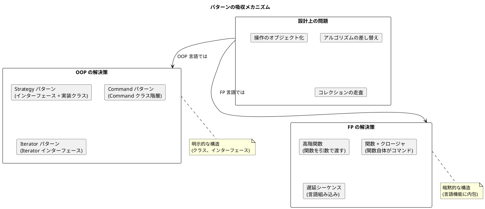
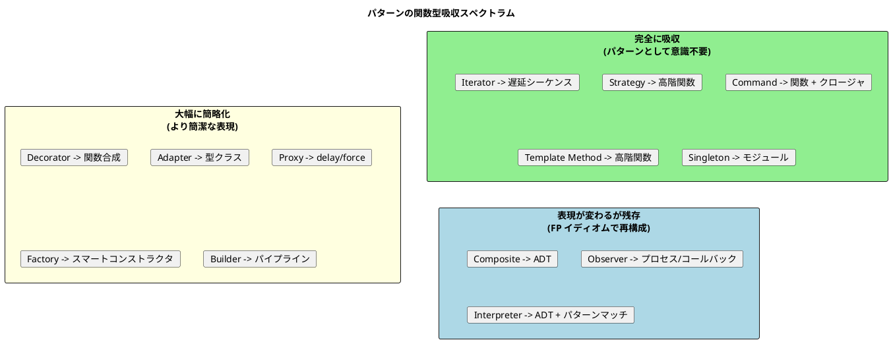

# 第 2 章: OOP パターンと関数型代替の対応表

## はじめに

GoF のデザインパターンは、オブジェクト指向プログラミングの文脈で生まれました。しかし関数型言語でこれらのパターンを実装しようとすると、多くのパターンが「消える」ことに気づきます。

これは関数型言語が優れているという意味ではありません。GoF パターンが解こうとした問題を、関数型言語は別の言語機能 --- 高階関数、代数的データ型、パターンマッチ、型クラス --- で直接解決しているのです。

本章では、13 の GoF パターンそれぞれについて、OOP での実装と関数型での代替手段を対応づけ、「パターンが言語機能に吸収される」メカニズムを明らかにします。

---

## パターンが「消える」とはどういうことか



Peter Norvig は 1996 年の講演 "Design Patterns in Dynamic Languages" で、GoF の 23 パターンのうち 16 パターンが動的言語や関数型言語では「不可視になるか、大幅に簡略化される」と指摘しました。本章では、本シリーズで扱う 13 パターンについて具体的に検証します。

---

## 完全対応表

### 振る舞い系パターン

#### Strategy

| 観点 | OOP | 関数型 |
|------|-----|--------|
| **構造** | Strategy インターフェース + 具象クラス | 高階関数 |
| **差し替え** | コンストラクタ / setter でオブジェクトを注入 | 関数を引数で渡す |
| **状態** | 具象クラスがフィールドを持てる | クロージャで状態をキャプチャ |

**OOP（Java）**:
```java
interface Formatter {
    String format(Report report);
}
class HtmlFormatter implements Formatter { ... }

Report report = new Report(new HtmlFormatter());
```

**関数型（Haskell）**:
```haskell
type Formatter = String -> String

htmlFormat :: Formatter
htmlFormat title = "<h1>" ++ title ++ "</h1>"

report :: Formatter -> String -> String
report formatter title = formatter title
```

**なぜ消えるか**: 関数型言語では関数がファーストクラス値であるため、「アルゴリズムを差し替える」ことは「関数を引数で渡す」という日常的な操作に過ぎません。インターフェースを定義する必要がなく、パターンとして意識されません。

---

#### Template Method

| 観点 | OOP | 関数型 |
|------|-----|--------|
| **構造** | 抽象クラス + フックメソッド | Record of functions / 高階関数 |
| **可変部分** | サブクラスでオーバーライド | 関数を引数 / レコードフィールドで注入 |

**OOP（C#）**:
```csharp
abstract class Report {
    public void OutputReport() {
        OutputHeader();
        OutputBody();
    }
    protected abstract void OutputHeader();
    protected abstract void OutputBody();
}
```

**関数型（F#）**:
```fsharp
type ReportFormat = {
    OutputHeader: string -> string
    OutputBody: string list -> string
}

let outputReport format title body =
    (format.OutputHeader title) + (format.OutputBody body)
```

**なぜ消えるか**: Template Method は「アルゴリズムの骨組みを固定し、可変部分を差し替える」パターンです。関数型言語では、可変部分を関数として受け取るだけで同じことが実現できます。継承階層が不要になります。

---

#### Observer

| 観点 | OOP | 関数型 |
|------|-----|--------|
| **構造** | Subject + Observer インターフェース | コールバックリスト / イベントストリーム / プロセス |
| **通知** | `notifyObservers()` で全 Observer を呼び出し | コールバック関数を順次呼び出し / メッセージ送信 |
| **登録** | `addObserver(observer)` | 関数をリストに追加 / プロセスを購読 |

**OOP（Java）**:
```java
interface Observer { void update(Employee emp); }
class Payroll implements Observer { ... }

employee.addObserver(new Payroll());
employee.setSalary(50000); // Payroll に通知
```

**関数型（Elixir）**:
```elixir
defmodule Employee do
  use GenServer

  def set_salary(pid, salary) do
    GenServer.cast(pid, {:set_salary, salary})
  end

  def handle_cast({:set_salary, salary}, state) do
    Enum.each(state.observers, &send(&1, {:salary_changed, salary}))
    {:noreply, %{state | salary: salary}}
  end
end
```

**なぜ形が変わるか**: 関数型言語では Observer パターンが完全に消えるわけではありませんが、表現方法が大きく変わります。Elixir ではプロセス間メッセージパッシング、Haskell では IORef + コールバック関数リスト、Clojure では atom の watch 機能がそれぞれ自然な代替手段となります。

---

#### Iterator

| 観点 | OOP | 関数型 |
|------|-----|--------|
| **構造** | Iterator インターフェース | 遅延シーケンス / Stream |
| **走査** | `hasNext()` / `next()` | `map` / `filter` / `fold` |
| **遅延** | 明示的に実装 | 言語レベルでサポート |

**OOP（Java）**:
```java
interface Iterator<T> {
    boolean hasNext();
    T next();
}
```

**関数型（Clojure）**:
```clojure
;; 遅延シーケンスは言語の基本機能
(defn portfolio-values [accounts]
  (lazy-seq (map :balance accounts)))
```

**なぜ消えるか**: 関数型言語では遅延シーケンスとコレクション操作関数（`map`, `filter`, `fold`）が言語の基本機能です。Iterator パターンは完全に言語に吸収されています。

---

#### Command

| 観点 | OOP | 関数型 |
|------|-----|--------|
| **構造** | Command インターフェース + 具象コマンドクラス | 関数 + クロージャ |
| **実行** | `command.execute()` | 関数を呼び出す |
| **Undo** | `command.undo()` で逆操作 | (execute, undo) のペアを保持 |

**OOP（Java）**:
```java
interface Command {
    void execute();
    void undo();
}
class CreateFileCommand implements Command { ... }
```

**関数型（全 FP 言語）**:
```haskell
type Command = (IO (), IO ())  -- (execute, undo)

createFile :: FilePath -> String -> Command
createFile path content =
    (writeFile path content, removeFile path)
```

**なぜ消えるか**: 「操作をオブジェクトとして扱う」ことは、関数型言語では「関数を値として扱う」ことと同義です。関数がファーストクラス値である以上、Command パターンは特別なパターンではなく、日常的なプログラミングスタイルそのものです。

---

### 構造系パターン

#### Composite

| 観点 | OOP | 関数型 |
|------|-----|--------|
| **構造** | Component インターフェース + Leaf / Composite クラス | ADT（再帰的代数的データ型） |
| **操作** | 多態メソッド呼び出し | パターンマッチ |

**OOP（TypeScript）**:
```typescript
interface Task { getTimeRequired(): number; }
class LeafTask implements Task { ... }
class CompositeTask implements Task {
    children: Task[] = [];
    getTimeRequired(): number {
        return this.children.reduce((sum, t) => sum + t.getTimeRequired(), 0);
    }
}
```

**関数型（Scala）**:
```scala
enum Task:
  case Leaf(name: String, time: Double)
  case Composite(name: String, children: List[Task])

def getTimeRequired(task: Task): Double = task match
  case Task.Leaf(_, time)          => time
  case Task.Composite(_, children) => children.map(getTimeRequired).sum
```

**なぜ形が変わるか**: Composite パターンは関数型言語でも必要ですが、ADT + パターンマッチで表現すると、インターフェースとクラス階層が不要になり、大幅に簡潔になります。再帰的なデータ構造は関数型言語の得意領域です。

---

#### Decorator

| 観点 | OOP | 関数型 |
|------|-----|--------|
| **構造** | 同一インターフェースのラッパーチェーン | 関数合成 |
| **責務追加** | ラッパークラスを重ねる | 関数を合成する |

**OOP（Java）**:
```java
Writer writer = new NumberingWriter(
    new TimestampingWriter(
        new SimpleWriter("out.txt")));
```

**関数型（Haskell）**:
```haskell
write :: (String -> String) -> String -> IO ()
write decorator text = putStrLn (decorator text)

numbering :: Int -> String -> String
timestamping :: String -> String

-- 関数合成で Decorator チェーン
decoratedWrite = write (numbering 1 . timestamping)
```

**なぜ消えるか**: Decorator パターンの本質は「責務の段階的な追加」です。関数型言語では関数合成演算子（Haskell の `.`、Elixir の `|>`）がこれを直接表現します。クラス階層が関数合成に置き換わります。

---

#### Adapter

| 観点 | OOP | 関数型 |
|------|-----|--------|
| **構造** | Adapter クラス（ラッパー） | 型クラスインスタンス / プロトコル拡張 |
| **変換** | メソッド委譲 + インターフェース変換 | 既存型に新しい振る舞いを後付け |

**OOP（Java）**:
```java
class BritishTextObjectAdapter implements Renderer {
    private BritishTextObject adaptee;
    public String render() { return adaptee.display(); }
}
```

**関数型（Haskell）**:
```haskell
class Renderable a where
    render :: a -> String

instance Renderable BritishTextObject where
    render obj = display obj  -- 既存型に Renderable を後付け
```

**なぜ形が変わるか**: Haskell の型クラスや Clojure のプロトコルは、既存の型に新しいインターフェースを後付けできます。ラッパークラスを作る必要がなく、Adapter パターンが型クラスインスタンスの宣言に吸収されます。

---

#### Proxy

| 観点 | OOP | 関数型 |
|------|-----|--------|
| **構造** | 同一インターフェースのラッパー | 遅延評価 / newtype |
| **遅延生成** | Virtual Proxy クラス | `delay` / `force` / lazy |
| **アクセス制御** | Protection Proxy クラス | newtype + モジュール公開制御 |

**OOP（Java）**:
```java
class VirtualAccountProxy implements BankAccount {
    private BankAccount real;
    public double getBalance() {
        if (real == null) real = new RealBankAccount();
        return real.getBalance();
    }
}
```

**関数型（Clojure）**:
```clojure
;; 遅延評価が言語組み込み
(def account (delay (create-expensive-account)))
(force account) ; 初回アクセスで生成
```

**なぜ形が変わるか**: Virtual Proxy の核心は「遅延初期化」です。Haskell のような遅延評価言語ではすべてが遅延されるため、Proxy パターン自体が不要になります。正格評価の関数型言語でも `delay` / `force` で直接表現できます。

---

### 生成系パターン

#### Singleton

| 観点 | OOP | 関数型 |
|------|-----|--------|
| **構造** | private コンストラクタ + static 参照 | モジュールレベルの束縛 |
| **唯一性の保証** | 言語機構で制約 | モジュールシステムで自然に実現 |

**OOP（Java）**:
```java
public enum DatabaseLogger {
    INSTANCE;
    public void log(String msg) { ... }
}
```

**関数型（F# / Clojure）**:
```fsharp
// F#: モジュール自体が Singleton
module Logger =
    let log msg = printfn "%s" msg
```
```clojure
;; Clojure: namespace レベルの値
(def logger (create-logger))
```

**なぜ消えるか**: 関数型言語ではモジュール（名前空間）がトップレベルの値を持ちます。モジュール自体がプログラム内で唯一であるため、Singleton パターンの構造が不要になります。

---

#### Factory

| 観点 | OOP | 関数型 |
|------|-----|--------|
| **構造** | Factory Method / Abstract Factory | スマートコンストラクタ + ADT |
| **生成の分離** | ファクトリクラス / ファクトリメソッド | コンパニオンオブジェクト / モジュール関数 |

**OOP（Java）**:
```java
interface OrganismFactory {
    Animal createAnimal();
    Plant createPlant();
}
class FrogFactory implements OrganismFactory { ... }
```

**関数型（Scala）**:
```scala
enum Organism:
  case Frog(name: String)
  case Duck(name: String)

object Organism:
  def create(kind: String, name: String): Organism = kind match
    case "frog" => Frog(name)
    case "duck" => Duck(name)
```

**なぜ形が変わるか**: ADT（代数的データ型）を使うと、生成対象のバリエーションが型の定義に含まれます。Factory パターンはスマートコンストラクタ（バリデーション付きの生成関数）に簡略化されます。

---

#### Builder

| 観点 | OOP | 関数型 |
|------|-----|--------|
| **構造** | Builder クラス + メソッドチェーン | パイプライン / Computation Expression |
| **段階的構築** | setter 呼び出しの連鎖 | パイプ演算子で変換を連鎖 |

**OOP（Java）**:
```java
Computer computer = Computer.builder()
    .cpu("Intel i7")
    .memory(16)
    .storage(512)
    .build();
```

**関数型（Elixir）**:
```elixir
computer =
  %Computer{}
  |> Computer.with_cpu("Intel i7")
  |> Computer.with_memory(16)
  |> Computer.with_storage(512)
```

**なぜ形が変わるか**: パイプライン演算子（Elixir の `|>`）や Computation Expression（F#）が、Builder パターンの「段階的な構築」を言語機能として直接サポートします。Builder クラスは不要になり、変換関数のパイプラインに置き換わります。

---

#### Interpreter

| 観点 | OOP | 関数型 |
|------|-----|--------|
| **構造** | Expression クラス階層 | ADT + パターンマッチ |
| **評価** | 多態メソッド `evaluate()` | 再帰関数 + パターンマッチ |
| **文法拡張** | 新しいクラスを追加 | ADT にバリアントを追加 |

**OOP（Java）**:
```java
interface Expression { boolean evaluate(String context); }
class And implements Expression { ... }
class Or implements Expression { ... }
class Not implements Expression { ... }
```

**関数型（Haskell）**:
```haskell
data Expr
    = Literal String
    | And Expr Expr
    | Or Expr Expr
    | Not Expr

evaluate :: String -> Expr -> Bool
evaluate ctx (Literal s)  = s `isInfixOf` ctx
evaluate ctx (And e1 e2)  = evaluate ctx e1 && evaluate ctx e2
evaluate ctx (Or e1 e2)   = evaluate ctx e1 || evaluate ctx e2
evaluate ctx (Not e)       = not (evaluate ctx e)
```

**なぜ最も自然な表現になるか**: Interpreter パターンは、関数型言語で最も自然に表現されるパターンです。ADT が文法の構造をそのまま表現し、パターンマッチが評価ロジックを簡潔に記述します。GoF 本の Interpreter パターンは、事実上 ADT のシミュレーションだったと言えます。

---

## 吸収の度合いによる分類



---

## 結論: 「パターンが不要になる」のではなく「言語機能に吸収される」

重要なのは以下の認識です:

1. **問題は消えない**: アルゴリズムの差し替え、操作のオブジェクト化、コレクション走査といった設計上の問題は、言語を問わず存在し続けます。

2. **解決策の粒度が変わる**: OOP ではクラスとインターフェースの構造で問題を解決しますが、関数型言語では高階関数や ADT という、より細粒度の言語機能で解決します。

3. **パターンの知識は普遍的**: 「ここは Strategy だ」「これは Composite 構造だ」と認識する能力は、どの言語を使っていても設計判断を助けます。パターンの名前は、設計上の問題を共有するための共通語彙です。

4. **言語選択が設計に影響する**: 同じ問題に対して、言語の設計思想が解決策の自然さを決定します。Interpreter パターンを実装するなら Haskell が最も自然であり、Observer パターンを実装するなら Elixir の GenServer が最も堅牢です。

---

## 参照

- [パターン思考の言語横断比較](01-pattern-thinking-across-languages.md)
- [各言語のイディオム集](03-language-idioms.md)
- Peter Norvig, "Design Patterns in Dynamic Languages" (1996)
- 『Design Patterns in Ruby』 - Russ Olsen
