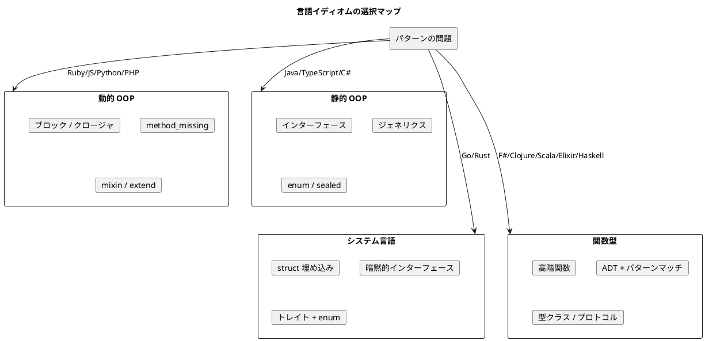

# 第 3 章: 各言語のイディオム集

## はじめに

前章では、GoF パターンが関数型言語でどう吸収されるかを見ました。本章では視点を変え、14 言語それぞれの「この言語ならでは」のパターン表現を集めます。

各言語には、その設計思想に根差した固有のイディオムがあります。同じ Strategy パターンでも、Ruby ではブロック、Java ではインターフェース、Haskell では高階関数と、表現の姿が大きく異なります。これらのイディオムを知ることは、その言語で「自然なコード」を書くために不可欠です。

---

## 動的 OOP 言語

### Ruby

Ruby は本シリーズの源流です。Russ Olsen 『Design Patterns in Ruby』 が示したように、Ruby のメタプログラミング機能は多くのパターンを軽量化します。

#### ブロックと Proc

Ruby の最も強力なイディオムはブロックです。Strategy パターンや Template Method パターンで、匿名の振る舞いをメソッドに渡す手段として頻繁に使われます。

```ruby
# Strategy をブロックで実現
report = Report.new("月次報告") do |line|
  "<p>#{line}</p>"
end
```

ブロックは暗黙的に 1 つだけメソッドに渡せるため、Strategy が 1 つのアルゴリズムの差し替えである場合に最も自然にフィットします。複数の Strategy が必要な場合は、Proc オブジェクトを明示的に渡します。

#### method_missing

`method_missing` は、存在しないメソッド呼び出しを動的にハンドリングするフックです。Proxy パターンで透過的な委譲を実現し、Builder パターンで DSL 的なインターフェースを構築する際に活用されます。

```ruby
# Proxy: method_missing で透過的委譲
class AccountProxy
  def method_missing(name, *args)
    @real_account.send(name, *args)
  end
end
```

#### Module mixin

Ruby の Module は、Decorator パターンの軽量な代替手段です。`extend` を使って実行時に個別のオブジェクトにモジュールを追加できます。

```ruby
# Decorator を Module で実現
module NumberingWriter
  def write_line(line)
    super("#{@line_number}: #{line}")
    @line_number += 1
  end
end

writer = SimpleWriter.new
writer.extend(NumberingWriter)
```

---

### JavaScript

JavaScript はプロトタイプベースの OOP と関数型プログラミングの両面を持つ言語です。

#### プロトタイプチェーン

JavaScript のオブジェクトは、プロトタイプチェーンを通じて振る舞いを継承します。クラスベースの継承とは異なり、個別のオブジェクトに直接メソッドを追加できます。

```javascript
// Decorator をプロトタイプ操作で実現
const writer = new SimpleWriter();
writer.writeLine = function(line) {
  SimpleWriter.prototype.writeLine.call(this, `${this.lineNumber++}: ${line}`);
};
```

#### クロージャ

JavaScript のクロージャは、Strategy パターンと Command パターンの最も自然な表現です。関数がレキシカルスコープをキャプチャするため、状態を持つ Strategy を関数として表現できます。

```javascript
// Command をクロージャで実現
function createFileCommand(path, content) {
  return {
    execute: () => fs.writeFileSync(path, content),
    undo: () => fs.unlinkSync(path)
  };
}
```

#### Proxy オブジェクト

ES6 の `Proxy` は、Proxy パターンを言語レベルでサポートする機能です。任意のオブジェクト操作（プロパティアクセス、メソッド呼び出し、代入など）をインターセプトできます。

```javascript
// ES6 Proxy で保護 Proxy を実現
const account = new Proxy(realAccount, {
  get(target, prop) {
    if (prop === 'balance' && !isAuthorized()) throw new Error('Unauthorized');
    return target[prop];
  }
});
```

---

### Python

Python は「明示は暗黙に勝る」（Explicit is better than implicit）を信条とする言語です。

#### デコレータ構文

Python の `@decorator` 構文は、Decorator パターンそのものではありませんが、関数やクラスに振る舞いを追加する強力な仕組みです。

```python
# デコレータ構文で Strategy 的な前後処理
def with_logging(func):
    def wrapper(*args, **kwargs):
        print(f"Calling {func.__name__}")
        result = func(*args, **kwargs)
        print(f"Finished {func.__name__}")
        return result
    return wrapper

@with_logging
def format_report(title):
    return f"<h1>{title}</h1>"
```

#### `__iter__` / `__next__` プロトコル

Python の Iterator プロトコルは、ダンダーメソッド（`__iter__`, `__next__`）で定義されます。ジェネレータ関数を使えば、さらに簡潔に Iterator を実装できます。

```python
# ジェネレータで Iterator パターン
class Portfolio:
    def __init__(self, accounts):
        self._accounts = accounts

    def __iter__(self):
        for account in self._accounts:
            yield account
```

#### ABC（Abstract Base Class）

Python の `abc` モジュールは、抽象基底クラスを定義するための仕組みです。Template Method パターンや Strategy パターンで、インターフェースの契約を明示するために使います。

```python
from abc import ABC, abstractmethod

class Report(ABC):
    @abstractmethod
    def output_header(self): ...

    @abstractmethod
    def output_body(self): ...

    def output_report(self):
        self.output_header()
        self.output_body()
```

---

### PHP

PHP は Web 開発に特化した言語で、漸進的型付けの導入により OOP の表現力が向上しています。

#### Traits

PHP の Traits は、コードの再利用を実現する仕組みで、Ruby の Module mixin に相当します。Decorator パターンの簡易的な代替として使えます。

```php
trait TimestampingWriter {
    public function writeLine(string $line): void {
        parent::writeLine(date('Y-m-d H:i:s') . " " . $line);
    }
}
```

#### SplObjectStorage

PHP の SPL（Standard PHP Library）には、Observer パターンの実装を支援する `SplObjectStorage` が含まれています。オブジェクトをキーとしたセットを管理できます。

```php
class EventManager {
    private SplObjectStorage $observers;

    public function __construct() {
        $this->observers = new SplObjectStorage();
    }

    public function attach(Observer $observer): void {
        $this->observers->attach($observer);
    }
}
```

#### IteratorAggregate

PHP の `IteratorAggregate` インターフェースは、`foreach` でオブジェクトを走査可能にする仕組みです。

```php
class Portfolio implements IteratorAggregate {
    private array $accounts;

    public function getIterator(): ArrayIterator {
        return new ArrayIterator($this->accounts);
    }
}
```

---

## 静的 OOP 言語

### Java

Java は GoF 本のメインターゲット言語であり、パターンの古典的な実装が最も自然に表現される言語です。

#### インターフェースとラムダ式

Java 8 以降、関数型インターフェース（SAM インターフェース）とラムダ式により、Strategy パターンが大幅に軽量化されました。

```java
// Java 8 以前: 明示的なクラス
class HtmlFormatter implements Formatter { ... }

// Java 8 以降: ラムダ式
Formatter htmlFormatter = line -> "<p>" + line + "</p>";
```

#### enum Singleton

Java の enum は、Singleton パターンの最も安全な実装手段です。シリアライズ、リフレクション攻撃に対しても唯一性が保証されます。

```java
public enum DatabaseLogger {
    INSTANCE;

    public void log(String message) {
        System.out.println(message);
    }
}
```

#### Stream API

Java の Stream API は、Iterator パターンの現代的な代替です。内部イテレータとして、コレクションの走査・変換・集約を宣言的に記述できます。

```java
portfolio.getAccounts().stream()
    .filter(a -> a.getBalance() > 1000)
    .mapToDouble(Account::getBalance)
    .sum();
```

---

### TypeScript

TypeScript は JavaScript の表現力に静的型付けの安全性を加えた言語です。

#### ジェネリクスと型パラメータ

TypeScript のジェネリクスは、Factory パターンや Iterator パターンで型安全な汎用実装を可能にします。

```typescript
interface Factory<T> {
    create(): T;
}

class FrogFactory implements Factory<Frog> {
    create(): Frog { return new Frog(); }
}
```

#### ユニオン型と型ガード

TypeScript のユニオン型は、Interpreter パターンの AST を型安全に表現できます。関数型言語の ADT に近い表現力を持ちます。

```typescript
type Expr =
    | { type: 'literal'; value: string }
    | { type: 'and'; left: Expr; right: Expr }
    | { type: 'or'; left: Expr; right: Expr }
    | { type: 'not'; operand: Expr };

function evaluate(expr: Expr, context: string): boolean {
    switch (expr.type) {
        case 'literal': return context.includes(expr.value);
        case 'and': return evaluate(expr.left, context) && evaluate(expr.right, context);
        case 'or': return evaluate(expr.left, context) || evaluate(expr.right, context);
        case 'not': return !evaluate(expr.operand, context);
    }
}
```

#### Proxy\<T\>

ES6 の `Proxy` を TypeScript で型付けして使うことで、型安全な Proxy パターンが実現できます。

```typescript
function createProtectionProxy<T extends object>(target: T, authorizer: () => boolean): T {
    return new Proxy(target, {
        get(obj, prop) {
            if (!authorizer()) throw new Error('Unauthorized');
            return Reflect.get(obj, prop);
        }
    });
}
```

---

### C\#

C# は OOP と関数型の要素を積極的に取り込んだ現代的な言語です。

#### LINQ

LINQ（Language Integrated Query）は、Iterator パターンを言語レベルで統合した仕組みです。コレクション操作を SQL ライクな構文で記述できます。

```csharp
var highValueAccounts = portfolio
    .Where(a => a.Balance > 1000)
    .Select(a => a.Name)
    .OrderBy(name => name);
```

#### event / delegate

C# の event と delegate は、Observer パターンを言語レベルでサポートします。イベントの発火、購読、購読解除が言語構文で表現されます。

```csharp
class Employee {
    public event EventHandler<SalaryChangedEventArgs> SalaryChanged;

    public decimal Salary {
        set {
            _salary = value;
            SalaryChanged?.Invoke(this, new SalaryChangedEventArgs(value));
        }
    }
}
```

#### Lazy\<T\> と record

`Lazy<T>` は Virtual Proxy パターンの言語レベルのサポートです。`record` 型は Builder パターンの `with` 式と相性が良く、不変オブジェクトの段階的構築を自然に表現します。

```csharp
// Lazy<T> で Virtual Proxy
Lazy<ExpensiveResource> resource = new(() => new ExpensiveResource());

// record + with 式で Builder 的な構築
record Computer(string Cpu, int Memory, int Storage);
var laptop = new Computer("i5", 8, 256) with { Memory = 16 };
```

---

## システム言語

### Go

Go は「シンプルさ」を徹底的に追求した言語です。継承がなく、インターフェースは暗黙的に満たされます。

#### struct 埋め込み

Go の構造体埋め込み（embedding）は、継承の代替手段です。Template Method パターンや Decorator パターンで、委譲を簡潔に表現します。

```go
// Decorator を構造体埋め込みで実現
type NumberingWriter struct {
    Writer     // 埋め込み（委譲）
    lineNumber int
}

func (nw *NumberingWriter) WriteLine(line string) {
    nw.Writer.WriteLine(fmt.Sprintf("%d: %s", nw.lineNumber, line))
    nw.lineNumber++
}
```

#### 暗黙的インターフェース

Go のインターフェースは、明示的な `implements` 宣言なしに満たされます。これにより、Adapter パターンが「既存の型がたまたまインターフェースを満たしている」という形で実現されることがあります。

```go
// io.Reader を満たせば、Reader として使える
type MyReader struct { ... }
func (r *MyReader) Read(p []byte) (n int, err error) { ... }
// 明示的な implements 宣言は不要
```

#### sync.Once

`sync.Once` は Singleton パターンのスレッドセーフな実装を提供します。初期化関数が正確に 1 回だけ実行されることを保証します。

```go
var (
    instance *Logger
    once     sync.Once
)

func GetLogger() *Logger {
    once.Do(func() {
        instance = &Logger{}
    })
    return instance
}
```

---

### Rust

Rust は所有権システムとトレイトにより、安全性と表現力を両立する言語です。

#### トレイトとデフォルト実装

Rust のトレイトは、Template Method パターンの自然な表現手段です。デフォルト実装を持つメソッドと、実装必須のメソッドを組み合わせることで、アルゴリズムの骨組みと可変部分を分離します。

```rust
trait Report {
    fn output_header(&self) -> String;  // 実装必須（フック）
    fn output_body(&self) -> String;    // 実装必須（フック）

    fn output_report(&self) -> String { // デフォルト実装（テンプレート）
        format!("{}\n{}", self.output_header(), self.output_body())
    }
}
```

#### 所有権と Decorator

Rust の所有権システムは、Decorator パターンの実装に独特の制約を加えます。所有権の移動（move）により、Decorator チェーンの構築が明示的になります。

```rust
let writer = SimpleWriter::new("output.txt");
let writer = NumberingWriter::new(writer);   // 所有権が移動
let writer = TimestampingWriter::new(writer); // さらに移動
```

#### enum と Interpreter

Rust の `enum` は関数型言語の ADT に相当し、Interpreter パターンの最も自然な表現手段です。`match` によるパターンマッチで、すべてのバリアントの処理漏れをコンパイル時に検出できます。

```rust
enum Expr {
    Literal(String),
    And(Box<Expr>, Box<Expr>),
    Or(Box<Expr>, Box<Expr>),
    Not(Box<Expr>),
}

fn evaluate(expr: &Expr, context: &str) -> bool {
    match expr {
        Expr::Literal(s) => context.contains(s),
        Expr::And(l, r) => evaluate(l, context) && evaluate(r, context),
        Expr::Or(l, r) => evaluate(l, context) || evaluate(r, context),
        Expr::Not(e) => !evaluate(e, context),
    }
}
```

#### OnceLock

`OnceLock`（Rust 1.70+）は Singleton パターンのスレッドセーフな実装です。

```rust
use std::sync::OnceLock;

static LOGGER: OnceLock<Logger> = OnceLock::new();

fn get_logger() -> &'static Logger {
    LOGGER.get_or_init(|| Logger::new())
}
```

---

## 関数型言語（JVM / .NET）

### F\#

F# は .NET 上の関数型ファースト言語です。判別共用体、パイプライン、Computation Expression が特徴的です。

#### 判別共用体（Discriminated Union）

F# の判別共用体は、Composite パターンと Interpreter パターンの最も自然な表現手段です。

```fsharp
type Task =
    | Leaf of name: string * time: float
    | Composite of name: string * children: Task list

let rec getTimeRequired = function
    | Leaf(_, time) -> time
    | Composite(_, children) -> children |> List.sumBy getTimeRequired
```

#### パイプライン演算子

F# のパイプライン演算子 `|>` は、Builder パターンと Decorator パターンの自然な代替です。

```fsharp
// Builder をパイプラインで表現
let computer =
    Computer.empty
    |> Computer.withCpu "Intel i7"
    |> Computer.withMemory 16
    |> Computer.withStorage 512
```

#### Computation Expression

F# の Computation Expression（CE）は、Builder パターンの高度な代替手段です。モナド的な構文で、段階的な構築プロセスを宣言的に記述できます。

```fsharp
let computer = computerBuilder {
    cpu "Intel i7"
    memory 16
    storage 512
}
```

---

### Clojure

Clojure は JVM 上の LISP 方言です。不変データ、プロトコル、マルチメソッドが特徴的です。

#### defmulti / defmethod

Clojure のマルチメソッドは、Strategy パターンや Factory パターンの自然な表現手段です。ディスパッチ関数を自由に定義できるため、クラスベースの多態よりも柔軟です。

```clojure
;; Factory をマルチメソッドで表現
(defmulti create-organism :type)

(defmethod create-organism :frog [spec]
  {:type :frog :name (:name spec)})

(defmethod create-organism :duck [spec]
  {:type :duck :name (:name spec)})
```

#### atom と watch

Clojure の `atom` は変更可能な参照型で、`add-watch` により Observer パターンを実現します。

```clojure
(def employee (atom {:name "Alice" :salary 50000}))

(add-watch employee :payroll
  (fn [_ _ old new]
    (when (not= (:salary old) (:salary new))
      (println "Salary changed:" (:salary new)))))
```

#### delay / force

Clojure の `delay` / `force` は、Virtual Proxy パターンの直接的な代替です。

```clojure
(def expensive-resource (delay (create-expensive-resource)))

;; 初回アクセス時にのみ生成
(force expensive-resource)
```

#### threading macro

Clojure の threading macro（`->`, `->>`）は、Builder パターンのパイプライン的な表現です。

```clojure
(-> (empty-computer)
    (with-cpu "Intel i7")
    (with-memory 16)
    (with-storage 512))
```

---

### Scala

Scala は OOP と FP を融合した JVM 言語です。Scala 3 では enum、given/using、extension methods が導入され、パターンの表現力が向上しています。

#### enum ADT

Scala 3 の `enum` は、Composite パターンと Interpreter パターンの ADT 表現です。

```scala
enum Expr:
  case Literal(value: String)
  case And(left: Expr, right: Expr)
  case Or(left: Expr, right: Expr)
  case Not(operand: Expr)
```

#### given / using（型クラス）

Scala 3 の `given` / `using` は、Adapter パターンと Strategy パターンの型クラスベースの表現です。

```scala
trait Formatter:
  def format(text: String): String

given htmlFormatter: Formatter with
  def format(text: String): String = s"<p>$text</p>"

def report(title: String)(using formatter: Formatter): String =
  formatter.format(title)
```

#### extension methods

Scala 3 の extension methods は、既存の型に新しいメソッドを追加する手段で、Adapter パターンの軽量な代替です。

```scala
extension (s: String)
  def toHtml: String = s"<p>$s</p>"

"Hello".toHtml // "<p>Hello</p>"
```

#### companion object

Scala の companion object は、Factory パターンと Singleton パターンの自然な表現です。

```scala
class Computer private (val cpu: String, val memory: Int)

object Computer:
  def apply(cpu: String, memory: Int): Computer =
    new Computer(cpu, memory)
```

---

## 関数型言語（VM / 純粋）

### Elixir

Elixir は Erlang VM 上の関数型言語で、プロセスモデルとパターンマッチングが特徴的です。

#### Protocol

Elixir の Protocol は、Adapter パターンとポリモーフィズムの表現手段です。既存の型に新しい振る舞いを後付けできます。

```elixir
defprotocol Renderable do
  def render(data)
end

defimpl Renderable, for: Map do
  def render(map), do: inspect(map)
end
```

#### GenServer

Elixir の GenServer は、Observer パターンと Singleton パターンのプロセスベースの表現です。状態を持つプロセスとして、通知の管理と唯一性の保証を行います。

```elixir
defmodule Employee do
  use GenServer

  def set_salary(pid, salary) do
    GenServer.cast(pid, {:set_salary, salary})
  end

  def handle_cast({:set_salary, salary}, state) do
    notify_observers(state.observers, salary)
    {:noreply, %{state | salary: salary}}
  end
end
```

#### パイプ演算子

Elixir のパイプ演算子 `|>` は、Builder パターンと Decorator パターンのパイプライン表現です。

```elixir
"Hello, World!"
|> String.upcase()
|> String.trim()
|> IO.puts()
```

---

### Haskell

Haskell は純粋関数型言語であり、最も多くの GoF パターンが言語機能に吸収される言語です。

#### 型クラス

Haskell の型クラスは、Strategy パターンと Adapter パターンの最も表現力のある代替手段です。

```haskell
class Renderable a where
    render :: a -> String

instance Renderable Report where
    render report = "<h1>" ++ title report ++ "</h1>"
```

#### ADT（代数的データ型）

Haskell の ADT は、Composite パターンと Interpreter パターンの最も自然な表現です。

```haskell
data Task
    = Leaf String Double
    | Composite String [Task]

getTimeRequired :: Task -> Double
getTimeRequired (Leaf _ time) = time
getTimeRequired (Composite _ tasks) = sum (map getTimeRequired tasks)
```

#### 関数合成

Haskell の関数合成演算子 `.` は、Decorator パターンの最も簡潔な表現です。

```haskell
numbering :: String -> String
timestamping :: String -> String

-- Decorator チェーン = 関数合成
decoratedWrite :: String -> String
decoratedWrite = numbering . timestamping
```

#### IORef

Haskell の IORef は、Observer パターンの状態管理手段です。純粋関数型の中で変更可能な参照を扱います。

```haskell
type Observer = Double -> IO ()

notifySalaryChange :: IORef [Observer] -> Double -> IO ()
notifySalaryChange observersRef salary = do
    observers <- readIORef observersRef
    mapM_ (\obs -> obs salary) observers
```

#### CAF（Constant Applicative Form）

Haskell の CAF は、Singleton パターンのトップレベル束縛です。モジュール内のトップレベルの値は、プログラム全体で共有されます。

```haskell
-- モジュールレベルの値 = Singleton
logger :: Logger
logger = createLogger defaultConfig
```

---

## まとめ: イディオムの選択指針



各言語のイディオムを知ることで、「このパターンをこの言語ではどう書くべきか」という判断が自然にできるようになります。重要なのは、パターンのクラス図をそのまま翻訳するのではなく、その言語で最も自然な表現を選択することです。

---

## 参照

- [OOP パターンと関数型代替の対応表](02-oop-vs-fp.md)
- [過剰適用・誤用パターン](04-pattern-anti-patterns.md)
- 『Design Patterns in Ruby』 - Russ Olsen
- 『Effective Java 第 3 版』 - Joshua Bloch
- 『Programming Rust 第 2 版』 - Jim Blandy, Jason Orendorff, Leonora F.S. Tindall
