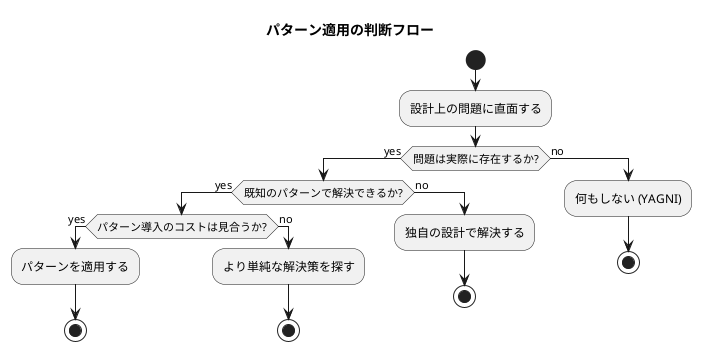
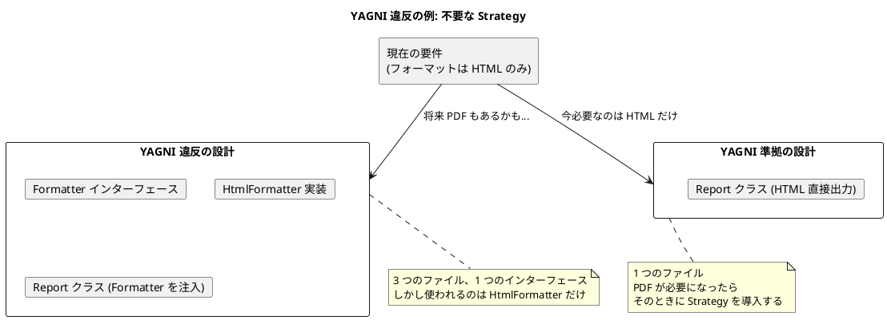
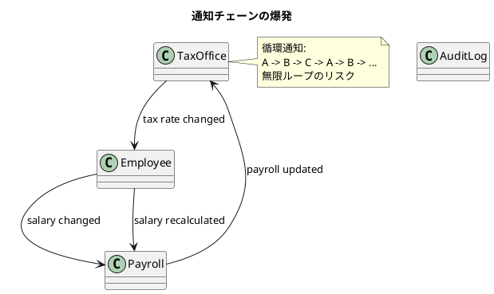
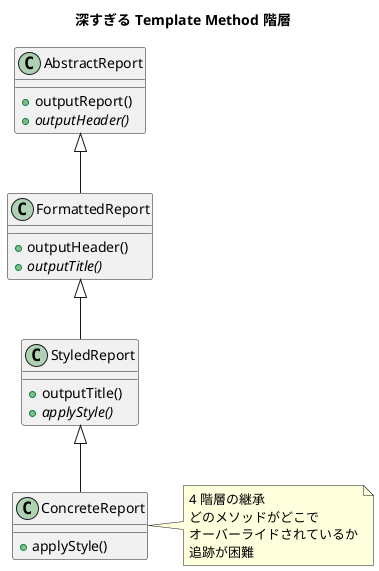
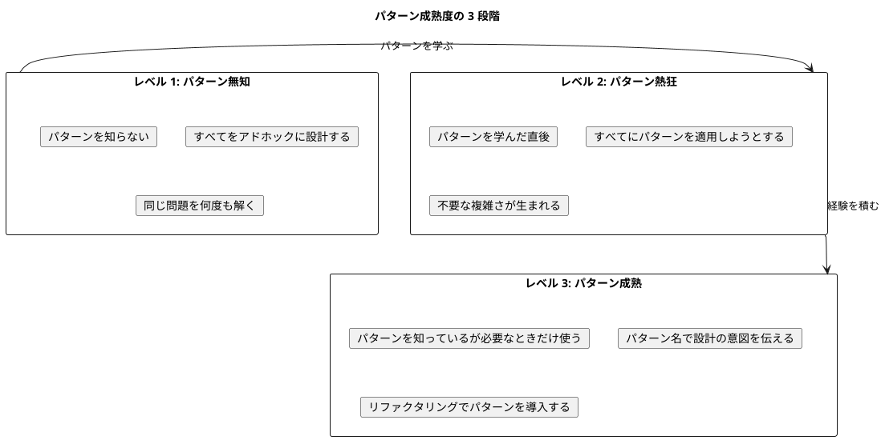

# 第 4 章: 過剰適用・誤用パターン

## はじめに

> パターンを学んだ直後の開発者は、すべての問題にパターンを適用しようとする。ハンマーを手にした人には、すべてが釘に見える。
>
> --- Abraham Maslow の法則（パラフレーズ）

デザインパターンは強力な道具ですが、道具の使い方を誤れば害になります。本章では、パターンの「使いどころ」と「使うべきでないとき」を整理し、過剰適用・誤用のアンチパターンを具体的に示します。

「パターンを知っているが使わない」という判断ができることこそ、設計者としての成熟の証です。

---

## いつパターンを使うべきか

パターンを適用すべき条件は、以下の 3 つが同時に成り立つときです:

1. **問題が実際に存在する**: 将来の仮想的な問題ではなく、今まさに直面している設計上の問題がある
2. **パターンがその問題を解く**: パターンの意図（Intent）が、手元の問題と一致する
3. **パターンのコストが見合う**: パターン導入による複雑さの増加が、問題解決の利益を下回る



---

## YAGNI とパターン

YAGNI（You Aren't Gonna Need It）は、XP（エクストリームプログラミング）の基本原則です。「今必要でない機能を実装するな」という教えですが、これはパターンの適用にもそのまま当てはまります。

### 過剰な抽象化の害

将来の拡張に備えてパターンを適用すると、以下の問題が生じます:

- **可読性の低下**: 不要な抽象レイヤーが、コードの意図を隠す
- **保守コストの増加**: 抽象化の維持にもコストがかかる
- **間違った抽象化**: 将来の要求は予測できないため、間違った方向に抽象化するリスクが高い
- **テストの複雑化**: 不要なインターフェースのモックが必要になる



### リファクタリングでパターンを導入する

正しいアプローチは、以下の順序です:

1. 最もシンプルな設計で実装する
2. 要求の変化により設計上の問題が発生する
3. リファクタリングでパターンを導入する

パターンは「最初から設計に組み込む」ものではなく、「必要になったときにリファクタリングで導入する」ものです。TDD の Red-Green-Refactor サイクルにおいて、パターンの導入は Refactor フェーズの一部です。

---

## 各パターンのアンチパターン

### Singleton

**正しい使いどころ**: システム全体で唯一であることに本質的な意味があるリソース（ログ出力先、設定管理など）

#### アンチパターン: グローバル状態の偽装

Singleton の最も頻繁な誤用は、グローバル変数の代替として使うことです。

```java
// アンチパターン: Singleton をグローバル変数として使う
public enum AppState {
    INSTANCE;
    private User currentUser;
    private Map<String, Object> cache;
    private Connection dbConnection;
    // ... あらゆる状態を詰め込む
}
```

**問題点**:

- テスト時にリセットが困難（テスト間の状態漏れ）
- 依存関係が暗黙的になる（コンストラクタに現れない）
- 並行処理で競合状態が発生しやすい
- 単一責任の原則に違反する

**代替策**: 依存性注入（DI）を使い、必要なオブジェクトをコンストラクタで明示的に渡す

#### アンチパターン: テスト困難な設計

```java
// テストしにくい: DatabaseLogger に直接依存
class OrderService {
    public void placeOrder(Order order) {
        DatabaseLogger.INSTANCE.log("Order placed: " + order.getId());
        // ...
    }
}

// テストしやすい: Logger インターフェースを注入
class OrderService {
    private final Logger logger;
    public OrderService(Logger logger) { this.logger = logger; }

    public void placeOrder(Order order) {
        logger.log("Order placed: " + order.getId());
    }
}
```

---

### Factory

**正しい使いどころ**: 生成するオブジェクトの種類が実行時に決定される場合

#### アンチパターン: 不要な抽象化レイヤー

```java
// アンチパターン: 生成対象が 1 種類しかない Factory
interface UserFactory {
    User createUser(String name);
}

class DefaultUserFactory implements UserFactory {
    public User createUser(String name) {
        return new User(name);
    }
}

// シンプルな代替策
User user = new User(name);
```

**判断基準**: Factory を導入する前に、以下を自問してください:

- 生成対象のクラスが 2 つ以上あるか?
- 生成ロジックが複雑か（バリデーション、初期化処理など）?
- 生成対象を実行時に切り替える必要があるか?

すべて No なら、`new` で十分です。

#### アンチパターン: Factory の Factory

抽象化の層を重ねすぎると、コードの追跡が困難になります。

```java
// アンチパターン: 過剰な抽象化
FactoryProvider.getFactory("organism")
    .createFactory("frog")
    .create("Kermit");

// シンプルな代替策
OrganismFactory.createFrog("Kermit");
```

---

### Observer

**正しい使いどころ**: 1 対多の依存関係で、Subject の変更を複数のオブジェクトに通知する必要がある場合

#### アンチパターン: 通知チェーンの爆発

Observer 同士が相互に通知し合うと、無限ループや予測困難な振る舞いが発生します。



**対策**:

- 通知の方向を一方向に制限する
- 通知の深さに上限を設ける
- イベントバスを導入して直接的な依存を排除する
- 「変更中」フラグで再帰的な通知を防ぐ

#### アンチパターン: Observer の管理放棄

Observer を登録したまま解除しないと、メモリリークと予期しない副作用が発生します。

```java
// アンチパターン: Observer の解除忘れ
employee.addObserver(temporaryView);
// ... temporaryView が不要になっても解除しない
// -> GC で回収されず、通知が飛び続ける
```

**対策**: Observer のライフサイクルを明示的に管理する。弱参照（WeakReference）の使用も検討する。

---

### Strategy

**正しい使いどころ**: 同じ問題に対して複数のアルゴリズムが存在し、実行時に切り替える必要がある場合

#### アンチパターン: 1 つしかない戦略のインターフェース

```java
// アンチパターン: Strategy が 1 つしかない
interface SortStrategy { void sort(List<?> list); }
class QuickSort implements SortStrategy { ... }

// 2 年間、QuickSort しか使われていない
// -> インターフェースが不要なコスト
```

**判断基準**: Strategy を導入する前に、「2 つ目の実装が現実的に必要になるか」を確認してください。答えが No なら、直接実装で十分です。

#### アンチパターン: Strategy の乱用による断片化

すべての振る舞いを Strategy として切り出すと、ロジックが散在し、全体の流れが把握できなくなります。

```java
// アンチパターン: 過度な Strategy 分離
class Report {
    private HeaderStrategy headerStrategy;
    private BodyStrategy bodyStrategy;
    private FooterStrategy footerStrategy;
    private DateFormatStrategy dateStrategy;
    private NumberFormatStrategy numberStrategy;
    // ... 10 個の Strategy を注入
}
```

**対策**: 関連する振る舞いをグループ化し、適切な粒度で Strategy を定義する。

---

### Template Method

**正しい使いどころ**: 複数のクラスが同じアルゴリズム構造を共有し、一部のステップだけが異なる場合

#### アンチパターン: 深い継承階層

Template Method を多段階に適用すると、継承階層が深くなり、変更の影響範囲が予測困難になります。



**対策**: 継承より委譲を選ぶ。Template Method ではなく Strategy の組み合わせを検討する。

---

### Composite

**正しい使いどころ**: 部分-全体の階層構造があり、個々の要素と集合体を統一的に扱いたい場合

#### アンチパターン: すべてをツリーにする

Composite パターンを適用するために、本来フラットなデータ構造を無理にツリーに変換するのは誤りです。

```java
// アンチパターン: フラットで十分なデータをツリーにする
// ユーザーリスト -> なぜか CompositeUser を作る
class CompositeUser implements User {
    private List<User> children; // ユーザーの子ユーザー?
}
```

**判断基準**: データが本当に再帰的な構造を持っているかを確認してください。

---

### Command

**正しい使いどころ**: 操作の取り消し（Undo）、操作のキュー化、操作の記録が必要な場合

#### アンチパターン: すべての操作を Command にする

```java
// アンチパターン: 単純な getter を Command にする
class GetUserNameCommand implements Command {
    public Object execute() {
        return user.getName();
    }
}
```

**判断基準**: Undo / キュー化 / 記録のいずれも不要な操作を Command にする必要はありません。

---

### Decorator

**正しい使いどころ**: 既存のオブジェクトに、実行時に動的に責務を追加したい場合

#### アンチパターン: Decorator チェーンの無限の入れ子

```java
// アンチパターン: 追跡不能な Decorator チェーン
Writer writer = new LoggingWriter(
    new CachingWriter(
        new CompressingWriter(
            new EncryptingWriter(
                new BufferingWriter(
                    new SimpleWriter("out.txt"))))));
// -> デバッグ時にどの Decorator が何をしているか追跡困難
```

**対策**: Decorator の層数に実用的な上限を設ける（3 層程度が目安）。それ以上になる場合は、設計を見直す。

---

### Adapter

**正しい使いどころ**: 変更できない既存のインターフェースを、新しいインターフェースに合わせる必要がある場合

#### アンチパターン: 設計の問題を Adapter で隠す

インターフェースの不一致が頻繁に発生するなら、Adapter を量産するのではなく、インターフェースの設計を見直すべきです。

```java
// アンチパターン: Adapter だらけ
class UserToCustomerAdapter implements Customer { ... }
class CustomerToUserAdapter implements User { ... }
class UserToEmployeeAdapter implements Employee { ... }
// -> インターフェース設計に問題がある
```

---

### Proxy

**正しい使いどころ**: アクセス制御、遅延初期化、リモート呼び出しの透過性が必要な場合

#### アンチパターン: Proxy で隠された複雑さ

Proxy が透過的であるがゆえに、呼び出し側がパフォーマンスコストや副作用に気づかないリスクがあります。

```java
// アンチパターン: 透過的すぎる Proxy
BankAccount account = getAccount(); // 実は Remote Proxy
account.getBalance(); // ネットワーク呼び出しが発生（呼び出し側は気づかない）
```

**対策**: Proxy の存在をドキュメントで明示する。パフォーマンスに影響する Proxy は、API 名で暗示する（例: `getRemoteAccount()`）。

---

### Builder

**正しい使いどころ**: 多数のオプショナルパラメータを持つオブジェクトの構築

#### アンチパターン: 2-3 個のフィールドに Builder を使う

```java
// アンチパターン: フィールドが少ないのに Builder
class PointBuilder {
    private int x;
    private int y;
    public PointBuilder x(int x) { this.x = x; return this; }
    public PointBuilder y(int y) { this.y = y; return this; }
    public Point build() { return new Point(x, y); }
}

// シンプルな代替策
Point point = new Point(10, 20);
```

**判断基準**: コンストラクタの引数が 4 つ以上、かつオプショナルなパラメータが存在する場合に Builder を検討する。

---

### Interpreter

**正しい使いどころ**: 文法が単純で、パフォーマンスが重要でない DSL の評価

#### アンチパターン: 複雑な文法への適用

文法が複雑な場合、Interpreter パターンは AST のクラス爆発を招きます。パーサジェネレータや既存の言語処理系を使うべきです。

**判断基準**: 文法規則が 10 を超える場合、Interpreter パターンの適用を再考してください。

---

## パターン成熟度モデル



### レベル 3 の特徴

- パターンの名前を知っている（コミュニケーションのための共通語彙）
- パターンが解く問題を理解している（パターンの Intent を説明できる）
- パターンを使わない判断ができる（YAGNI を実践できる）
- リファクタリングでパターンを導入できる（Red-Green-Refactor の Refactor フェーズ）
- 言語のイディオムで代替できる場合はそちらを選ぶ

---

## チェックリスト: パターン適用前の自問

パターンを適用する前に、以下の問いに答えてください:

- [ ] この問題は実際に存在するか?（YAGNI 違反でないか?）
- [ ] より単純な解決策はないか?
- [ ] このパターンの Intent は、手元の問題と一致するか?
- [ ] パターン導入後のコードは、導入前より理解しやすいか?
- [ ] テストは書きやすくなるか、書きにくくなるか?
- [ ] この言語のイディオムで、より自然に表現できないか?
- [ ] チームメンバーがこのパターンを理解できるか?

1 つでも No がある場合は、パターンの適用を再考してください。

---

## まとめ

パターンは「知っていて使わない」ことに価値があります。

- **YAGNI を忘れない**: 今必要なものだけを作る
- **リファクタリングで導入する**: 最初からパターンを設計に組み込まない
- **言語のイディオムを優先する**: パターンのクラス図をそのまま翻訳しない
- **パターン名は共通語彙**: 使わなくても、名前を知っていることに価値がある
- **シンプルさが最高の設計**: 「動くきれいなコード」は、多くの場合パターンを意識しないコード

> Simple made easy.

---

## 参照

- [パターン思考の言語横断比較](01-pattern-thinking-across-languages.md)
- [OOP パターンと関数型代替の対応表](02-oop-vs-fp.md)
- [各言語のイディオム集](03-language-idioms.md)
- 『Design Patterns in Ruby』 - Russ Olsen, Chapter 16: "Opening Up the Toolkit"
- 『Refactoring』 - Martin Fowler
- 『エクストリームプログラミング』 - Kent Beck
