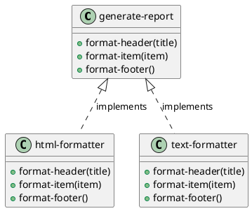

# 第 2 章 Template Method -- 高階関数による骨格の定義

## はじめに

Template Method パターンは、アルゴリズムの骨格を固定し、一部のステップだけを差し替えるパターンです。Clojure では継承の代わりに高階関数とマップを使って、同じ意図を軽量に表現できます。

## パターンの構造



## Clojure イディオム: ステップ関数を持つマップ

骨格となる関数が、差し替え可能なステップ関数をマップとして受け取ります。

```clojure
(defn generate-report
  [{:keys [format-header format-item format-footer]} title items]
  (str (format-header title)
       (apply str (map format-item items))
       (format-footer)))
```

フォーマッタ自体はデータとして定義できます。

```clojure
(def html-formatter
  {:format-header (fn [title] (str "<html><head><title>" title "</title></head><body>\n"))
   :format-item   (fn [item] (str "  <p>" item "</p>\n"))
   :format-footer (fn [] "</body></html>\n")})

(def text-formatter
  {:format-header (fn [title] (str "=== " title " ===\n"))
   :format-item   (fn [item] (str "  - " item "\n"))
   :format-footer (fn [] "==========\n")})
```

## TDD で作る

### Red: 失敗するテストを書く

```clojure
(deftest html-report-test
  (testing "HTML フォーマットでレポートを生成する"
    (let [result (generate-report html-formatter "Sales Report" ["Item A" "Item B"])]
      (is (clojure.string/includes? result "<html>"))
      (is (clojure.string/includes? result "Sales Report")))))
```

### Green: 最小限の実装

```clojure
(defn generate-report
  [{:keys [format-header format-item format-footer]} title items]
  (str (format-header title)
       (apply str (map format-item items))
       (format-footer)))

(def html-formatter
  {:format-header (fn [title] (str "<html><head><title>" title "</title></head><body>\n"))
   :format-item   (fn [item] (str "  <p>" item "</p>\n"))
   :format-footer (fn [] "</body></html>\n")})
```

### Refactor

フォーマッタをマップとして分離しておくと、骨格の `generate-report` は固定したまま、HTML 以外の表現を後から追加できます。

## まとめ

オブジェクト指向では抽象クラスと具象クラスの継承階層が必要でしたが、Clojure では関数のマップを渡すだけで同じ柔軟性を実現できます。
