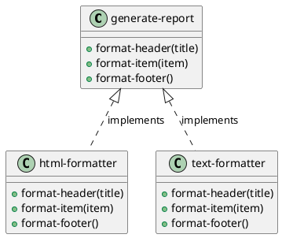

# 第 2 章 Template Method -- 高階関数による骨格の定義

## パターンの意図

Template Method パターンは、アルゴリズムの骨格を定義し、一部のステップをサブクラスで差し替えられるようにするパターンです。

## Clojure での解釈

Clojure では継承の代わりに高階関数を使います。骨格となる関数がカスタマイズ可能なステップ関数をマップとして受け取ります。

## 実装

```clojure
(defn generate-report
  [{:keys [format-header format-item format-footer]} title items]
  (str (format-header title)
       (apply str (map format-item items))
       (format-footer)))
```

フォーマッタはマップとして定義します。

```clojure
(def html-formatter
  {:format-header (fn [title] (str "<html><head><title>" title "</title></head><body>\n"))
   :format-item   (fn [item] (str "  <p>" item "</p>\n"))
   :format-footer (fn [] "</body></html>\n")})

(def text-formatter
  {:format-header (fn [title] (str "=== " title " ===\n"))
   :format-item   (fn [item] (str "  - " item "\n"))
   :format-footer (fn [] "==========\n")})
```

## クラス図



## テスト

```clojure
(deftest html-report-test
  (testing "HTML フォーマットでレポートを生成する"
    (let [result (generate-report html-formatter "Sales Report" ["Item A" "Item B"])]
      (is (clojure.string/includes? result "<html>"))
      (is (clojure.string/includes? result "Sales Report")))))
```

## まとめ

オブジェクト指向では抽象クラスと具象クラスの継承階層が必要でしたが、Clojure では関数のマップを渡すだけで同じ柔軟性を実現できます。
