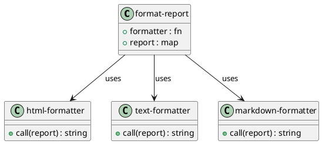

# 第 3 章 Strategy -- 関数は最良の戦略

## はじめに

Strategy パターンは、アルゴリズム全体を入れ替え可能にするパターンです。Clojure では関数がそのまま戦略になるため、インターフェースや具象クラスを作らずに実現できます。

## パターンの構造



## Clojure イディオム: 戦略を関数として渡す

```clojure
(defn format-report [formatter report]
  (formatter report))

(defn html-formatter [{:keys [title items]}]
  (str "<html><head><title>" title "</title></head><body>\n"
       (apply str (map #(str "  <p>" % "</p>\n") items))
       "</body></html>\n"))

(defn text-formatter [{:keys [title items]}]
  (str "=== " title " ===\n"
       (apply str (map #(str "  - " % "\n") items))
       "==========\n"))

(defn markdown-formatter [{:keys [title items]}]
  (str "# " title "\n\n"
       (apply str (map #(str "- " % "\n") items))))
```

## TDD で作る

### Red: 失敗するテストを書く

```clojure
(deftest strategy-is-just-a-function-test
  (testing "戦略は任意の関数で差し替えられる"
    (let [custom-fn (fn [{:keys [title]}] (str "Custom: " title))
          result    (format-report custom-fn sample-report)]
      (is (= "Custom: Monthly Sales" result)))))
```

### Green: 最小限の実装

```clojure
(defn format-report [formatter report]
  (formatter report))
```

まずは戦略を呼び出す関数だけを通し、フォーマットの違いは関数の差し替えに委ねます。

### Refactor

`html-formatter`、`text-formatter`、`markdown-formatter` を独立関数に分けると、呼び出し側は `format-report` だけを知っていれば十分になります。

## Template Method との違い

Template Method は骨格の中の一部ステップを差し替えるのに対し、Strategy はアルゴリズム全体を差し替えます。Clojure ではどちらも高階関数で表現でき、その境界は曖昧になります。

## まとめ

関数型言語において Strategy パターンは最も自然なパターンです。関数を値として扱えること自体が、Strategy パターンの本質だからです。
