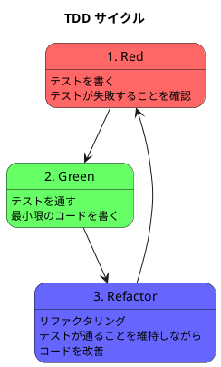

# 第 3 章: 開発環境と TDD 基盤

## はじめに

本章では、デザインパターンを TDD で実装するための Clojure 開発環境をセットアップします。Leiningen、clojure.test、Eastwood を使い、テスト・静的解析・品質チェックの一括実行環境を構築します。

---

## 開発環境

### Clojure バージョン

本シリーズでは **Clojure 1.12** を使用します。

```bash
# バージョン確認
lein version
```

### プロジェクト構成

```
apps/clojure/design-pattern/
├── project.clj               # プロジェクト定義（依存関係・プラグイン）
├── src/design_pattern/
│   ├── core.clj              # エントリポイント
│   ├── template_method.clj   # パターン実装
│   ├── strategy.clj
│   └── ...
└── test/design_pattern/
    ├── template_method_test.clj  # テストファイル
    ├── strategy_test.clj
    └── ...
```

### project.clj

```clojure
(defproject design-pattern "1.0.0"
  :description "Design Patterns in Clojure"
  :dependencies [[org.clojure/clojure "1.12.0"]]
  :main ^:skip-aot design-pattern.core
  :target-path "target/%s"
  :plugins [[jonase/eastwood "1.4.3"]]
  :profiles {:uberjar {:aot :all}}
  :aliases {"check" ["do" ["eastwood"] ["test"]]})
```

### セットアップ

```bash
cd apps/clojure/design-pattern
lein deps
```

---

## テスティングフレームワーク: clojure.test

### なぜ clojure.test か

- Clojure 標準ライブラリに含まれている（外部依存が不要）
- シンプルで高速
- `deftest` + `testing` + `is` の 3 つのマクロだけで書ける

### テストの書き方

```clojure
(ns design-pattern.example-test
  (:require [clojure.test :refer :all]
            [design-pattern.example :refer :all]))

(deftest basic-test
  (testing "基本的な動作を確認する"
    (is (= 42 (some-function 40 2)))))

(deftest error-test
  (testing "例外が投げられることを確認する"
    (is (thrown? clojure.lang.ExceptionInfo
                (failing-function)))))
```

### テスト実行

```bash
# 全テスト実行
lein test

# 特定の名前空間だけ実行
lein test design-pattern.template-method-test
```

---

## TDD サイクル

本シリーズでは、各パターンを以下の TDD サイクルで実装します。

### Red-Green-Refactor



1. **Red**: パターンの期待動作をテストで表現する（テストは失敗する）
2. **Green**: テストを通す最小限の実装を書く
3. **Refactor**: パターンの構造に沿ってリファクタリングする（テストは通り続ける）

### パターン実装の進め方

各パターン章では、以下の順で TDD サイクルを回します。

1. **素朴な実装**: まず最もシンプルな形でテストを通す
2. **問題の発見**: 要件の追加により、素朴な実装の限界が見える
3. **パターンの適用**: リファクタリングでパターンの構造に変換する
4. **Clojure らしい改善**: 高階関数、マルチメソッド、プロトコル等で更に改善する

---

## 静的コード解析: Eastwood

### Eastwood とは

Eastwood は Clojure の静的コード解析（Lint）ツールです。暗黙の依存関係、未使用の変数、間違った引数の数などを検出します。

### Eastwood の実行

```bash
# 静的解析の実行
lein eastwood

# 静的解析 + テストの一括実行
lein check
```

### Eastwood の主要なルール

| ルール | 説明 |
|--------|------|
| `implicit-dependencies` | 明示的に require されていない名前空間の使用 |
| `unused-ret-vals` | 戻り値が使われていない関数呼び出し |
| `wrong-arity` | 引数の数が間違っている関数呼び出し |
| `suspicious-expression` | 疑わしい式（常に true になる条件など） |
| `unused-namespaces` | 使用されていない require |

---

## コード複雑度のチェック

Clojure の関数型スタイルと不変データ構造は、自然にコードの複雑度を低く保ちます。

| 手法 | 説明 |
|------|------|
| Eastwood | 暗黙の依存関係、未使用変数の検出 |
| `lein check` | コンパイル時チェック |
| 不変データ | 状態の変化を atom に限定し、予測可能性を向上 |
| REPL | 対話的な開発で即座にフィードバックを得る |

---

## 品質チェックの一括実行

```bash
# 静的解析 + テスト
lein check
```

### 各言語の品質ツール比較

| 用途 | Clojure | Ruby | Java | TypeScript | Python |
|------|---------|------|------|-----------|--------|
| パッケージ管理 | Leiningen | Bundler | Gradle | npm | uv |
| テスト | clojure.test | minitest | JUnit 5 | Jest | pytest |
| 静的解析 | Eastwood | RuboCop | Checkstyle + PMD | ESLint | Ruff |
| フォーマッター | cljfmt | RuboCop | Checkstyle | Prettier | Ruff |
| カバレッジ | cloverage | SimpleCov | JaCoCo | @vitest/coverage-v8 | pytest-cov |
| 複雑度チェック | Eastwood | RuboCop Metrics | PMD | ESLint complexity | Ruff McCabe |

---

## まとめ

- Clojure 1.12 + Leiningen + clojure.test + Eastwood の環境を構築した
- テストは `*_test.clj` の命名規則で、`test/` ディレクトリに配置する
- TDD の Red-Green-Refactor サイクルでパターンを段階的に実装する
- Eastwood で静的解析を自動チェックする
- `lein check` で静的解析 + テストを一括実行できる
- 次章からは、この環境を使って最初のパターン **Template Method** を実装する
