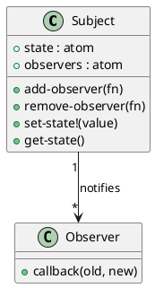

# 第 4 章 Observer -- atom と watch による状態監視

## はじめに

Observer パターンは、状態変化を複数の関心事へ自動通知するパターンです。Clojure では `atom` と `add-watch` がこの問題に直接対応しており、手動実装も比較的簡潔です。

## パターンの構造



## Clojure イディオム: atom + add-watch

### 手動実装

```clojure
(defn create-subject [initial-value]
  {:state     (atom initial-value)
   :observers (atom [])})

(defn add-observer [subject observer-fn]
  (swap! (:observers subject) conj observer-fn))

(defn set-state! [subject new-value]
  (let [old-value @(:state subject)]
    (reset! (:state subject) new-value)
    (doseq [observer @(:observers subject)]
      (observer old-value new-value))))
```

### `add-watch` を使う実装

```clojure
(defn create-watched-atom [initial-value]
  (atom initial-value))

(defn watch! [a key callback]
  (add-watch a key (fn [_key _ref old-val new-val]
                     (callback old-val new-val))))
```

## TDD で作る

### Red: 失敗するテストを書く

```clojure
(deftest observer-notification-test
  (testing "状態変更時に observer が通知される"
    (let [subject  (create-subject 0)
          received (atom [])]
      (add-observer subject (fn [old new] (swap! received conj {:old old :new new})))
      (set-state! subject 42)
      (is (= [{:old 0 :new 42}] @received)))))
```

### Green: 最小限の実装

```clojure
(defn create-subject [initial-value]
  {:state     (atom initial-value)
   :observers (atom [])})

(defn add-observer [subject observer-fn]
  (swap! (:observers subject) conj observer-fn))

(defn set-state! [subject new-value]
  (let [old-value @(:state subject)]
    (reset! (:state subject) new-value)
    (doseq [observer @(:observers subject)]
      (observer old-value new-value))))
```

### Refactor

手動実装で通知の仕組みを理解したあと、実運用では `add-watch` を使うと Clojure らしく簡潔に書けます。

## まとめ

Clojure の atom + add-watch は Observer パターンの組み込み実装と言えます。手動実装も atom と関数のリストで簡潔に表現できます。
