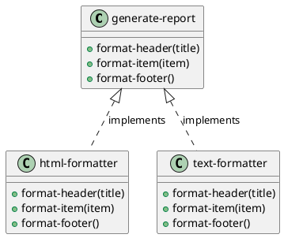

# 第 4 章 Template Method -- 高階関数による骨格の定義

## はじめに

Template Method パターンは、アルゴリズムの骨格を固定し、一部のステップだけを差し替えるパターンです。オブジェクト指向言語では抽象クラスと継承で実現しますが、Clojure では高階関数とマップを使って、同じ意図を軽量に表現できます。

---

## パターンの構造



**登場人物**:

- **generate-report**: テンプレート関数。骨格（ヘッダー → アイテム → フッター）を定義する
- **html-formatter / text-formatter**: ステップ関数をまとめたマップ。各ステップの具体的な振る舞いを提供する

---

## Clojure イディオム: ステップ関数を持つマップ

骨格となる関数が、差し替え可能なステップ関数をマップとして受け取ります。

```clojure
(defn generate-report
  "レポート生成のテンプレート。format-header, format-item, format-footer を差し替え可能。"
  [{:keys [format-header format-item format-footer]} title items]
  (str (format-header title)
       (apply str (map format-item items))
       (format-footer)))
```

フォーマッタ自体はデータとして定義します。

```clojure
;; --- HTML フォーマット ---
(def html-formatter
  {:format-header (fn [title] (str "<html><head><title>" title "</title></head><body>\n"))
   :format-item   (fn [item] (str "  <p>" item "</p>\n"))
   :format-footer (fn [] "</body></html>\n")})

;; --- Plain Text フォーマット ---
(def text-formatter
  {:format-header (fn [title] (str "=== " title " ===\n"))
   :format-item   (fn [item] (str "  - " item "\n"))
   :format-footer (fn [] "==========\n")})
```

---

## TDD で作る

### Red: 失敗するテストを書く

```clojure
(deftest html-report-test
  (testing "HTML フォーマットでレポートを生成する"
    (let [result (generate-report html-formatter "Sales Report" ["Item A" "Item B"])]
      (is (clojure.string/includes? result "<html>"))
      (is (clojure.string/includes? result "Sales Report"))
      (is (clojure.string/includes? result "<p>Item A</p>"))
      (is (clojure.string/includes? result "<p>Item B</p>"))
      (is (clojure.string/includes? result "</html>")))))
```

### Green: 最小限の実装

```clojure
(defn generate-report
  [{:keys [format-header format-item format-footer]} title items]
  (str (format-header title)
       (apply str (map format-item items))
       (format-footer)))

(def html-formatter
  {:format-header (fn [title] (str "<html><head><title>" title "</title></head><body>\n"))
   :format-item   (fn [item] (str "  <p>" item "</p>\n"))
   :format-footer (fn [] "</body></html>\n")})
```

### Refactor: カスタムフォーマッタのテストを追加

フォーマッタをマップとして分離しておくと、骨格の `generate-report` は固定したまま、カスタムフォーマッタを後から自由に追加できます。

```clojure
(deftest custom-formatter-test
  (testing "カスタムフォーマッタを渡せる"
    (let [custom {:format-header (fn [title] (str "[" title "]\n"))
                  :format-item   (fn [item] (str "* " item "\n"))
                  :format-footer (fn [] "[END]\n")}
          result (generate-report custom "My Report" ["X" "Y"])]
      (is (= "[My Report]\n* X\n* Y\n[END]\n" result)))))

(deftest empty-items-test
  (testing "アイテムが空の場合でも正常に動作する"
    (let [result (generate-report text-formatter "Empty Report" [])]
      (is (clojure.string/includes? result "=== Empty Report ==="))
      (is (clojure.string/includes? result "==========")))))
```

---

## 他言語との比較

| 言語 | 実装方法 |
|------|---------|
| Java | 抽象クラス + 継承 + @Override |
| Ruby | 基底クラス + サブクラス + フックメソッド |
| Python | ABC + 抽象メソッド |
| Clojure | 高階関数 + マップ |

Clojure ではクラス階層が不要なため、テンプレートの骨格と具象ステップの関係が 1 つの関数呼び出しで完結します。

---

## まとめ

- Template Method は「骨格を固定し、ステップを差し替える」パターン
- Clojure では継承の代わりに、ステップ関数をマップに閉じ込めて高階関数に渡す
- フォーマッタはデータとして定義でき、後から自由に追加可能
- オブジェクト指向言語で必要だった抽象クラスと継承階層が完全に不要になる
