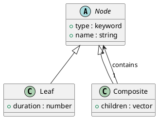

# 第 5 章 Composite -- 再帰データとマルチメソッド

## パターンの意図

Composite パターンは、オブジェクトをツリー構造に組み立て、個々のオブジェクトとその集合を同一視して扱えるようにするパターンです。

## Clojure での解釈

Clojure のマップとベクタで再帰的なデータ構造を自然に表現できます。`:type` キーワードでノードの種類を区別し、マルチメソッドでディスパッチします。

## 実装

```clojure
(defn leaf [name duration]
  {:type :leaf :name name :duration duration})

(defn composite [name & children]
  {:type :composite :name name :children (vec children)})

(defmulti total-duration :type)

(defmethod total-duration :leaf [node]
  (:duration node))

(defmethod total-duration :composite [node]
  (reduce + 0 (map total-duration (:children node))))
```

## クラス図



## テスト

```clojure
(deftest nested-composite-test
  (testing "ネストされたコンポジットの合計所要時間を計算する"
    (let [sub1    (composite "Backend" (leaf "API" 4.0) (leaf "DB" 3.0))
          sub2    (composite "Frontend" (leaf "UI" 5.0) (leaf "CSS" 2.0))
          project (composite "Full Project" sub1 sub2)]
      (is (= 14.0 (total-duration project))))))
```

## まとめ

Clojure の不変データ構造とマルチメソッドの組み合わせは、Composite パターンを非常に簡潔に表現します。データとしてのツリーは、シリアライズや変換も容易です。
