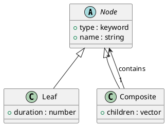

# 第 5 章 Composite -- 再帰データとマルチメソッド

## はじめに

Composite パターンは、個別要素と複合要素を同じように扱うためのパターンです。Clojure では再帰的なマップ / ベクタ構造とマルチメソッドで、ツリーを自然に表現できます。

## パターンの構造



## Clojure イディオム: 再帰データ + マルチメソッド

```clojure
(defn leaf [name duration]
  {:type :leaf :name name :duration duration})

(defn composite [name & children]
  {:type :composite :name name :children (vec children)})

(defmulti total-duration :type)

(defmethod total-duration :leaf [node]
  (:duration node))

(defmethod total-duration :composite [node]
  (reduce + 0 (map total-duration (:children node))))
```

## TDD で作る

### Red: 失敗するテストを書く

```clojure
(deftest nested-composite-test
  (testing "ネストされたコンポジットの合計所要時間を計算する"
    (let [sub1    (composite "Backend" (leaf "API" 4.0) (leaf "DB" 3.0))
          sub2    (composite "Frontend" (leaf "UI" 5.0) (leaf "CSS" 2.0))
          project (composite "Full Project" sub1 sub2)]
      (is (= 14.0 (total-duration project))))))
```

### Green: 最小限の実装

```clojure
(defn leaf [name duration]
  {:type :leaf :name name :duration duration})

(defn composite [name & children]
  {:type :composite :name name :children (vec children)})

(defmulti total-duration :type)

(defmethod total-duration :leaf [node]
  (:duration node))

(defmethod total-duration :composite [node]
  (reduce + 0 (map total-duration (:children node))))
```

### Refactor

`:type` を dispatch key にしておくと、新しいノード種別を既存ロジックへ後付けしやすくなります。

## まとめ

Clojure の不変データ構造とマルチメソッドの組み合わせは、Composite パターンを非常に簡潔に表現します。データとしてのツリーは、シリアライズや変換も容易です。
