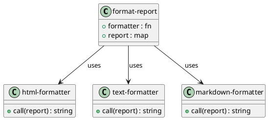

# 第 5 章 Strategy -- 関数は最良の戦略

## はじめに

Strategy パターンは、アルゴリズム全体を入れ替え可能にするパターンです。オブジェクト指向言語ではインターフェースと実装クラスの組み合わせで実現しますが、Clojure では関数がそのまま戦略になるため、パターンが言語機能に吸収されます。

---

## パターンの構造



**登場人物**:

- **format-report**: コンテキスト。戦略関数を受け取り、レポートデータに適用する
- **html-formatter / text-formatter / markdown-formatter**: 具象戦略。それぞれ異なるフォーマットで整形する

---

## Clojure イディオム: 戦略を関数として渡す

```clojure
(defn format-report
  "レポートデータを受け取り、formatter 関数で整形する。"
  [formatter report]
  (formatter report))
```

各戦略は独立した関数として定義します。

```clojure
;; --- HTML 戦略 ---
(defn html-formatter [{:keys [title items]}]
  (str "<html><head><title>" title "</title></head><body>\n"
       (apply str (map #(str "  <p>" % "</p>\n") items))
       "</body></html>\n"))

;; --- Plain Text 戦略 ---
(defn text-formatter [{:keys [title items]}]
  (str "=== " title " ===\n"
       (apply str (map #(str "  - " % "\n") items))
       "==========\n"))

;; --- Markdown 戦略 ---
(defn markdown-formatter [{:keys [title items]}]
  (str "# " title "\n\n"
       (apply str (map #(str "- " % "\n") items))))
```

---

## TDD で作る

### Red: 失敗するテストを書く

```clojure
(def sample-report {:title "Monthly Sales" :items ["Item A" "Item B" "Item C"]})

(deftest html-strategy-test
  (testing "HTML 戦略でレポートを整形する"
    (let [result (format-report html-formatter sample-report)]
      (is (clojure.string/includes? result "<html>"))
      (is (clojure.string/includes? result "Monthly Sales"))
      (is (clojure.string/includes? result "<p>Item A</p>")))))

(deftest markdown-strategy-test
  (testing "Markdown 戦略でレポートを整形する"
    (let [result (format-report markdown-formatter sample-report)]
      (is (clojure.string/includes? result "# Monthly Sales"))
      (is (clojure.string/includes? result "- Item A")))))
```

### Green: 最小限の実装

```clojure
(defn format-report [formatter report]
  (formatter report))

(defn html-formatter [{:keys [title items]}]
  (str "<html><head><title>" title "</title></head><body>\n"
       (apply str (map #(str "  <p>" % "</p>\n") items))
       "</body></html>\n"))
```

### Refactor: 任意の関数が戦略になることを確認

戦略は任意の関数で差し替えられます。無名関数をインラインで渡すことも可能です。

```clojure
(deftest strategy-is-just-a-function-test
  (testing "戦略は任意の関数で差し替えられる"
    (let [custom-fn (fn [{:keys [title]}] (str "Custom: " title))
          result    (format-report custom-fn sample-report)]
      (is (= "Custom: Monthly Sales" result)))))

(deftest empty-items-strategy-test
  (testing "空のアイテムリストでも正常に動作する"
    (let [result (format-report text-formatter {:title "Empty" :items []})]
      (is (clojure.string/includes? result "=== Empty ===")))))
```

---

## Template Method との違い

Template Method は骨格の中の一部ステップを差し替えるのに対し、Strategy はアルゴリズム全体を差し替えます。Clojure ではどちらも高階関数で表現でき、その境界は曖昧になります。

| 観点 | Template Method | Strategy |
|------|----------------|----------|
| 差し替え範囲 | アルゴリズムの一部ステップ | アルゴリズム全体 |
| Clojure での表現 | マップの中の関数 | 関数そのもの |
| 柔軟性 | 骨格は固定 | 完全に自由 |

---

## 他言語との比較

| 言語 | 実装方法 |
|------|---------|
| Java | Strategy インターフェース + 実装クラス |
| Ruby | Proc / ブロック + 委譲 |
| Python | 関数オブジェクト + 委譲 |
| Clojure | 関数をそのまま引数に渡す |

---

## まとめ

- Strategy パターンは「アルゴリズム全体を差し替え可能にする」パターン
- Clojure では関数が第一級オブジェクトであるため、パターンが言語機能に吸収される
- `format-report` のコンテキスト関数は 1 行で済む（`(formatter report)`）
- 新しい戦略の追加は新しい関数を定義するだけ
- 無名関数をインラインで渡すこともでき、最大限の柔軟性を持つ
