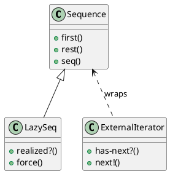

# 第 6 章 Iterator -- シーケンス抽象という究極の反復子

## はじめに

Iterator パターンは、コレクションの内部構造を隠したまま順番に要素へアクセスするためのパターンです。Clojure では `seq` 抽象と遅延評価がこの役割を標準で担います。

## パターンの構造



## Clojure イディオム: seq と lazy-seq

```clojure
;; 外部イテレータ風（通常は不要）
(defn external-iterator [coll]
  (let [state (atom (seq coll))]
    {:has-next? (fn [] (boolean @state))
     :next!     (fn []
                  (let [current (first @state)]
                    (swap! state next)
                    current))}))

;; 遅延シーケンス
(defn fibonacci []
  (letfn [(fib [a b] (lazy-seq (cons a (fib b (+ a b)))))]
    (fib 0 1)))
```

## TDD で作る

### Red: 失敗するテストを書く

```clojure
(deftest fibonacci-test
  (testing "フィボナッチ数列の最初の10項を取得する"
    (is (= [0 1 1 2 3 5 8 13 21 34] (take 10 (fibonacci))))))
```

### Green: 最小限の実装

```clojure
(defn fibonacci []
  (letfn [(fib [a b] (lazy-seq (cons a (fib b (+ a b)))))]
    (fib 0 1)))
```

### Refactor

通常の Clojure コードでは外部イテレータを自作するより、`map`、`filter`、`reduce`、`take` などのシーケンス API に寄せたほうが読みやすくなります。

## まとめ

Clojure では Iterator パターンを意識する必要はほとんどありません。シーケンス抽象が言語の根幹に組み込まれているからです。
