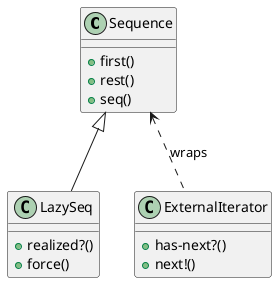

# 第 6 章 Iterator -- シーケンス抽象という究極の反復子

## パターンの意図

Iterator パターンは、コレクションの内部構造を公開せずに、要素へのアクセスを順番に行えるようにするパターンです。

## Clojure での解釈

Clojure のシーケンス抽象（seq）は Iterator パターンの究極の実装です。`map`、`filter`、`reduce`、`take`、`drop` といった関数群が、あらゆるコレクションに対して統一的なインターフェースを提供します。さらに `lazy-seq` による遅延評価は、無限シーケンスさえ扱えます。

## 実装

```clojure
;; 外部イテレータ風（通常は不要）
(defn external-iterator [coll]
  (let [state (atom (seq coll))]
    {:has-next? (fn [] (boolean @state))
     :next!     (fn []
                  (let [current (first @state)]
                    (swap! state next)
                    current))}))

;; 遅延シーケンス
(defn fibonacci []
  (letfn [(fib [a b] (lazy-seq (cons a (fib b (+ a b)))))]
    (fib 0 1)))
```

## クラス図



## テスト

```clojure
(deftest fibonacci-test
  (testing "フィボナッチ数列の最初の10項を取得する"
    (is (= [0 1 1 2 3 5 8 13 21 34] (take 10 (fibonacci))))))
```

## まとめ

Clojure では Iterator パターンを意識する必要はほとんどありません。シーケンス抽象が言語の根幹に組み込まれているからです。
