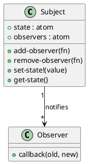

# 第 6 章 Observer -- atom と watch による状態監視

## はじめに

Observer パターンは、状態変化を複数の関心事へ自動通知するパターンです。Clojure では `atom` と `add-watch` がこの問題に直接対応しており、手動実装も比較的簡潔です。

---

## パターンの構造



**登場人物**:

- **Subject**: 監視対象。状態と observer リストを持つ
- **Observer**: コールバック関数。状態変化時に `(fn [old-val new-val])` の形式で呼ばれる

---

## Clojure イディオム: atom + コールバック

### 手動実装

```clojure
(defn create-subject
  "監視対象を作成する。state-atom と observers リストを持つ。"
  [initial-value]
  {:state     (atom initial-value)
   :observers (atom [])})

(defn add-observer
  "observer 関数を追加する。observer は (fn [old-val new-val]) の形式。"
  [subject observer-fn]
  (swap! (:observers subject) conj observer-fn))

(defn remove-observer
  "observer 関数を削除する。"
  [subject observer-fn]
  (swap! (:observers subject) (fn [obs] (remove #(= % observer-fn) obs))))

(defn set-state!
  "状態を更新し、全 observer に通知する。"
  [subject new-value]
  (let [old-value @(:state subject)]
    (reset! (:state subject) new-value)
    (doseq [observer @(:observers subject)]
      (observer old-value new-value))))

(defn get-state
  "現在の状態を取得する。"
  [subject]
  @(:state subject))
```

### `add-watch` を使う簡易版

```clojure
(defn create-watched-atom
  "add-watch を使ったシンプルな observer。"
  [initial-value]
  (atom initial-value))

(defn watch!
  "atom に watcher を追加する。"
  [a key callback]
  (add-watch a key (fn [_key _ref old-val new-val]
                     (callback old-val new-val))))
```

---

## TDD で作る

### Red: 失敗するテストを書く

```clojure
(deftest observer-notification-test
  (testing "状態変更時に observer が通知される"
    (let [subject  (create-subject 0)
          received (atom [])]
      (add-observer subject (fn [old new] (swap! received conj {:old old :new new})))
      (set-state! subject 42)
      (is (= [{:old 0 :new 42}] @received)))))
```

### Green: 最小限の実装

```clojure
(defn create-subject [initial-value]
  {:state     (atom initial-value)
   :observers (atom [])})

(defn add-observer [subject observer-fn]
  (swap! (:observers subject) conj observer-fn))

(defn set-state! [subject new-value]
  (let [old-value @(:state subject)]
    (reset! (:state subject) new-value)
    (doseq [observer @(:observers subject)]
      (observer old-value new-value))))
```

### Refactor: remove-observer と get-state を追加

observer の削除と状態の取得を追加します。

```clojure
(deftest remove-observer-test
  (testing "observer を削除すると通知されなくなる"
    (let [subject  (create-subject 0)
          received (atom [])
          obs-fn   (fn [_ new] (swap! received conj new))]
      (add-observer subject obs-fn)
      (set-state! subject 1)
      (remove-observer subject obs-fn)
      (set-state! subject 2)
      (is (= [1] @received)))))

(deftest create-subject-test
  (testing "subject を作成し初期値を持つ"
    (let [subject (create-subject 0)]
      (is (= 0 (get-state subject))))))

(deftest add-watch-test
  (testing "add-watch を使った簡易版 observer"
    (let [a       (create-watched-atom 0)
          changes (atom [])]
      (watch! a :test (fn [old new] (swap! changes conj {:old old :new new})))
      (reset! a 10)
      (is (= [{:old 0 :new 10}] @changes)))))
```

---

## 他言語との比較

| 言語 | 実装方法 |
|------|---------|
| Java | Observer/Observable インターフェース、PropertyChangeListener |
| Ruby | Observable モジュール |
| Python | コールバックリスト、signals |
| Clojure | atom + add-watch（言語組み込み） |

Clojure の `add-watch` は Observer パターンの組み込み実装と言えます。手動実装も atom と関数のリストで簡潔に表現できます。

---

## まとめ

- Observer は「状態変化を自動通知する」パターン
- Clojure では `atom` + `add-watch` が Observer パターンを言語レベルでサポートする
- 手動実装でも atom と関数リストで簡潔に表現できる
- `remove-observer` で observer の動的な追加・削除が可能
- `get-state` で現在の状態をいつでも取得できる
