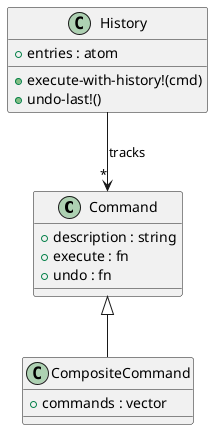

# 第 7 章 Command -- マップとクロージャで操作を具体化

## パターンの意図

Command パターンは、リクエストをオブジェクトとしてカプセル化し、パラメータ化、キューイング、ログ記録、undo を可能にするパターンです。

## Clojure での解釈

コマンドをマップ `{:execute fn, :undo fn, :description str}` で表現します。クロージャが状態をキャプチャするため、コマンドオブジェクトの代わりにマップと関数で十分です。

## 実装

```clojure
(defn make-command [description execute-fn undo-fn]
  {:description description
   :execute     execute-fn
   :undo        undo-fn})

(defn execute [cmd] ((:execute cmd)))
(defn undo [cmd] ((:undo cmd)))

;; コンポジットコマンド
(defn composite-command [description commands]
  (make-command
    description
    (fn [] (doseq [cmd commands] (execute cmd)))
    (fn [] (doseq [cmd (reverse commands)] (undo cmd)))))
```

## クラス図



## テスト

```clojure
(deftest command-history-test
  (testing "コマンド履歴で undo ができる"
    (let [fs      (atom {})
          history (create-history)]
      (execute-with-history! history (create-file-command fs "x.txt" "xxx"))
      (execute-with-history! history (create-file-command fs "y.txt" "yyy"))
      (is (= {"x.txt" "xxx" "y.txt" "yyy"} @fs))
      (undo-last! history)
      (is (= {"x.txt" "xxx"} @fs)))))
```

## まとめ

Clojure のクロージャとマップの組み合わせは、Command パターンを非常にシンプルに表現します。コマンド履歴も atom のベクタで簡潔に実装できます。
