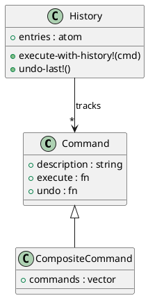

# 第 7 章 Command -- マップとクロージャで操作を具体化

## はじめに

Command パターンは、操作をオブジェクト化して実行や取り消しを統一的に扱うパターンです。Clojure ではコマンドをマップとクロージャで表現できるため、軽量な実装に向いています。

## パターンの構造



## Clojure イディオム: マップに操作を閉じ込める

```clojure
(defn make-command [description execute-fn undo-fn]
  {:description description
   :execute     execute-fn
   :undo        undo-fn})

(defn execute [cmd] ((:execute cmd)))
(defn undo [cmd] ((:undo cmd)))

(defn composite-command [description commands]
  (make-command
    description
    (fn [] (doseq [cmd commands] (execute cmd)))
    (fn [] (doseq [cmd (reverse commands)] (undo cmd)))))
```

## TDD で作る

### Red: 失敗するテストを書く

```clojure
(deftest command-history-test
  (testing "コマンド履歴で undo ができる"
    (let [fs      (atom {})
          history (create-history)]
      (execute-with-history! history (create-file-command fs "x.txt" "xxx"))
      (execute-with-history! history (create-file-command fs "y.txt" "yyy"))
      (is (= {"x.txt" "xxx" "y.txt" "yyy"} @fs))
      (undo-last! history)
      (is (= {"x.txt" "xxx"} @fs)))))
```

### Green: 最小限の実装

```clojure
(defn make-command [description execute-fn undo-fn]
  {:description description
   :execute     execute-fn
   :undo        undo-fn})

(defn execute [cmd] ((:execute cmd)))
(defn undo [cmd] ((:undo cmd)))
```

### Refactor

複数コマンドの一括実行は `composite-command` に、履歴管理は `history` に分離すると責務が明確になります。

## まとめ

Clojure のクロージャとマップの組み合わせは、Command パターンを非常にシンプルに表現します。コマンド履歴も atom のベクタで簡潔に実装できます。
