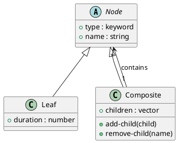

# 第 7 章 Composite -- 再帰データとマルチメソッド

## はじめに

Composite パターンは、個別要素と複合要素を同じように扱うためのパターンです。Clojure では再帰的なマップ / ベクタ構造とマルチメソッドで、ツリーを自然に表現できます。

---

## パターンの構造



**登場人物**:

- **Node**: 共通のインターフェース。`:type` キーワードでディスパッチする
- **Leaf**: リーフノード（タスク）。名前と所要時間を持つ
- **Composite**: コンポジットノード（プロジェクト）。子ノードのベクタを持つ

---

## Clojure イディオム: 再帰データ + マルチメソッド

### ノードの生成

```clojure
(defn leaf
  "リーフノード（タスク）を作成する。"
  [name duration]
  {:type :leaf :name name :duration duration})

(defn composite
  "コンポジットノード（プロジェクト）を作成する。"
  [name & children]
  {:type :composite :name name :children (vec children)})
```

### 子ノードの操作

```clojure
(defn add-child
  "コンポジットに子ノードを追加する。"
  [parent child]
  (update parent :children conj child))

(defn remove-child
  "コンポジットから指定名の子ノードを削除する。"
  [parent child-name]
  (update parent :children (fn [cs] (vec (remove #(= (:name %) child-name) cs)))))
```

### マルチメソッドによるディスパッチ

```clojure
(defmulti total-duration
  "ノードの合計所要時間を計算する。"
  :type)

(defmethod total-duration :leaf [node]
  (:duration node))

(defmethod total-duration :composite [node]
  (reduce + 0 (map total-duration (:children node))))

(defmulti display
  "ノードをインデント付きで表示する。"
  (fn [node _depth] (:type node)))

(defmethod display :leaf [node depth]
  (str (apply str (repeat depth "  ")) "- " (:name node)
       " (" (:duration node) "h)\n"))

(defmethod display :composite [node depth]
  (str (apply str (repeat depth "  ")) "+ " (:name node) "\n"
       (apply str (map #(display % (inc depth)) (:children node)))))
```

---

## TDD で作る

### Red: 失敗するテストを書く

```clojure
(deftest nested-composite-test
  (testing "ネストされたコンポジットの合計所要時間を計算する"
    (let [sub1    (composite "Backend" (leaf "API" 4.0) (leaf "DB" 3.0))
          sub2    (composite "Frontend" (leaf "UI" 5.0) (leaf "CSS" 2.0))
          project (composite "Full Project" sub1 sub2)]
      (is (= 14.0 (total-duration project))))))
```

### Green: 最小限の実装

```clojure
(defn leaf [name duration]
  {:type :leaf :name name :duration duration})

(defn composite [name & children]
  {:type :composite :name name :children (vec children)})

(defmulti total-duration :type)

(defmethod total-duration :leaf [node]
  (:duration node))

(defmethod total-duration :composite [node]
  (reduce + 0 (map total-duration (:children node))))
```

### Refactor: add-child、remove-child、display を追加

```clojure
(deftest add-child-test
  (testing "コンポジットに子を追加する"
    (let [project  (composite "Project" (leaf "Task1" 1.0))
          project' (add-child project (leaf "Task2" 2.0))]
      (is (= 3.0 (total-duration project'))))))

(deftest remove-child-test
  (testing "コンポジットから子を削除する"
    (let [project  (composite "Project" (leaf "Task1" 1.0) (leaf "Task2" 2.0))
          project' (remove-child project "Task1")]
      (is (= 2.0 (total-duration project'))))))

(deftest display-test
  (testing "ツリーを文字列で表示する"
    (let [project (composite "Project" (leaf "Task1" 1.0) (leaf "Task2" 2.0))
          result  (display project 0)]
      (is (clojure.string/includes? result "+ Project"))
      (is (clojure.string/includes? result "- Task1"))
      (is (clojure.string/includes? result "- Task2")))))
```

---

## 他言語との比較

| 言語 | 実装方法 |
|------|---------|
| Java | Component/Leaf/Composite クラス階層 |
| Ruby | クラス階層 + Enumerable |
| Python | ABC + 再帰クラス |
| Clojure | 再帰マップ + マルチメソッド |

Clojure ではデータ構造が不変なので、`add-child` は元のツリーを壊さず新しいツリーを返します。

---

## まとめ

- Composite は「個別要素と複合要素を同一視する」パターン
- Clojure ではマップとベクタの再帰構造でツリーを表現する
- マルチメソッドで `:type` に応じたディスパッチを行う
- `add-child` / `remove-child` は不変データを操作し、新しいツリーを返す
- `display` でインデント付きのツリー表示が可能
- データとしてのツリーはシリアライズや変換も容易
