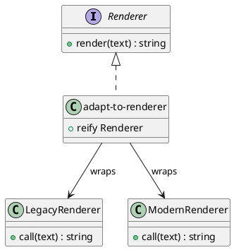

# 第 8 章 Adapter -- プロトコルによる型適合

## はじめに

Adapter パターンは、互換性のないインターフェース同士を接続するパターンです。Clojure ではプロトコルと `reify` によって、既存関数や既存データを必要な形へすばやく適合させられます。

## パターンの構造



## Clojure イディオム: protocol + reify

```clojure
(defprotocol Renderer
  (render [this text]))

(defn adapt-to-renderer [render-fn]
  (reify Renderer
    (render [_ text] (render-fn text))))

(defn csv->maps [csv-string]
  (let [lines  (clojure.string/split-lines csv-string)
        header (mapv clojure.string/trim (clojure.string/split (first lines) #","))
        rows   (rest lines)]
    (mapv (fn [row]
            (zipmap (map keyword header)
                    (mapv clojure.string/trim (clojure.string/split row #","))))
          rows)))
```

## TDD で作る

### Red: 失敗するテストを書く

```clojure
(deftest legacy-adapter-test
  (testing "レガシーレンダラーをプロトコルに適合させる"
    (let [renderer (adapt-to-renderer legacy-renderer)]
      (is (= "HELLO WORLD" (render renderer "hello world"))))))
```

### Green: 最小限の実装

```clojure
(defprotocol Renderer
  (render [this text]))

(defn adapt-to-renderer [render-fn]
  (reify Renderer
    (render [_ text] (render-fn text))))
```

### Refactor

関数アダプタとデータ変換アダプタの両方を並べておくと、Adapter が「型を合わせる」だけでなく「表現を変換する」役割も持つことが分かります。

## まとめ

Clojure のプロトコルと `reify` は、軽量なアダプタを作成する強力な手段です。関数をラップするだけで型適合が完了します。
