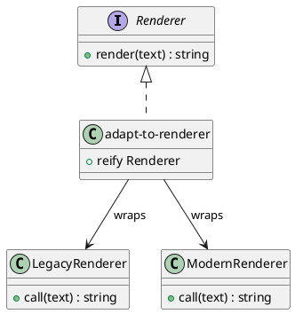

# 第 8 章 Adapter -- プロトコルによる型適合

## パターンの意図

Adapter パターンは、互換性のないインターフェースを持つクラスを協調して動作させるパターンです。

## Clojure での解釈

Clojure のプロトコルは共通のインターフェースを定義する手段です。`reify` を使えば、任意の関数をプロトコルに適合させるアダプターを即座に作成できます。また、データフォーマットの変換もアダプターの一種です。

## 実装

```clojure
(defprotocol Renderer
  (render [this text]))

(defn adapt-to-renderer [render-fn]
  (reify Renderer
    (render [_ text] (render-fn text))))

;; データフォーマットアダプター
(defn csv->maps [csv-string]
  (let [lines  (clojure.string/split-lines csv-string)
        header (mapv clojure.string/trim (clojure.string/split (first lines) #","))
        rows   (rest lines)]
    (mapv (fn [row]
            (zipmap (map keyword header)
                    (mapv clojure.string/trim (clojure.string/split row #","))))
          rows)))
```

## クラス図



## テスト

```clojure
(deftest legacy-adapter-test
  (testing "レガシーレンダラーをプロトコルに適合させる"
    (let [renderer (adapt-to-renderer legacy-renderer)]
      (is (= "HELLO WORLD" (render renderer "hello world"))))))
```

## まとめ

Clojure のプロトコルと reify は、軽量なアダプターを作成する強力な手段です。関数をラップするだけで型適合が完了します。
