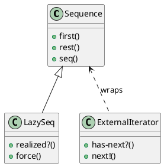

# 第 8 章 Iterator -- シーケンス抽象という究極の反復子

## はじめに

Iterator パターンは、コレクションの内部構造を隠したまま順番に要素へアクセスするためのパターンです。Clojure では `seq` 抽象と遅延評価がこの役割を標準で担うため、パターンが言語機能に吸収されます。

---

## パターンの構造



**登場人物**:

- **Sequence**: Clojure のシーケンス抽象。`first`、`rest`、`seq` を提供する
- **LazySeq**: 遅延シーケンス。必要になるまで値を計算しない
- **ExternalIterator**: 外部イテレータ風のインターフェース（通常は不要）

---

## Clojure イディオム: seq と lazy-seq

### 外部イテレータ風（学習用）

```clojure
(defn external-iterator
  "外部イテレータ風のインターフェースを提供する。
   seq を内部に持ち、next で要素を取得する。"
  [coll]
  (let [state (atom (seq coll))]
    {:has-next? (fn [] (boolean @state))
     :next!     (fn []
                  (let [current (first @state)]
                    (swap! state next)
                    current))}))
```

### フィルタリング・変換・集約

```clojure
(defn filter-by
  "述語でフィルタリングする。"
  [pred coll]
  (filter pred coll))

(defn transform
  "変換関数を適用する。"
  [f coll]
  (map f coll))

(defn aggregate
  "集約関数を適用する。"
  [f init coll]
  (reduce f init coll))
```

### 遅延シーケンス

```clojure
(defn fibonacci
  "フィボナッチ数列の遅延シーケンス。"
  []
  (letfn [(fib [a b] (lazy-seq (cons a (fib b (+ a b)))))]
    (fib 0 1)))

(defn take-while-under
  "指定値未満の要素を取得する。"
  [limit coll]
  (take-while #(< % limit) coll))
```

---

## TDD で作る

### Red: 失敗するテストを書く

```clojure
(deftest fibonacci-test
  (testing "フィボナッチ数列の最初の10項を取得する"
    (is (= [0 1 1 2 3 5 8 13 21 34] (take 10 (fibonacci))))))
```

### Green: 最小限の実装

```clojure
(defn fibonacci []
  (letfn [(fib [a b] (lazy-seq (cons a (fib b (+ a b)))))]
    (fib 0 1)))
```

### Refactor: フィルタリング・変換・集約のテストを追加

```clojure
(deftest external-iterator-test
  (testing "外部イテレータで要素を順に取得する"
    (let [iter     (external-iterator [1 2 3])
          has-next (:has-next? iter)
          next!    (:next! iter)]
      (is (has-next))
      (is (= 1 (next!)))
      (is (= 2 (next!)))
      (is (= 3 (next!)))
      (is (not (has-next))))))

(deftest filter-by-test
  (testing "述語でフィルタリングする"
    (is (= [2 4 6] (vec (filter-by even? [1 2 3 4 5 6]))))))

(deftest transform-test
  (testing "変換関数を適用する"
    (is (= [2 4 6] (vec (transform #(* 2 %) [1 2 3]))))))

(deftest aggregate-test
  (testing "集約関数を適用する"
    (is (= 15 (aggregate + 0 [1 2 3 4 5])))))

(deftest take-while-under-test
  (testing "指定値未満の要素を取得する"
    (is (= [0 1 1 2 3 5 8] (vec (take-while-under 10 (fibonacci)))))))
```

---

## 他言語との比較

| 言語 | 実装方法 |
|------|---------|
| Java | Iterator インターフェース + hasNext/next |
| Ruby | Enumerable モジュール + each |
| Python | \_\_iter\_\_ / \_\_next\_\_ プロトコル |
| Clojure | seq 抽象（言語組み込み） |

---

## まとめ

- Iterator は「コレクションの走査方法を統一する」パターン
- Clojure では `seq` 抽象が言語の根幹に組み込まれており、パターンが不要
- `map`、`filter`、`reduce`、`take-while` などの標準関数がイテレーション操作を提供
- `lazy-seq` により無限シーケンスも安全に扱える
- 外部イテレータは学習目的では有用だが、通常はシーケンス API を使う
