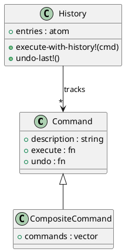

# 第 9 章 Command -- マップとクロージャで操作を具体化

## はじめに

Command パターンは、操作をオブジェクト化して実行や取り消しを統一的に扱うパターンです。Clojure ではコマンドをマップとクロージャで表現できるため、軽量な実装に向いています。

---

## パターンの構造



**登場人物**:

- **Command**: コマンドマップ。`:execute`、`:undo`、`:description` を持つ
- **CompositeCommand**: 複数コマンドをまとめて実行する
- **History**: コマンド履歴を管理し、undo を可能にする

---

## Clojure イディオム: マップに操作を閉じ込める

### 基本コマンド

```clojure
(defn make-command
  "コマンドを作成する。"
  [description execute-fn undo-fn]
  {:description description
   :execute     execute-fn
   :undo        undo-fn})

(defn execute
  "コマンドを実行する。"
  [cmd]
  ((:execute cmd)))

(defn undo
  "コマンドを取り消す。"
  [cmd]
  ((:undo cmd)))
```

### ファイル操作コマンド

```clojure
(defn create-file-command
  "ファイル作成コマンド（シミュレーション）。state-atom にファイルリストを保持。"
  [state-atom filename content]
  (make-command
    (str "Create file: " filename)
    (fn [] (swap! state-atom assoc filename content))
    (fn [] (swap! state-atom dissoc filename))))

(defn delete-file-command
  "ファイル削除コマンド。"
  [state-atom filename]
  (let [backup (atom nil)]
    (make-command
      (str "Delete file: " filename)
      (fn []
        (reset! backup (get @state-atom filename))
        (swap! state-atom dissoc filename))
      (fn []
        (when @backup
          (swap! state-atom assoc filename @backup))))))
```

### コンポジットコマンド

```clojure
(defn composite-command
  "複数のコマンドをまとめて実行するコンポジットコマンド。"
  [description commands]
  (make-command
    description
    (fn [] (doseq [cmd commands] (execute cmd)))
    (fn [] (doseq [cmd (reverse commands)] (undo cmd)))))
```

### コマンド履歴

```clojure
(defn create-history
  "コマンド履歴を作成する。"
  []
  (atom []))

(defn execute-with-history!
  "コマンドを実行し、履歴に記録する。"
  [history cmd]
  (execute cmd)
  (swap! history conj cmd))

(defn undo-last!
  "最後に実行したコマンドを取り消す。"
  [history]
  (when-let [cmd (peek @history)]
    (undo cmd)
    (swap! history pop)))
```

---

## TDD で作る

### Red: 失敗するテストを書く

```clojure
(deftest command-history-test
  (testing "コマンド履歴で undo ができる"
    (let [fs      (atom {})
          history (create-history)]
      (execute-with-history! history (create-file-command fs "x.txt" "xxx"))
      (execute-with-history! history (create-file-command fs "y.txt" "yyy"))
      (is (= {"x.txt" "xxx" "y.txt" "yyy"} @fs))
      (undo-last! history)
      (is (= {"x.txt" "xxx"} @fs))
      (undo-last! history)
      (is (= {} @fs)))))
```

### Green: 最小限の実装

```clojure
(defn make-command [description execute-fn undo-fn]
  {:description description
   :execute     execute-fn
   :undo        undo-fn})

(defn execute [cmd] ((:execute cmd)))
(defn undo [cmd] ((:undo cmd)))
```

### Refactor: コンポジットコマンドとファイル操作を追加

```clojure
(deftest undo-command-test
  (testing "コマンドの取り消しができる"
    (let [fs  (atom {})
          cmd (create-file-command fs "test.txt" "hello")]
      (execute cmd)
      (is (= {"test.txt" "hello"} @fs))
      (undo cmd)
      (is (= {} @fs)))))

(deftest delete-and-undo-test
  (testing "削除コマンドの実行と取り消し"
    (let [fs      (atom {"readme.md" "# README"})
          del-cmd (delete-file-command fs "readme.md")]
      (execute del-cmd)
      (is (nil? (get @fs "readme.md")))
      (undo del-cmd)
      (is (= "# README" (get @fs "readme.md"))))))

(deftest composite-command-test
  (testing "コンポジットコマンドで複数操作をまとめて実行する"
    (let [fs   (atom {})
          cmds [(create-file-command fs "a.txt" "aaa")
                (create-file-command fs "b.txt" "bbb")]
          comp-cmd (composite-command "Create files" cmds)]
      (execute comp-cmd)
      (is (= {"a.txt" "aaa" "b.txt" "bbb"} @fs))
      (undo comp-cmd)
      (is (= {} @fs)))))
```

---

## 他言語との比較

| 言語 | 実装方法 |
|------|---------|
| Java | Command インターフェース + 具象クラス |
| Ruby | Command クラス + Proc |
| Python | Command クラス + callable |
| Clojure | マップ {:execute fn, :undo fn} |

---

## まとめ

- Command は「操作をオブジェクト化し、実行と取り消しを統一する」パターン
- Clojure ではコマンドをマップ（`:execute`、`:undo`、`:description`）で表現する
- クロージャが状態をキャプチャし、undo に必要な情報を保持する
- `composite-command` で複数操作をまとめて実行・取り消しできる
- `create-history` + `execute-with-history!` + `undo-last!` で履歴管理を行う
