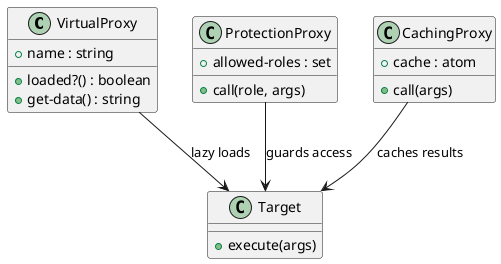

# 第 9 章 Proxy -- delay と関数ラッパーによる代理

## はじめに

Proxy パターンは、本体へのアクセスを仲介して制御するパターンです。Clojure では `delay`、`atom`、クロージャを組み合わせることで、遅延初期化や権限制御、キャッシュを関数レベルで表現できます。

## パターンの構造



## Clojure イディオム: delay と関数ラッパー

```clojure
(defn virtual-proxy [name]
  (let [resource (delay (create-heavy-resource name))]
    {:name       name
     :loaded?    (fn [] (realized? resource))
     :get-data   (fn [] (:data (force resource)))}))

(defn protection-proxy [target-fn allowed-roles]
  (fn [role & args]
    (if (contains? (set allowed-roles) role)
      (apply target-fn args)
      (throw (ex-info "Access denied" {:role role})))))

(defn caching-proxy [target-fn]
  (let [cache (atom {})]
    {:call  (fn [& args]
              (if-let [cached (get @cache args)]
                cached
                (let [result (apply target-fn args)]
                  (swap! cache assoc args result)
                  result)))
     :cache (fn [] @cache)}))
```

## TDD で作る

### Red: 失敗するテストを書く

```clojure
(deftest caching-proxy-test
  (testing "Caching Proxy は同じ引数の結果をキャッシュする"
    (let [call-count (atom 0)
          expensive  (fn [x] (swap! call-count inc) (* x x))
          proxy      (caching-proxy expensive)]
      (is (= 25 ((:call proxy) 5)))
      (is (= 25 ((:call proxy) 5)))
      (is (= 1 @call-count)))))
```

### Green: 最小限の実装

```clojure
(defn caching-proxy [target-fn]
  (let [cache (atom {})]
    {:call  (fn [& args]
              (if-let [cached (get @cache args)]
                cached
                (let [result (apply target-fn args)]
                  (swap! cache assoc args result)
                  result)))
     :cache (fn [] @cache)}))
```

### Refactor

キャッシュ、保護、遅延初期化を別関数に切り出すと、Proxy のバリエーションごとの責務を比較しやすくなります。

## まとめ

Clojure の `delay`、`atom`、クロージャにより、Proxy パターンの各バリエーションを関数レベルで簡潔に実装できます。
