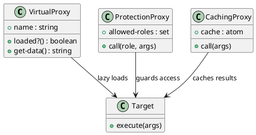

# 第 9 章 Proxy -- delay と関数ラッパーによる代理

## パターンの意図

Proxy パターンは、他のオブジェクトへのアクセスを制御するための代理を提供するパターンです。

## Clojure での解釈

- **Virtual Proxy**: `delay` / `force` で遅延初期化を実現
- **Protection Proxy**: 関数ラッパーでアクセス制御
- **Logging Proxy**: 関数ラッパーでログ記録
- **Caching Proxy**: atom でキャッシュを管理

## 実装

```clojure
;; Virtual Proxy
(defn virtual-proxy [name]
  (let [resource (delay (create-heavy-resource name))]
    {:name       name
     :loaded?    (fn [] (realized? resource))
     :get-data   (fn [] (:data (force resource)))}))

;; Protection Proxy
(defn protection-proxy [target-fn allowed-roles]
  (fn [role & args]
    (if (contains? (set allowed-roles) role)
      (apply target-fn args)
      (throw (ex-info "Access denied" {:role role})))))

;; Caching Proxy
(defn caching-proxy [target-fn]
  (let [cache (atom {})]
    {:call  (fn [& args]
              (if-let [cached (get @cache args)]
                cached
                (let [result (apply target-fn args)]
                  (swap! cache assoc args result)
                  result)))
     :cache (fn [] @cache)}))
```

## クラス図



## テスト

```clojure
(deftest caching-proxy-test
  (testing "Caching Proxy は同じ引数の結果をキャッシュする"
    (let [call-count (atom 0)
          expensive  (fn [x] (swap! call-count inc) (* x x))
          proxy      (caching-proxy expensive)]
      (is (= 25 ((:call proxy) 5)))
      (is (= 25 ((:call proxy) 5)))
      (is (= 1 @call-count)))))
```

## まとめ

Clojure の `delay`、`atom`、クロージャにより、Proxy パターンの各バリエーションを関数レベルで簡潔に実装できます。
