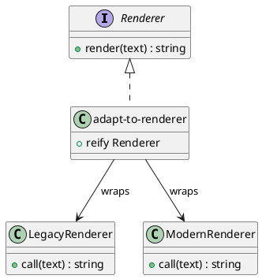

# 第 10 章 Adapter -- プロトコルによる型適合

## はじめに

Adapter パターンは、互換性のないインターフェース同士を接続するパターンです。Clojure ではプロトコルと `reify` によって、既存関数や既存データを必要な形へすばやく適合させられます。

---

## パターンの構造



**登場人物**:

- **Renderer**: 共通プロトコル。`render` メソッドを定義する
- **legacy-renderer / modern-renderer**: 既存の関数。プロトコルに準拠していない
- **adapt-to-renderer**: アダプター。任意の関数を Renderer プロトコルに適合させる

---

## Clojure イディオム: protocol + reify

### 共通プロトコルとレンダラー

```clojure
(defprotocol Renderer
  (render [this text] "テキストを描画する。"))

(defn legacy-renderer
  "レガシーレンダラーのシミュレーション。大文字変換する。"
  [text]
  (clojure.string/upper-case text))

(defn modern-renderer
  "モダンレンダラー。Markdown 形式で出力する。"
  [text]
  (str "**" text "**"))
```

### アダプター

```clojure
(defn adapt-to-renderer
  "任意の (fn [text] -> string) を Renderer プロトコルに適合させる。"
  [render-fn]
  (reify Renderer
    (render [_ text] (render-fn text))))
```

### データフォーマットアダプター

```clojure
(defn csv->maps
  "CSV 文字列（ヘッダー付き）をマップのシーケンスに変換する。"
  [csv-string]
  (let [lines  (clojure.string/split-lines csv-string)
        header (mapv clojure.string/trim (clojure.string/split (first lines) #","))
        rows   (rest lines)]
    (mapv (fn [row]
            (zipmap (map keyword header)
                    (mapv clojure.string/trim (clojure.string/split row #","))))
          rows)))

(defn maps->csv
  "マップのシーケンスを CSV 文字列に変換する。"
  [maps]
  (when (seq maps)
    (let [ks     (keys (first maps))
          header (clojure.string/join "," (map name ks))
          rows   (map (fn [m] (clojure.string/join "," (map #(get m %) ks))) maps)]
      (clojure.string/join "\n" (cons header rows)))))
```

---

## TDD で作る

### Red: 失敗するテストを書く

```clojure
(deftest legacy-adapter-test
  (testing "レガシーレンダラーをプロトコルに適合させる"
    (let [renderer (adapt-to-renderer legacy-renderer)]
      (is (= "HELLO WORLD" (render renderer "hello world"))))))
```

### Green: 最小限の実装

```clojure
(defprotocol Renderer
  (render [this text]))

(defn adapt-to-renderer [render-fn]
  (reify Renderer
    (render [_ text] (render-fn text))))
```

### Refactor: モダンレンダラーとデータ変換を追加

```clojure
(deftest modern-adapter-test
  (testing "モダンレンダラーをプロトコルに適合させる"
    (let [renderer (adapt-to-renderer modern-renderer)]
      (is (= "**hello**" (render renderer "hello"))))))

(deftest csv-to-maps-test
  (testing "CSV 文字列をマップのシーケンスに変換する"
    (let [csv    "name,age,city\nAlice,30,Tokyo\nBob,25,Osaka"
          result (csv->maps csv)]
      (is (= 2 (count result)))
      (is (= "Alice" (:name (first result))))
      (is (= "Osaka" (:city (second result)))))))

(deftest maps-to-csv-test
  (testing "マップのシーケンスを CSV 文字列に変換する"
    (let [maps   [{:name "Alice" :age "30"} {:name "Bob" :age "25"}]
          result (maps->csv maps)]
      (is (clojure.string/includes? result "name"))
      (is (clojure.string/includes? result "Alice"))
      (is (clojure.string/includes? result "Bob")))))

(deftest roundtrip-test
  (testing "CSV -> Maps -> CSV のラウンドトリップ"
    (let [csv      "name,age\nAlice,30\nBob,25"
          maps     (csv->maps csv)
          csv-back (maps->csv maps)]
      (is (clojure.string/includes? csv-back "Alice"))
      (is (clojure.string/includes? csv-back "Bob")))))
```

---

## 他言語との比較

| 言語 | 実装方法 |
|------|---------|
| Java | Adapter クラス + 委譲 |
| Ruby | Adapter クラス + 特異メソッド |
| Python | Adapter クラス + \_\_getattr\_\_ |
| Clojure | プロトコル + reify |

---

## まとめ

- Adapter は「互換性のないインターフェースを接続する」パターン
- Clojure ではプロトコルと `reify` で軽量なアダプタを作成できる
- 関数をラップするだけで型適合が完了する
- データフォーマット変換（CSV <-> Maps）もアダプターの一種
- `csv->maps` と `maps->csv` でラウンドトリップが可能
