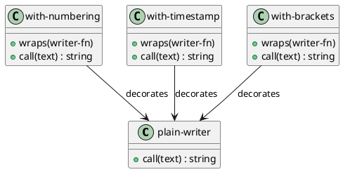

# 第 10 章 Decorator -- 関数合成による装飾

## はじめに

Decorator パターンは、既存の振る舞いを壊さずに責務を重ねるパターンです。Clojure では関数合成がそのままデコレータになるため、非常に直接的に書けます。

## パターンの構造



## Clojure イディオム: 高階関数のネスト

```clojure
(defn plain-writer [text] text)

(defn with-numbering [writer-fn]
  (fn [text]
    (let [result (writer-fn text)
          lines  (clojure.string/split-lines result)]
      (clojure.string/join
        "\n"
        (map-indexed (fn [i line] (str (inc i) ": " line)) lines)))))

(defn with-timestamp [writer-fn]
  (fn [text]
    (let [result (writer-fn text)]
      (str "[" (java.time.LocalDateTime/now) "]\n" result))))

(defn with-brackets [writer-fn]
  (fn [text]
    (str "<<< " (writer-fn text) " >>>")))
```

## TDD で作る

### Red: 失敗するテストを書く

```clojure
(deftest composed-decorators-test
  (testing "複数のデコレータを合成できる"
    (let [writer (with-uppercase (with-brackets plain-writer))
          result (writer "hello")]
      (is (= "<<< HELLO >>>" result)))))
```

### Green: 最小限の実装

```clojure
(defn plain-writer [text] text)

(defn with-brackets [writer-fn]
  (fn [text]
    (str "<<< " (writer-fn text) " >>>")))
```

### Refactor

行番号、タイムスタンプ、大文字化のような責務を個別の高階関数に切ると、合成順序による違いも追いやすくなります。

## まとめ

関数合成は Decorator パターンの最も自然な表現です。`comp` やネストされた高階関数呼び出しで、任意の数のデコレータを自由に組み合わせられます。
