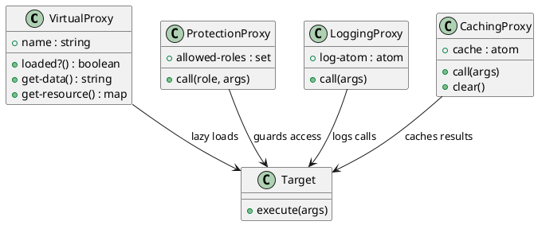

# 第 11 章 Proxy -- delay と関数ラッパーによる代理

## はじめに

Proxy パターンは、本体へのアクセスを仲介して制御するパターンです。Clojure では `delay`、`atom`、クロージャを組み合わせることで、遅延初期化・権限制御・ロギング・キャッシュを関数レベルで表現できます。

---

## パターンの構造



**登場人物**:

- **VirtualProxy**: 遅延初期化プロキシ。初回アクセス時にのみリソースを生成する
- **ProtectionProxy**: アクセス制御プロキシ。role が許可リストに含まれる場合のみ操作を許可する
- **LoggingProxy**: ロギングプロキシ。呼び出しをログに記録する
- **CachingProxy**: キャッシュプロキシ。同じ引数での呼び出し結果をキャッシュする

---

## Clojure イディオム: delay と関数ラッパー

### Virtual Proxy

```clojure
(defn create-heavy-resource
  "重い初期化処理をシミュレートする。"
  [name]
  (Thread/sleep 10)
  {:name name :data (str "Heavy data for " name) :loaded true})

(defn virtual-proxy
  "遅延初期化プロキシ。初回アクセス時にのみリソースを生成する。"
  [name]
  (let [resource (delay (create-heavy-resource name))]
    {:name       name
     :loaded?    (fn [] (realized? resource))
     :get-data   (fn [] (:data (force resource)))
     :get-resource (fn [] (force resource))}))
```

### Protection Proxy

```clojure
(defn protection-proxy
  "アクセス制御プロキシ。role が許可リストに含まれる場合のみ操作を許可する。"
  [target-fn allowed-roles]
  (fn [role & args]
    (if (contains? (set allowed-roles) role)
      (apply target-fn args)
      (throw (ex-info "Access denied" {:role role :allowed allowed-roles})))))
```

### Logging Proxy

```clojure
(defn logging-proxy
  "ロギングプロキシ。呼び出しをログに記録する。"
  [target-fn log-atom]
  (fn [& args]
    (swap! log-atom conj {:fn-name "target" :args args :timestamp (System/currentTimeMillis)})
    (apply target-fn args)))
```

### Caching Proxy

```clojure
(defn caching-proxy
  "キャッシュプロキシ。同じ引数での呼び出し結果をキャッシュする。"
  [target-fn]
  (let [cache (atom {})]
    {:call  (fn [& args]
              (if-let [cached (get @cache args)]
                cached
                (let [result (apply target-fn args)]
                  (swap! cache assoc args result)
                  result)))
     :cache (fn [] @cache)
     :clear (fn [] (reset! cache {}))}))
```

---

## TDD で作る

### Red: 失敗するテストを書く

```clojure
(deftest virtual-proxy-lazy-test
  (testing "Virtual Proxy は初回アクセスまでリソースを生成しない"
    (let [p       (virtual-proxy "TestResource")
          loaded? (:loaded? p)
          get-data (:get-data p)]
      (is (not (loaded?)))
      (is (= "Heavy data for TestResource" (get-data)))
      (is (loaded?)))))
```

### Green: 最小限の実装

```clojure
(defn virtual-proxy [name]
  (let [resource (delay (create-heavy-resource name))]
    {:name       name
     :loaded?    (fn [] (realized? resource))
     :get-data   (fn [] (:data (force resource)))}))
```

### Refactor: Protection、Logging、Caching Proxy を追加

```clojure
(deftest protection-proxy-allowed-test
  (testing "許可された role はアクセスできる"
    (let [secret-fn  (fn [x] (str "secret: " x))
          protected  (protection-proxy secret-fn [:admin :manager])]
      (is (= "secret: data" (protected :admin "data"))))))

(deftest protection-proxy-denied-test
  (testing "許可されていない role はアクセスが拒否される"
    (let [secret-fn  (fn [x] (str "secret: " x))
          protected  (protection-proxy secret-fn [:admin])]
      (is (thrown? clojure.lang.ExceptionInfo (protected :guest "data"))))))

(deftest logging-proxy-test
  (testing "Logging Proxy は呼び出しをログに記録する"
    (let [log     (atom [])
          add-fn  (fn [a b] (+ a b))
          proxied (logging-proxy add-fn log)]
      (is (= 5 (proxied 2 3)))
      (is (= 1 (count @log)))
      (is (= [2 3] (:args (first @log)))))))

(deftest caching-proxy-test
  (testing "Caching Proxy は同じ引数の結果をキャッシュする"
    (let [call-count (atom 0)
          expensive  (fn [x] (swap! call-count inc) (* x x))
          proxy      (caching-proxy expensive)]
      (is (= 25 ((:call proxy) 5)))
      (is (= 25 ((:call proxy) 5)))
      (is (= 1 @call-count))
      (is (= {[5] 25} ((:cache proxy)))))))
```

---

## 他言語との比較

| 言語 | 実装方法 |
|------|---------|
| Java | Proxy クラス、InvocationHandler |
| Ruby | method_missing による動的プロキシ |
| Python | \_\_getattr\_\_ による委譲 |
| Clojure | delay/force + 関数ラッパー |

---

## まとめ

- Proxy は「本体へのアクセスを仲介して制御する」パターン
- Clojure では 4 つのバリエーションを関数レベルで簡潔に実装できる
  - **Virtual Proxy**: `delay`/`force` で遅延初期化
  - **Protection Proxy**: 関数ラッパーでアクセス制御
  - **Logging Proxy**: 関数ラッパーで呼び出し記録
  - **Caching Proxy**: `atom` で結果をキャッシュ
- 各バリエーションは独立した関数として定義でき、責務が明確
