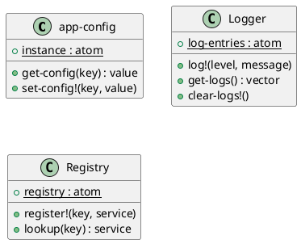

# 第 11 章 Singleton -- 名前空間レベルの唯一性

## パターンの意図

Singleton パターンは、クラスのインスタンスが 1 つだけであることを保証し、グローバルなアクセスポイントを提供するパターンです。

## Clojure での解釈

Clojure の `def` や `defonce` は名前空間レベルのシングルトンを自然に提供します。`atom` と組み合わせれば、状態を持つシングルトンも表現できます。

## 実装

```clojure
;; defonce で一度だけ初期化
(defonce app-config
  (atom {:database-url "jdbc:postgresql://localhost:5432/mydb"
         :max-connections 10
         :log-level :info}))

(defn get-config [key]
  (get @app-config key))

(defn set-config! [key value]
  (swap! app-config assoc key value))

;; ロガーシングルトン
(defonce ^:private log-entries (atom []))

(defn log! [level message]
  (swap! log-entries conj {:level level :message message}))
```

## クラス図



## テスト

```clojure
(deftest singleton-identity-test
  (testing "同じ atom への参照を共有している（シングルトン性）"
    (clear-logs!)
    (log! :info "first")
    (is (= 1 (log-count)))
    (log! :info "second")
    (is (= 2 (log-count)))
    (clear-logs!)))
```

## まとめ

Clojure では Singleton パターンのための特別な仕組みは不要です。`def` / `defonce` + `atom` が自然にシングルトンを提供します。
