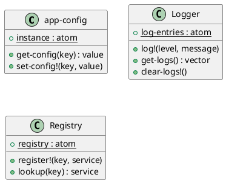

# 第 11 章 Singleton -- 名前空間レベルの唯一性

## はじめに

Singleton パターンは、共有すべきインスタンスを 1 つに限定するパターンです。Clojure では `def` や `defonce` が名前空間レベルの唯一性を自然に提供します。

## パターンの構造



## Clojure イディオム: defonce + atom

```clojure
(defonce app-config
  (atom {:database-url "jdbc:postgresql://localhost:5432/mydb"
         :max-connections 10
         :log-level :info}))

(defn get-config [key]
  (get @app-config key))

(defn set-config! [key value]
  (swap! app-config assoc key value))

(defonce ^:private log-entries (atom []))

(defn log! [level message]
  (swap! log-entries conj {:level level :message message}))
```

## TDD で作る

### Red: 失敗するテストを書く

```clojure
(deftest singleton-identity-test
  (testing "同じ atom への参照を共有している（シングルトン性）"
    (clear-logs!)
    (log! :info "first")
    (is (= 1 (log-count)))
    (log! :info "second")
    (is (= 2 (log-count)))
    (clear-logs!)))
```

### Green: 最小限の実装

```clojure
(defonce ^:private log-entries (atom []))

(defn log! [level message]
  (swap! log-entries conj {:level level :message message}))
```

### Refactor

設定、ログ、サービスレジストリのように用途別に singleton を分けると、1 つの巨大な共有状態へ責務が集中するのを防げます。

## まとめ

Clojure では Singleton パターンのための特別な仕組みは不要です。`def` / `defonce` + `atom` が自然にシングルトンを提供します。
