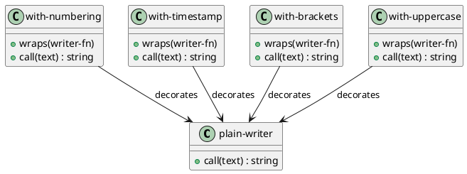

# 第 12 章 Decorator -- 関数合成による装飾

## はじめに

Decorator パターンは、既存の振る舞いを壊さずに責務を重ねるパターンです。Clojure では関数合成がそのままデコレータになるため、パターンが言語機能に吸収されます。

---

## パターンの構造



**登場人物**:

- **plain-writer**: 基本ライター。テキストをそのまま返す
- **with-numbering**: 行番号デコレータ
- **with-timestamp**: タイムスタンプデコレータ
- **with-brackets**: 括弧デコレータ
- **with-uppercase**: 大文字デコレータ

---

## Clojure イディオム: 高階関数のネスト

### 基本ライター

```clojure
(defn plain-writer
  "そのまま出力する基本ライター。"
  [text]
  text)
```

### デコレータ関数

各デコレータは `(fn [writer-fn] -> (fn [text] -> text))` の形式です。

```clojure
(defn with-numbering
  "行番号を付与するデコレータ。"
  [writer-fn]
  (fn [text]
    (let [result (writer-fn text)
          lines  (clojure.string/split-lines result)]
      (clojure.string/join
        "\n"
        (map-indexed (fn [i line] (str (inc i) ": " line)) lines)))))

(defn with-timestamp
  "タイムスタンプを付与するデコレータ。"
  [writer-fn]
  (fn [text]
    (let [result (writer-fn text)
          now    (java.time.LocalDateTime/now)
          fmt    (java.time.format.DateTimeFormatter/ofPattern "yyyy-MM-dd HH:mm:ss")]
      (str "[" (.format now fmt) "]\n" result))))

(defn with-brackets
  "括弧で囲むデコレータ。"
  [writer-fn]
  (fn [text]
    (let [result (writer-fn text)]
      (str "<<< " result " >>>"))))

(defn with-uppercase
  "大文字に変換するデコレータ。"
  [writer-fn]
  (fn [text]
    (let [result (writer-fn text)]
      (clojure.string/upper-case result))))
```

### 合成例

```clojure
;; 行番号付きライター
(def numbered-writer
  (with-numbering plain-writer))

;; タイムスタンプ + 行番号付きライター
(def timestamped-numbered-writer
  (with-timestamp (with-numbering plain-writer)))
```

---

## TDD で作る

### Red: 失敗するテストを書く

```clojure
(deftest composed-decorators-test
  (testing "複数のデコレータを合成できる"
    (let [writer (with-uppercase (with-brackets plain-writer))
          result (writer "hello")]
      (is (= "<<< HELLO >>>" result)))))
```

### Green: 最小限の実装

```clojure
(defn plain-writer [text] text)

(defn with-brackets [writer-fn]
  (fn [text]
    (str "<<< " (writer-fn text) " >>>")))

(defn with-uppercase [writer-fn]
  (fn [text]
    (clojure.string/upper-case (writer-fn text))))
```

### Refactor: 個別デコレータのテストを追加

```clojure
(deftest plain-writer-test
  (testing "plain-writer はそのまま出力する"
    (is (= "hello" (plain-writer "hello")))))

(deftest numbering-decorator-test
  (testing "行番号デコレータが行番号を付与する"
    (let [writer (with-numbering plain-writer)
          result (writer "line1\nline2\nline3")]
      (is (clojure.string/includes? result "1: line1"))
      (is (clojure.string/includes? result "2: line2"))
      (is (clojure.string/includes? result "3: line3")))))

(deftest brackets-decorator-test
  (testing "括弧デコレータがテキストを囲む"
    (let [writer (with-brackets plain-writer)
          result (writer "hello")]
      (is (= "<<< hello >>>" result)))))

(deftest uppercase-decorator-test
  (testing "大文字デコレータが大文字に変換する"
    (let [writer (with-uppercase plain-writer)
          result (writer "hello")]
      (is (= "HELLO" result)))))

(deftest timestamp-decorator-test
  (testing "タイムスタンプデコレータがタイムスタンプを付与する"
    (let [writer (with-timestamp plain-writer)
          result (writer "hello")]
      (is (clojure.string/includes? result "hello"))
      (is (re-find #"\[\d{4}-\d{2}-\d{2}" result)))))
```

---

## 他言語との比較

| 言語 | 実装方法 |
|------|---------|
| Java | Decorator 抽象クラス + 具象クラス |
| Ruby | Module mixin / SimpleDelegator |
| Python | デコレータ構文（@decorator） |
| Clojure | 高階関数のネスト（関数合成） |

---

## まとめ

- Decorator は「振る舞いを壊さず責務を重ねる」パターン
- Clojure では高階関数のネストがそのままデコレータになる
- 各デコレータは `(fn [writer-fn] -> (fn [text] -> text))` の統一形式
- `with-uppercase`、`with-brackets` 等を自由に組み合わせて合成可能
- 合成順序を変えると結果が変わる点に注意（例: 大文字化してから括弧 vs 括弧をつけてから大文字化）
