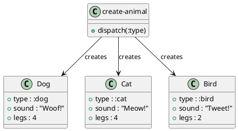

# 第 12 章 Factory -- マルチメソッドによる生成

## パターンの意図

Factory パターンは、オブジェクトの生成をサブクラスに委譲し、生成するオブジェクトの型を実行時に決定するパターンです。

## Clojure での解釈

マルチメソッドでタイプキーワードに応じたディスパッチを行います。新しい型を追加する際にも、既存のコードを変更せずに `defmethod` を追加するだけです（開放閉鎖原則）。

## 実装

```clojure
(defmulti create-animal :type)

(defmethod create-animal :dog [{:keys [name]}]
  {:type :dog :name name :sound "Woof!" :legs 4})

(defmethod create-animal :cat [{:keys [name]}]
  {:type :cat :name name :sound "Meow!" :legs 4})

(defmethod create-animal :bird [{:keys [name]}]
  {:type :bird :name name :sound "Tweet!" :legs 2})

(defmethod create-animal :default [{:keys [type name]}]
  {:type type :name (or name "Unknown") :sound "..." :legs 0})

;; Abstract Factory 風
(defn create-habitat [habitat-type]
  (case habitat-type
    :farm  [(create-animal {:type :dog :name "Rex"})
            (create-animal {:type :cat :name "Whiskers"})
            (create-animal {:type :bird :name "Tweety"})]
    :ocean [{:type :whale :name "Moby" :sound "Ooooo!" :legs 0}]
    []))
```

## クラス図



## テスト

```clojure
(deftest speak-test
  (testing "動物の鳴き声を返す"
    (let [dog (create-animal {:type :dog :name "Rex"})]
      (is (= "Rex says: Woof!" (speak dog))))))
```

## まとめ

Clojure のマルチメソッドは Factory パターンと多態性を同時に実現します。新しい型の追加が既存コードの変更なしに行える点は、開放閉鎖原則を体現しています。
