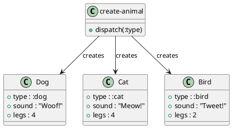

# 第 12 章 Factory -- マルチメソッドによる生成

## はじめに

Factory パターンは、生成ロジックを呼び出し側から分離するパターンです。Clojure ではタイプキーワードとマルチメソッドを使うと、生成対象の追加に強い構成にできます。

## パターンの構造



## Clojure イディオム: キーワード dispatch

```clojure
(defmulti create-animal :type)

(defmethod create-animal :dog [{:keys [name]}]
  {:type :dog :name name :sound "Woof!" :legs 4})

(defmethod create-animal :cat [{:keys [name]}]
  {:type :cat :name name :sound "Meow!" :legs 4})

(defmethod create-animal :bird [{:keys [name]}]
  {:type :bird :name name :sound "Tweet!" :legs 2})

(defmethod create-animal :default [{:keys [type name]}]
  {:type type :name (or name "Unknown") :sound "..." :legs 0})
```

## TDD で作る

### Red: 失敗するテストを書く

```clojure
(deftest speak-test
  (testing "動物の鳴き声を返す"
    (let [dog (create-animal {:type :dog :name "Rex"})]
      (is (= "Rex says: Woof!" (speak dog))))))
```

### Green: 最小限の実装

```clojure
(defmulti create-animal :type)

(defmethod create-animal :dog [{:keys [name]}]
  {:type :dog :name name :sound "Woof!" :legs 4})
```

### Refactor

`defmethod` を追加するだけで新しい生成対象を拡張できるので、Factory と開放閉鎖原則の相性が良くなります。

## まとめ

Clojure のマルチメソッドは Factory パターンと多態性を同時に実現します。新しい型の追加が既存コードの変更なしに行える点は、開放閉鎖原則を体現しています。
