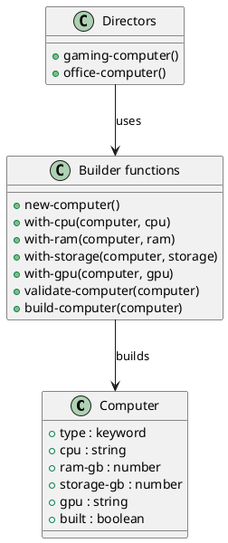

# 第 13 章 Builder -- スレッディングマクロで段階構築

## パターンの意図

Builder パターンは、複雑なオブジェクトの構築をその表現から分離し、同じ構築プロセスで異なる表現を作成できるようにするパターンです。

## Clojure での解釈

Clojure のスレッディングマクロ `->` は、Builder パターンの流れるようなインターフェース（fluent interface）を自然に表現します。不変マップを段階的に `assoc` で構築していきます。

## 実装

```clojure
(defn new-computer [] {:type :computer})

(defn with-cpu [computer cpu] (assoc computer :cpu cpu))
(defn with-ram [computer ram-gb] (assoc computer :ram-gb ram-gb))
(defn with-storage [computer storage-gb] (assoc computer :storage-gb storage-gb))
(defn with-gpu [computer gpu] (assoc computer :gpu gpu))

(defn validate-computer [computer]
  (doseq [field [:cpu :ram-gb :storage-gb]]
    (when-not (get computer field)
      (throw (ex-info (str "Missing required field: " (name field))
                      {:field field}))))
  computer)

(defn build-computer [computer]
  (-> computer validate-computer (assoc :built true)))

;; Director 風プリセット
(defn gaming-computer []
  (-> (new-computer)
      (with-cpu "Intel Core i9")
      (with-ram 32)
      (with-storage 2000)
      (with-gpu "NVIDIA RTX 4090")
      build-computer))
```

## クラス図



## テスト

```clojure
(deftest validation-fails-test
  (testing "必須フィールドが欠けている場合は例外を投げる"
    (is (thrown? clojure.lang.ExceptionInfo
                (-> (new-computer) (with-cpu "Intel") build-computer)))))
```

## まとめ

Clojure のスレッディングマクロと不変マップは、Builder パターンを非常に自然に表現します。各ステップが新しいマップを返すため、中間状態も安全に保持できます。
