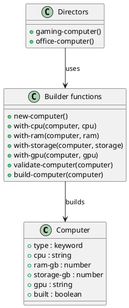

# 第 13 章 Builder -- スレッディングマクロで段階構築

## はじめに

Builder パターンは、複雑なオブジェクトを段階的に構築するパターンです。Clojure では不変マップと `->` マクロの組み合わせが、自然な fluent interface になります。

## パターンの構造



## Clojure イディオム: assoc をチェーンする

```clojure
(defn new-computer [] {:type :computer})

(defn with-cpu [computer cpu] (assoc computer :cpu cpu))
(defn with-ram [computer ram-gb] (assoc computer :ram-gb ram-gb))
(defn with-storage [computer storage-gb] (assoc computer :storage-gb storage-gb))
(defn with-gpu [computer gpu] (assoc computer :gpu gpu))

(defn validate-computer [computer]
  (doseq [field [:cpu :ram-gb :storage-gb]]
    (when-not (get computer field)
      (throw (ex-info (str "Missing required field: " (name field))
                      {:field field}))))
  computer)

(defn build-computer [computer]
  (-> computer validate-computer (assoc :built true)))
```

## TDD で作る

### Red: 失敗するテストを書く

```clojure
(deftest validation-fails-test
  (testing "必須フィールドが欠けている場合は例外を投げる"
    (is (thrown? clojure.lang.ExceptionInfo
                (-> (new-computer) (with-cpu "Intel") build-computer)))))
```

### Green: 最小限の実装

```clojure
(defn new-computer [] {:type :computer})

(defn with-cpu [computer cpu] (assoc computer :cpu cpu))

(defn build-computer [computer]
  (assoc computer :built true))
```

### Refactor

検証ロジックを `validate-computer` へ分離し、プリセット構成は `gaming-computer` のような director 関数としてまとめると見通しが良くなります。

## まとめ

Clojure のスレッディングマクロと不変マップは、Builder パターンを非常に自然に表現します。各ステップが新しいマップを返すため、中間状態も安全に保持できます。
