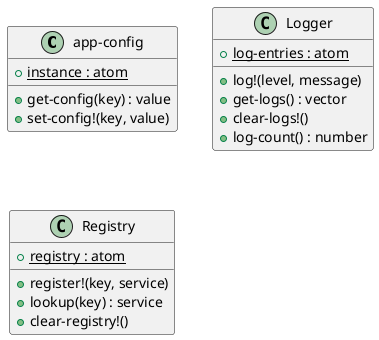

# 第 13 章 Singleton -- 名前空間レベルの唯一性

## はじめに

Singleton パターンは、共有すべきインスタンスを 1 つに限定するパターンです。Clojure では `def` や `defonce` が名前空間レベルの唯一性を自然に提供するため、特別な仕組みは不要です。

---

## パターンの構造



**登場人物**:

- **app-config**: アプリケーション設定のシングルトン
- **Logger**: ログシステムのシングルトン
- **Registry**: サービスレジストリ���シングルトン（シングルトンの一般化）

---

## Clojure イディオム: defonce + atom

### アプリケーション設定

```clojure
(defonce app-config
  (atom {:database-url "jdbc:postgresql://localhost:5432/mydb"
         :max-connections 10
         :log-level :info}))

(defn get-config
  "設定値を取得する。"
  [key]
  (get @app-config key))

(defn set-config!
  "設定値を更新する。"
  [key value]
  (swap! app-config assoc key value))
```

### ロガーシングルトン

```clojure
(defonce ^:private log-entries (atom []))

(defn log!
  "ログエントリを追加する。"
  [level message]
  (swap! log-entries conj {:level level :message message :timestamp (System/currentTimeMillis)}))

(defn get-logs
  "全ログエントリを取得する。"
  []
  @log-entries)

(defn clear-logs!
  "ログをクリアする。"
  []
  (reset! log-entries []))

(defn log-count
  "ログエントリ数を取得する。"
  []
  (count @log-entries))
```

### ���ジストリパターン（シングルトンの一般化）

```clojure
(defonce registry (atom {}))

(defn register!
  "レジストリにサービスを登録する。"
  [key service]
  (swap! registry assoc key service))

(defn lookup
  "レジストリからサービスを取得する。"
  [key]
  (get @registry key))

(defn clear-registry!
  "レジストリをクリアする。"
  []
  (reset! registry {}))
```

---

## TDD で作る

### Red: 失敗するテストを書く

```clojure
(deftest singleton-identity-test
  (testing "同じ atom への参照を共有している（シングルトン性）"
    (clear-logs!)
    (log! :info "first")
    (is (= 1 (log-count)))
    (log! :info "second")
    (is (= 2 (log-count)))
    (clear-logs!)))
```

### Green: ���小限の実装

```clojure
(defonce ^:private log-entries (atom []))

(defn log! [level message]
  (swap! log-entries conj {:level level :message message}))

(defn log-count [] (count @log-entries))
(defn clear-logs! [] (reset! log-entries []))
```

### Refactor: 設定とレジストリを追加

```clojure
(deftest config-get-test
  (testing "設定値を取得できる"
    (is (= :info (get-config :log-level)))))

(deftest config-set-test
  (testing "設定値を更新できる"
    (let [original (get-config :log-level)]
      (set-config! :log-level :debug)
      (is (= :debug (get-config :log-level)))
      (set-config! :log-level original))))

(deftest logger-test
  (testing "ログエントリを追加・取得できる"
    (clear-logs!)
    (log! :info "Test message")
    (log! :error "Error message")
    (is (= 2 (log-count)))
    (is (= :info (:level (first (get-logs)))))
    (clear-logs!)))

(deftest registry-test
  (testing "レジストリにサービスを登録・取得できる"
    (clear-registry!)
    (register! :db {:host "localhost" :port 5432})
    (is (= {:host "localhost" :port 5432} (lookup :db)))
    (clear-registry!)))
```

---

## 他言語との比較

| 言語 | 実装方法 |
|------|---------|
| Java | private コンストラクタ + static getInstance() |
| Ruby | Singleton モジュール |
| Python | モジュールレベル変数 / \_\_new\_\_ |
| Clojure | def / defonce + atom |

---

## まとめ

- Singleton は「共有インスタンスを 1 つに限定する」パターン
- Clojure では `def` / `defonce` が名前空間レベルのシングルトンを自然に提供する
- `atom` で状態を持つシングルトンも表現可能
- `^:private` メタデータで外部からの直接アクセスを制限できる
- レジストリパターンはシングルトンの一般化であり、サービスの動的な登録・取得を実現する
- `get-logs`、`clear-logs!`、`log-count` のようなヘルパー関数で操作を抽象化する
