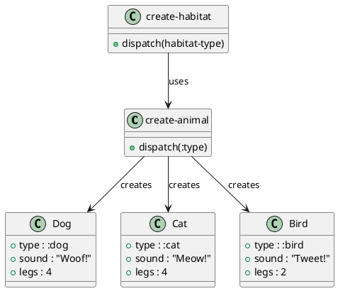

# 第 14 章 Factory -- マルチメソッドによる生成

## はじめに

Factory パターンは、生成ロジックを呼び出し側から分離するパターンです。Clojure ではタイプキーワードとマルチメソッドを使うと、生成対象の追加に強い構成にできます。

---

## パターンの構造



**登場人物**:

- **create-animal**: Factory Method。`:type` でディスパッチし、動物マップを生成する
- **speak**: 動物の振る舞いを返すマルチメソッド
- **create-habitat**: Abstract Factory 風。生息地タイプに応じた動物セットを生成する

---

## Clojure イディオム: キーワード dispatch

### マルチメソッドファクトリ

```clojure
(defmulti create-animal
  "動物を生成するファクトリ。:type でディスパッチ。"
  :type)

(defmethod create-animal :dog [{:keys [name]}]
  {:type :dog :name name :sound "Woof!" :legs 4})

(defmethod create-animal :cat [{:keys [name]}]
  {:type :cat :name name :sound "Meow!" :legs 4})

(defmethod create-animal :bird [{:keys [name]}]
  {:type :bird :name name :sound "Tweet!" :legs 2})

(defmethod create-animal :default [{:keys [type name]}]
  {:type type :name (or name "Unknown") :sound "..." :legs 0})
```

### 動物の振る舞い

```clojure
(defmulti speak
  "動物の鳴き声を返す。"
  :type)

(defmethod speak :dog [animal]
  (str (:name animal) " says: Woof!"))

(defmethod speak :cat [animal]
  (str (:name animal) " says: Meow!"))

(defmethod speak :bird [animal]
  (str (:name animal) " says: Tweet!"))

(defmethod speak :default [animal]
  (str (:name animal) " says: ..."))
```

### Abstract Factory 風

```clojure
(defn create-habitat
  "生息地タイプに応じた動物セットを生成する。"
  [habitat-type]
  (case habitat-type
    :farm  [(create-animal {:type :dog :name "Rex"})
            (create-animal {:type :cat :name "Whiskers"})
            (create-animal {:type :bird :name "Tweety"})]
    :ocean [{:type :whale :name "Moby" :sound "Ooooo!" :legs 0}
            {:type :dolphin :name "Flipper" :sound "Click!" :legs 0}]
    :forest [(create-animal {:type :bird :name "Eagle"})
             {:type :bear :name "Teddy" :sound "Growl!" :legs 4}]
    []))
```

---

## TDD で作る

### Red: 失���するテストを書く

```clojure
(deftest speak-test
  (testing "動物の鳴き声を返す"
    (let [dog (create-animal {:type :dog :name "Rex"})]
      (is (= "Rex says: Woof!" (speak dog))))))
```

### Green: 最小限の実装

```clojure
(defmulti create-animal :type)

(defmethod create-animal :dog [{:keys [name]}]
  {:type :dog :name name :sound "Woof!" :legs 4})

(defmulti speak :type)

(defmethod speak :dog [animal]
  (str (:name animal) " says: Woof!"))
```

### Refactor: 他の動物と Abstract Factory を追加

```clojure
(deftest create-dog-test
  (testing "犬を生成する"
    (let [dog (create-animal {:type :dog :name "Rex"})]
      (is (= :dog (:type dog)))
      (is (= "Rex" (:name dog)))
      (is (= "Woof!" (:sound dog)))
      (is (= 4 (:legs dog))))))

(deftest create-cat-test
  (testing "猫を生成する"
    (let [cat (create-animal {:type :cat :name "Whiskers"})]
      (is (= :cat (:type cat)))
      (is (= "Meow!" (:sound cat))))))

(deftest create-bird-test
  (testing "鳥を生成する"
    (let [bird (create-animal {:type :bird :name "Tweety"})]
      (is (= 2 (:legs bird))))))

(deftest default-animal-test
  (testing "未知のタイプにはデフォルト値を返す"
    (let [unknown (create-animal {:type :fish :name "Nemo"})]
      (is (= "..." (:sound unknown))))))

(deftest create-habitat-test
  (testing "生息地タイプに応じた動物セットを生成する"
    (let [farm (create-habitat :farm)]
      (is (= 3 (count farm)))
      (is (= :dog (:type (first farm)))))))
```

---

## 他言語と���比較

| 言語 | 実装方法 |
|------|---------|
| Java | Factory Method + Abstract Factory クラス |
| Ruby | Factory Method + Factory クラス |
| Python | Factory Method + ABC |
| Clojure | マルチメソッド + case 式 |

---

## まとめ

- Factory は「生成ロジックを呼び出し側から分離する」パターン
- Clojure ではマルチメソッドが Factory Method と多態性を同時に実現する
- `defmethod` を追加するだけで新しい生成対象を拡張でき、開放閉鎖原則��体現する
- `speak` マルチメソッドで生成されたオブジェクトの振る舞いも多態的に定義できる
- `create-habitat` で Abstract Factory 風のファクトリも実現可能
- `:default` メソッドで未知のタイプにも安全に対応できる
