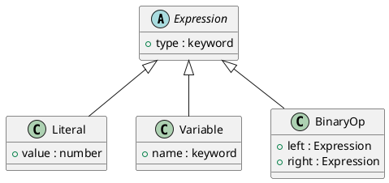

# 第 14 章 Interpreter -- データとしての AST

## はじめに

Interpreter パターンは、文法表現をデータ構造として持ち、その評価規則を別に定義するパターンです。Clojure ではマップで AST を表現し、マルチメソッドで評価する構成が自然です。

## パターンの構造



## Clojure イディオム: AST をマップで持つ

```clojure
(defn literal [value] {:type :literal :value value})
(defn variable [name] {:type :variable :name name})
(defn add [left right] {:type :add :left left :right right})

(defmulti evaluate (fn [node _env] (:type node)))

(defmethod evaluate :literal [node _env]
  (:value node))

(defmethod evaluate :variable [node env]
  (get env (:name node)))

(defmethod evaluate :add [node env]
  (+ (evaluate (:left node) env)
     (evaluate (:right node) env)))
```

## TDD で作る

### Red: 失敗するテストを書く

```clojure
(deftest nested-expression-test
  (testing "ネストされた式を評価する: (x + y) * 2"
    (let [expr (multiply (add (variable :x) (variable :y)) (literal 2))
          env  {:x 5 :y 3}]
      (is (= 16 (evaluate expr env))))))
```

### Green: 最小限の実装

```clojure
(defn literal [value] {:type :literal :value value})
(defn variable [name] {:type :variable :name name})
(defn add [left right] {:type :add :left left :right right})

(defmulti evaluate (fn [node _env] (:type node)))

(defmethod evaluate :literal [node _env]
  (:value node))

(defmethod evaluate :variable [node env]
  (get env (:name node)))
```

### Refactor

演算子ごとに `defmethod` を増やす構成にしておくと、構文の追加と評価規則の追加を同じ粒度で進められます。

## まとめ

Clojure はホモイコニックな言語であり、コードがデータです。Interpreter パターンは Clojure の本質に最も近いパターンと言えます。
