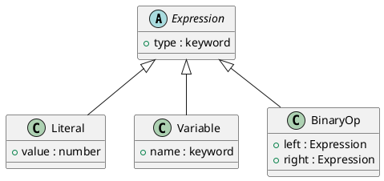

# 第 14 章 Interpreter -- データとしての AST

## パターンの意図

Interpreter パターンは、言語の文法表現を定義し、その表現を使ってインタプリタを構築するパターンです。

## Clojure での解釈

Clojure のマップで AST（抽象構文木）ノードを表現し、マルチメソッドで `:type` に応じた評価を行います。「コードはデータ」という Lisp の哲学が最も活きるパターンです。

## 実装

```clojure
;; AST ノード生成
(defn literal [value] {:type :literal :value value})
(defn variable [name] {:type :variable :name name})
(defn add [left right] {:type :add :left left :right right})

;; 評価
(defmulti evaluate (fn [node _env] (:type node)))

(defmethod evaluate :literal [node _env]
  (:value node))

(defmethod evaluate :variable [node env]
  (get env (:name node)))

(defmethod evaluate :add [node env]
  (+ (evaluate (:left node) env)
     (evaluate (:right node) env)))
```

## クラス図



## テスト

```clojure
(deftest nested-expression-test
  (testing "ネストされた式を評価する: (x + y) * 2"
    (let [expr (multiply (add (variable :x) (variable :y)) (literal 2))
          env  {:x 5 :y 3}]
      (is (= 16 (evaluate expr env))))))
```

## まとめ

Clojure はホモイコニックな言語であり、コードがデータです。Interpreter パターンは Clojure の本質に最も近いパターンと言えます。
