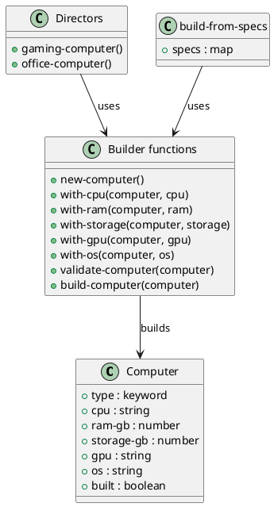

# 第 15 章 Builder -- スレッディングマクロで段階構築

## はじめに

Builder パターンは、複雑なオブジェクトを段階的に構築するパターンです。Clojure では不変マップと `->` マクロの組み合わせが、自然な fluent interface になります。

---

## パターンの構造



**登場人物**:

- **Computer**: 構築対象のマップ
- **Builder functions**: 各ステップの with-* 関数群
- **Directors**: プリセット構成（gaming-computer、office-computer）
- **build-from-specs**: 仕様マップからの動的構築

---

## Clojure イディオム: assoc をチェーンする

### Builder 関数群

```clojure
(defn new-computer
  "コンピュータの初期状態を作成する。"
  []
  {:type :computer})

(defn with-cpu [computer cpu]
  (assoc computer :cpu cpu))

(defn with-ram [computer ram-gb]
  (assoc computer :ram-gb ram-gb))

(defn with-storage [computer storage-gb]
  (assoc computer :storage-gb storage-gb))

(defn with-gpu [computer gpu]
  (assoc computer :gpu gpu))

(defn with-os [computer os]
  (assoc computer :os os))
```

### 検証とビルド

```clojure
(defn validate-computer
  "コンピュータの設定を検証する。必須項目が欠けている場合は例外を投げる。"
  [computer]
  (let [required [:cpu :ram-gb :storage-gb]]
    (doseq [field required]
      (when-not (get computer field)
        (throw (ex-info (str "Missing required field: " (name field))
                        {:field field :computer computer})))))
  computer)

(defn build-computer
  "検証済みのコンピュータを返す。"
  [computer]
  (-> computer
      validate-computer
      (assoc :built true)))
```

### Director 風ヘルパー

```clojure
(defn gaming-computer
  "ゲーミング PC のプリセット。"
  []
  (-> (new-computer)
      (with-cpu "Intel Core i9")
      (with-ram 32)
      (with-storage 2000)
      (with-gpu "NVIDIA RTX 4090")
      (with-os "Windows 11")
      build-computer))

(defn office-computer
  "オフィス PC のプリセット。"
  []
  (-> (new-computer)
      (with-cpu "Intel Core i5")
      (with-ram 16)
      (with-storage 512)
      (with-os "Windows 11")
      build-computer))
```

### reduce ベースのビルダー

```clojure
(defn build-from-specs
  "仕様マップのシーケンスから段階的にコンピュータを構築する。"
  [specs]
  (let [builders {:cpu     with-cpu
                  :ram-gb  with-ram
                  :storage-gb with-storage
                  :gpu     with-gpu
                  :os      with-os}]
    (reduce (fn [computer [k v]]
              (if-let [builder-fn (get builders k)]
                (builder-fn computer v)
                computer))
            (new-computer)
            specs)))
```

---

## TDD で作る

### Red: 失敗するテストを書く

```clojure
(deftest validation-fails-test
  (testing "必須フィールドが欠けている場合は例外を投げる"
    (is (thrown? clojure.lang.ExceptionInfo
                (-> (new-computer)
                    (with-cpu "Intel")
                    build-computer)))))
```

### Green: 最小限の実装

```clojure
(defn new-computer [] {:type :computer})
(defn with-cpu [computer cpu] (assoc computer :cpu cpu))
(defn build-computer [computer]
  (-> computer validate-computer (assoc :built true)))
```

### Refactor: Director と build-from-specs を追加

```clojure
(deftest basic-builder-test
  (testing "スレッディングマクロでコンピュータを構築する"
    (let [pc (-> (new-computer)
                 (with-cpu "Intel Core i7")
                 (with-ram 16)
                 (with-storage 512)
                 build-computer)]
      (is (= "Intel Core i7" (:cpu pc)))
      (is (= 16 (:ram-gb pc)))
      (is (= 512 (:storage-gb pc)))
      (is (:built pc)))))

(deftest gaming-computer-test
  (testing "ゲーミング PC プリセット"
    (let [pc (gaming-computer)]
      (is (= "NVIDIA RTX 4090" (:gpu pc)))
      (is (= 32 (:ram-gb pc)))
      (is (:built pc)))))

(deftest office-computer-test
  (testing "オフィス PC プリセット"
    (let [pc (office-computer)]
      (is (= "Intel Core i5" (:cpu pc)))
      (is (nil? (:gpu pc)))
      (is (:built pc)))))

(deftest build-from-specs-test
  (testing "仕様マップからコンピュータを構築する"
    (let [specs {:cpu "AMD Ryzen 9" :ram-gb 64 :storage-gb 4000 :gpu "NVIDIA RTX 4080"}
          pc    (build-computer (build-from-specs specs))]
      (is (= "AMD Ryzen 9" (:cpu pc)))
      (is (= 64 (:ram-gb pc)))
      (is (:built pc)))))
```

---

## 他言語との比較

| 言語 | 実装方法 |
|------|---------|
| Java | Builder クラス + fluent interface |
| Ruby | Builder クラス + method_missing DSL |
| Python | Builder クラス + メソッドチェーン |
| Clojure | -> マクロ + assoc 関数チェーン |

---

## まとめ

- Builder は「複雑なオブジェクトを段階的に構築する」パターン
- Clojure では `->` マクロと `assoc` のチェーンが自然な fluent interface になる
- 各 `with-*` 関数は新しいマップを返すため、中間状態も安全に保持できる
- `validate-computer` で必須フィールドの検証を行い、不完全なオブジェクトの構築を防ぐ
- `gaming-computer` / `office-computer` のような Director 関数でプリセット構成を提供する
- `build-from-specs` で仕様マップから動的にコンピュータを構築できる
