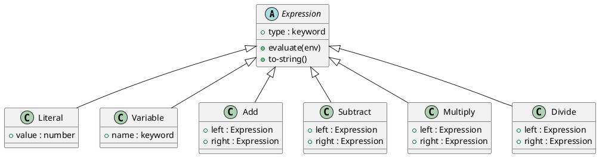

# 第 16 章 Interpreter 応用 -- DSL と評価器

## はじめに

第 14 章で基本的な Interpreter パターンを実装しました。本章ではその応用として、逆ポーランド記法（RPN）パーサーと式の文字列表現を扱います。

## 式の文字列表現

```clojure
(defmulti to-string :type)

(defmethod to-string :literal [node]
  (str (:value node)))

(defmethod to-string :variable [node]
  (str (:name node)))

(defmethod to-string :add [node]
  (str "(" (to-string (:left node)) " + " (to-string (:right node)) ")"))
```

## 逆ポーランド記法パーサー

```clojure
(defn parse-rpn [expression]
  (let [tokens (clojure.string/split expression #"\s+")
        ops    {"+" add "-" subtract "*" multiply "/" divide}]
    (reduce (fn [stack token]
              (if-let [op (get ops token)]
                (let [right  (peek stack)
                      stack' (pop stack)
                      left   (peek stack')
                      stack'' (pop stack')]
                  (conj stack'' (op left right)))
                (conj stack (if (re-matches #"-?\d+(\.\d+)?" token)
                              (literal (read-string token))
                              (variable (keyword token))))))
            []
            tokens)))
```

## Lisp の哲学との関係

Clojure は Lisp の方言であり、「コードはデータ、データはコード」（ホモイコニシティ）という哲学を持ちます。Interpreter パターンはこの哲学の直接的な表現です。

Clojure の S 式そのものが AST であり、マクロシステムはコンパイル時に AST を操作する仕組みです。つまり、Clojure プログラマは日常的に Interpreter パターンを使っていると言えます。

## クラス図



## テスト

```clojure
(deftest to-string-test
  (testing "式を文字列に変換する"
    (let [expr (add (variable :x) (multiply (literal 2) (variable :y)))]
      (is (= "(:x + (2 * :y))" (to-string expr))))))

(deftest division-by-zero-test
  (testing "ゼロ除算で例外を投げる"
    (is (thrown? clojure.lang.ExceptionInfo
                (evaluate (divide (literal 10) (literal 0)) {})))))
```

## まとめ

Interpreter パターンは Clojure の本質に最も近いパターンです。データとしての AST、マルチメソッドによる評価、そしてホモイコニシティの哲学が三位一体となり、強力な DSL 構築基盤を提供します。

本シリーズを通じて、デザインパターンが言語の力によってどのように変容するかを見てきました。パターンの背後にある問題と原則を理解することで、どの言語でも適切な設計判断ができるようになります。
