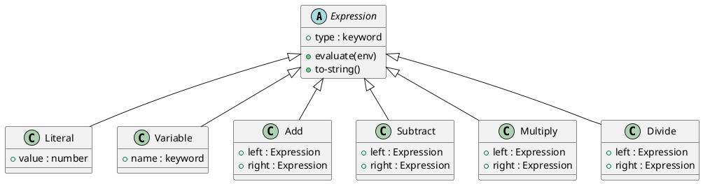

# 第 16 章 Interpreter -- データとしての AST

## はじめに

Interpreter パターンは、文法表現をデータ構造として持ち、その評価規則を別に定義するパターンです。Clojure はホモイコニックな言語（コードはデータ、データはコード）であり、Interpreter パターンは Clojure の本質に最も近いパターンと言えます。

本章では、AST をマップで表現し、マルチメソッドで評価する基本構成から、式の文字列表現、逆ポーランド記法（RPN）パーサーまでを包括的に扱います。

---

## パターンの構造



**登場人物**:

- **Expression**: AST ノードの共通インターフェース。`:type` でディスパッチする
- **Literal**: リテラル値ノード
- **Variable**: 変数ノード。環境（変数マップ）から値を取得する
- **Add / Subtract / Multiply / Divide**: 二項演算ノード

---

## Clojure イディオム: AST をマップで持つ

### AST ノード生成ヘルパー

```clojure
(defn literal [value]
  {:type :literal :value value})

(defn variable [name]
  {:type :variable :name name})

(defn add [left right]
  {:type :add :left left :right right})

(defn subtract [left right]
  {:type :subtract :left left :right right})

(defn multiply [left right]
  {:type :multiply :left left :right right})

(defn divide [left right]
  {:type :divide :left left :right right})
```

### 評価器

```clojure
(defmulti evaluate
  "AST ノードを環境 (変数マップ) の下で評価する。"
  (fn [node _env] (:type node)))

(defmethod evaluate :literal [node _env]
  (:value node))

(defmethod evaluate :variable [node env]
  (if-let [val (get env (:name node))]
    val
    (throw (ex-info (str "Undefined variable: " (:name node))
                    {:variable (:name node) :env env}))))

(defmethod evaluate :add [node env]
  (+ (evaluate (:left node) env)
     (evaluate (:right node) env)))

(defmethod evaluate :subtract [node env]
  (- (evaluate (:left node) env)
     (evaluate (:right node) env)))

(defmethod evaluate :multiply [node env]
  (* (evaluate (:left node) env)
     (evaluate (:right node) env)))

(defmethod evaluate :divide [node env]
  (let [divisor (evaluate (:right node) env)]
    (if (zero? divisor)
      (throw (ex-info "Division by zero" {:node node}))
      (/ (evaluate (:left node) env) divisor))))
```

### 式の文字列表現

```clojure
(defmulti to-string
  "AST ノードを文字列に変換する。"
  :type)

(defmethod to-string :literal [node]
  (str (:value node)))

(defmethod to-string :variable [node]
  (str (:name node)))

(defmethod to-string :add [node]
  (str "(" (to-string (:left node)) " + " (to-string (:right node)) ")"))

(defmethod to-string :subtract [node]
  (str "(" (to-string (:left node)) " - " (to-string (:right node)) ")"))

(defmethod to-string :multiply [node]
  (str "(" (to-string (:left node)) " * " (to-string (:right node)) ")"))

(defmethod to-string :divide [node]
  (str "(" (to-string (:left node)) " / " (to-string (:right node)) ")"))
```

### 逆ポーランド記法パーサー

```clojure
(defn parse-rpn
  "逆ポーランド記法の文字列を AST に変換する。"
  [expression]
  (let [tokens (clojure.string/split expression #"\s+")
        ops    {"+" add "-" subtract "*" multiply "/" divide}]
    (reduce (fn [stack token]
              (if-let [op (get ops token)]
                (let [right  (peek stack)
                      stack' (pop stack)
                      left   (peek stack')
                      stack'' (pop stack')]
                  (conj stack'' (op left right)))
                (conj stack (if (re-matches #"-?\d+(\.\d+)?" token)
                              (literal (read-string token))
                              (variable (keyword token))))))
            []
            tokens)))
```

---

## TDD で作る

### Red: 失敗するテストを書く

```clojure
(deftest nested-expression-test
  (testing "ネストされた式を評価する: (x + y) * 2"
    (let [expr (multiply (add (variable :x) (variable :y)) (literal 2))
          env  {:x 5 :y 3}]
      (is (= 16 (evaluate expr env))))))
```

### Green: 最小限の実装

```clojure
(defn literal [value] {:type :literal :value value})
(defn variable [name] {:type :variable :name name})
(defn add [left right] {:type :add :left left :right right})
(defn multiply [left right] {:type :multiply :left left :right right})

(defmulti evaluate (fn [node _env] (:type node)))

(defmethod evaluate :literal [node _env]
  (:value node))

(defmethod evaluate :variable [node env]
  (get env (:name node)))

(defmethod evaluate :add [node env]
  (+ (evaluate (:left node) env)
     (evaluate (:right node) env)))

(defmethod evaluate :multiply [node env]
  (* (evaluate (:left node) env)
     (evaluate (:right node) env)))
```

### Refactor: 全演算子、to-string、エラーハンドリングを追加

```clojure
(deftest literal-test
  (testing "リテラルを評価する"
    (is (= 42 (evaluate (literal 42) {})))))

(deftest variable-test
  (testing "変数を環境から取得する"
    (is (= 10 (evaluate (variable :x) {:x 10})))))

(deftest undefined-variable-test
  (testing "未定義の変数で例外を投げる"
    (is (thrown? clojure.lang.ExceptionInfo
                (evaluate (variable :z) {:x 10})))))

(deftest arithmetic-test
  (testing "四則演算を評価する"
    (let [env {:x 10 :y 3}]
      (is (= 13 (evaluate (add (variable :x) (variable :y)) env)))
      (is (= 7 (evaluate (subtract (variable :x) (variable :y)) env)))
      (is (= 30 (evaluate (multiply (variable :x) (variable :y)) env)))
      (is (= 10/3 (evaluate (divide (variable :x) (variable :y)) env))))))

(deftest to-string-test
  (testing "式を文字列に変換する"
    (let [expr (add (variable :x) (multiply (literal 2) (variable :y)))]
      (is (= "(:x + (2 * :y))" (to-string expr))))))

(deftest division-by-zero-test
  (testing "ゼロ除算で例外を投げる"
    (is (thrown? clojure.lang.ExceptionInfo
                (evaluate (divide (literal 10) (literal 0)) {})))))
```

---

## Lisp の哲学との関係

Clojure は Lisp の方言であり、「コードはデータ、データはコード」というホモイコニシティを持ちます。Interpreter パターンはその哲学の直接的な表現です。

- **AST はデータ**: マップで表現された AST は、そのまま関数で操作可能
- **評価は後付け**: `defmethod` で評価規則を追加することで、AST の構造を壊さずに拡張できる
- **to-string も後付け**: 表示器もパーサーも、AST を独立させているからこそ後付けできる
- **マクロとの接続**: Clojure のマクロは AST 変換であり、Interpreter パターンと同じ構造

---

## 他言語との比較

| 言語 | 実装方法 |
|------|---------|
| Java | Expression クラス階層 + Visitor |
| Ruby | AST クラス + eval メソッド |
| Python | AST クラス + evaluate メソッド |
| Clojure | マップ AST + マルチメソッド |

---

## まとめ

- Interpreter は「文法をデータ構造として持ち、評価規則を別に定義する」パターン
- Clojure ではマップで AST を表現し、マルチメソッドで評価する
- 四則演算（add、subtract、multiply、divide）を `defmethod` で定義
- `to-string` マルチメソッドで式の文字列表現を後付けできる
- `parse-rpn` で逆ポーランド記法から AST を構築できる
- ゼロ除算や未定義変数に対するエラーハンドリングも実装
- Interpreter パターンは Clojure のホモイコニシティと最も相性が良いパターン
