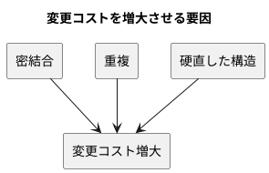
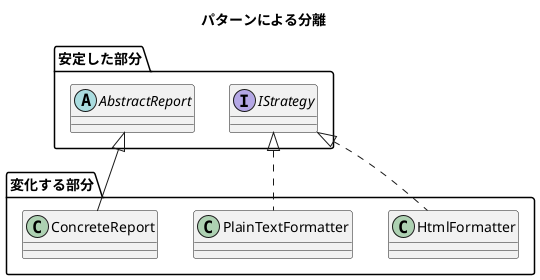

# 第 1 章: デザインパターンとパターン思考

## はじめに

ソフトウェア開発において「変更」は避けられません。要件は変わり、技術は進化し、ユーザーの期待は高まり続けます。**よいソフトウェア** --- 変更を楽に安全にできて役に立つソフトウェア --- を作るためには、変化に対応できる設計が不可欠です。

**デザインパターン**は、この「変化への対応力」を高めるための再利用可能な設計の知恵です。

---

## デザインパターンとは何か

### GoF の歴史

1994 年、Erich Gamma、Richard Helm、Ralph Johnson、John Vlissides の 4 人（通称 **Gang of Four / GoF**）が『Design Patterns: Elements of Reusable Object-Oriented Software』を出版しました。この書籍は 23 のデザインパターンをカタログ化し、オブジェクト指向設計の共通語彙を確立しました。

GoF のパターンは以下の 3 カテゴリに分類されます。

| カテゴリ | 目的 | 本シリーズで扱うパターン |
|---------|------|----------------------|
| **生成（Creational）** | オブジェクトの作り方を柔軟にする | Singleton, Factory Method, Abstract Factory, Builder |
| **構造（Structural）** | オブジェクトの組み合わせ方を整理する | Adapter, Composite, Proxy, Decorator |
| **振る舞い（Behavioral）** | オブジェクト間の責務分担を明確にする | Template Method, Strategy, Observer, Iterator, Command, Interpreter |

### Russ Olsen のアプローチ

本シリーズの源流である Russ Olsen 『Design Patterns in Ruby』は、GoF の 23 パターンから **特に有用な 13 パターン**を選び、各言語の特性を活かした実装を示しました。

C# 版では以下の視点を加えています。

- **イベントとデリゲート**による型安全な Observer パターン
- **LINQ と `IEnumerable<T>`** による宣言的な Iterator
- **`Lazy<T>`** によるスレッドセーフな Singleton / Virtual Proxy
- **record 型**による不変な値オブジェクト（Builder）
- **`Func<T,TResult>`** による軽量な Strategy

---

## パターンが解く問題

### 変更コストの問題

ソフトウェアの寿命が長くなるほど、変更にかかるコストは増大します。

1. **密結合（Tight Coupling）**: あるクラスを変更すると、他の多くのクラスも変更が必要になる
2. **重複（Duplication）**: 同じロジックが複数箇所に散在し、変更漏れが起きる
3. **硬直した構造（Rigidity）**: 新しい振る舞いの追加が既存コードの大幅な修正を要する

### パターンが提供する解決策

デザインパターンは「変化する部分」と「変化しない部分」を分離する設計手法を提供します。

---

## C# とデザインパターン

C# は静的型付け言語でありながら、ジェネリクス、デリゲート、LINQ、パターンマッチングなど豊富な言語機能を持ちます。これにより、GoF のパターンをより簡潔かつ型安全に実装できます。

### Ruby / Python との違い

| 観点 | Ruby / Python | C# |
|------|--------------|-----|
| 型の安全性 | Duck Typing | インターフェース + ジェネリクス |
| Observer | コールバック / ブロック | `event` + デリゲート |
| Iterator | Enumerable / Generator | `IEnumerable<T>` + LINQ |
| Singleton | モジュール変数 | `Lazy<T>` (スレッドセーフ) |
| 値オブジェクト | frozen hash / dataclass | `record` 型 |

---

## まとめ

- デザインパターンは「変化に対応する設計の知恵」である
- GoF の 23 パターンのうち、特に有用な 13 パターンを C# で実装する
- C# の言語機能（イベント、LINQ、`Lazy<T>`、record）を活かしてモダンに実装する
- パターンの目的は「変化する部分」と「安定した部分」を分離すること
