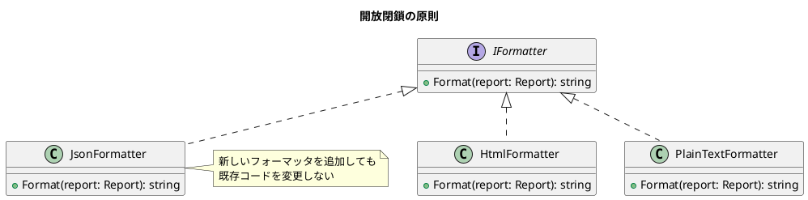
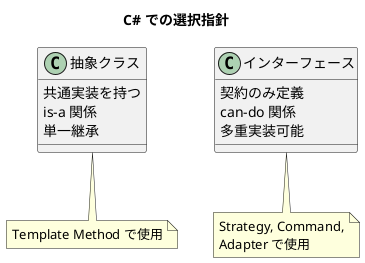

# 第 2 章: 設計原則とパターンの関係

## はじめに

デザインパターンを効果的に使うためには、その背後にある**設計原則**を理解することが重要です。本章では SOLID 原則を中心に、C# での適用方法を見ていきます。

---

## SOLID 原則

### 単一責任の原則（SRP）

クラスには変更する理由が 1 つだけであるべきです。

```csharp
// Bad: レポートの生成とフォーマットが混在
public class Report
{
    public string Generate() { /* データ取得 + HTML生成 */ }
}

// Good: 責務を分離
public class ReportData { /* データ取得 */ }
public class HtmlFormatter { /* HTML生成 */ }
```

### 開放閉鎖の原則（OCP）

拡張に対して開き、修正に対して閉じていること。



### リスコフの置換原則（LSP）

派生クラスは基底クラスと置換可能であるべきです。

### インターフェース分離の原則（ISP）

クライアントが使わないメソッドへの依存を強制しないこと。C# ではインターフェースを小さく保ちます。

### 依存性逆転の原則（DIP）

上位モジュールは下位モジュールに依存すべきでなく、両者とも抽象に依存すべきです。

```csharp
// DIP: 抽象（インターフェース）に依存
public class Report
{
    private readonly Func<Report, string> _formatter;

    public Report(Func<Report, string> formatter)
    {
        _formatter = formatter;
    }
}
```

---

## パターンと原則の対応

| パターン | 主に活用する原則 |
|---------|----------------|
| Template Method | OCP（フックメソッドで拡張） |
| Strategy | OCP + DIP（アルゴリズムの差し替え） |
| Observer | OCP（新しいオブザーバーの追加） |
| Composite | LSP（リーフとコンポジットの統一的扱い） |
| Decorator | OCP + SRP（機能の動的追加） |
| Factory | DIP（生成の抽象化） |

---

## C# 固有の設計指針

### インターフェース vs 抽象クラス



### デリゲートとインターフェース

C# では `Func<T,TResult>` や `Action<T>` を使うことで、単一メソッドのインターフェースをデリゲートで置き換えられます。

```csharp
// インターフェース版
public interface IFormatter
{
    string Format(Report report);
}

// デリゲート版（より軽量）
Func<Report, string> formatter = r => $"<html>{r.Title}</html>";
```

---

## まとめ

- SOLID 原則はデザインパターンの理論的基盤である
- C# ではインターフェース、抽象クラス、デリゲートを使い分けてパターンを実装する
- 各パターンがどの原則を活用しているかを理解することで、適切なパターン選択ができる
