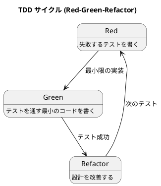

# 第 3 章: TDD とツールチェイン

## はじめに

本シリーズでは、すべてのパターンを **テスト駆動開発（TDD）** で実装します。本章では C# における TDD 環境と xUnit の使い方を紹介します。

---

## プロジェクト構成

```
apps/csharp/design-pattern/
├── DesignPattern.sln
├── src/
│   └── DesignPattern/
│       ├── DesignPattern.csproj
│       └── Patterns/
└── tests/
    └── DesignPattern.Tests/
        ├── DesignPattern.Tests.csproj
        └── Patterns/
```

### プロジェクトの初期化

```bash
dotnet new classlib -n DesignPattern -o src/DesignPattern --framework net9.0
dotnet new xunit -n DesignPattern.Tests -o tests/DesignPattern.Tests --framework net9.0
dotnet new sln -n DesignPattern
dotnet sln add src/DesignPattern/DesignPattern.csproj
dotnet sln add tests/DesignPattern.Tests/DesignPattern.Tests.csproj
cd tests/DesignPattern.Tests && dotnet add reference ../../src/DesignPattern/DesignPattern.csproj
```

---

## xUnit の基本

### テストの書き方

```csharp
using Xunit;

public class CalculatorTest
{
    [Fact]
    public void Add_TwoNumbers_ReturnsSum()
    {
        // Arrange
        var calculator = new Calculator();

        // Act
        var result = calculator.Add(2, 3);

        // Assert
        Assert.Equal(5, result);
    }
}
```

### 主要なアサーション

| メソッド | 用途 |
|---------|------|
| `Assert.Equal(expected, actual)` | 値の等価性 |
| `Assert.True(condition)` | 条件が真 |
| `Assert.Contains(expected, collection)` | コレクションに含まれる |
| `Assert.StartsWith(prefix, text)` | 文字列の先頭一致 |
| `Assert.IsType<T>(obj)` | 型の検証 |
| `Assert.Same(obj1, obj2)` | 参照の同一性 |
| `Assert.Throws<T>(action)` | 例外の検証 |

---

## TDD サイクル



### 1. Red: 失敗するテストを書く

```csharp
[Fact]
public void HtmlReport_ContainsHtmlTags()
{
    var report = new HtmlReport("Test", new[] { "Hello" });
    var output = report.OutputReport();

    Assert.StartsWith("<html>", output);
}
```

### 2. Green: テストを通す最小のコードを書く

```csharp
public class HtmlReport : Report
{
    protected override string OutputStart() => "<html>\n";
    // ... 最小限の実装
}
```

### 3. Refactor: 設計を改善する

テストが通った状態で、重複の除去や命名の改善を行います。

---

## テストの実行

```bash
# 全テスト実行
dotnet test

# 特定のテストクラスのみ
dotnet test --filter "TemplateMethodTest"

# 詳細出力
dotnet test --verbosity normal
```

---

## まとめ

- xUnit を使い、`[Fact]` 属性でテストを記述する
- Red-Green-Refactor の TDD サイクルに従ってパターンを実装する
- `dotnet test` でテストを実行し、継続的にフィードバックを得る
