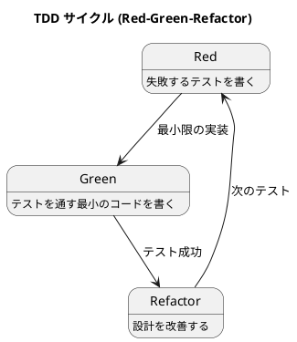

# 第 3 章: TDD とツールチェイン

## はじめに

本シリーズでは、すべてのパターンを **テスト駆動開発（TDD）** で実装します。本章では C# における TDD 環境と xUnit の使い方を紹介します。

---

## プロジェクト構成

```
apps/csharp/design-pattern/
├── DesignPattern.sln
├── src/
│   └── DesignPattern/
│       ├── DesignPattern.csproj
│       └── Patterns/
└── tests/
    └── DesignPattern.Tests/
        ├── DesignPattern.Tests.csproj
        └── Patterns/
```

### プロジェクトの初期化

```bash
dotnet new classlib -n DesignPattern -o src/DesignPattern --framework net9.0
dotnet new xunit -n DesignPattern.Tests -o tests/DesignPattern.Tests --framework net9.0
dotnet new sln -n DesignPattern
dotnet sln add src/DesignPattern/DesignPattern.csproj
dotnet sln add tests/DesignPattern.Tests/DesignPattern.Tests.csproj
cd tests/DesignPattern.Tests && dotnet add reference ../../src/DesignPattern/DesignPattern.csproj
```

---

## xUnit の基本

### テストの書き方

```csharp
using Xunit;

public class CalculatorTest
{
    [Fact]
    public void Add_TwoNumbers_ReturnsSum()
    {
        // Arrange
        var calculator = new Calculator();

        // Act
        var result = calculator.Add(2, 3);

        // Assert
        Assert.Equal(5, result);
    }
}
```

### 主要なアサーション

| メソッド | 用途 |
|---------|------|
| `Assert.Equal(expected, actual)` | 値の等価性 |
| `Assert.True(condition)` | 条件が真 |
| `Assert.Contains(expected, collection)` | コレクションに含まれる |
| `Assert.StartsWith(prefix, text)` | 文字列の先頭一致 |
| `Assert.IsType<T>(obj)` | 型の検証 |
| `Assert.Same(obj1, obj2)` | 参照の同一性 |
| `Assert.Throws<T>(action)` | 例外の検証 |

---

## TDD サイクル



### 1. Red: 失敗するテストを書く

```csharp
[Fact]
public void HtmlReport_ContainsHtmlTags()
{
    var report = new HtmlReport("Test", new[] { "Hello" });
    var output = report.OutputReport();

    Assert.StartsWith("<html>", output);
}
```

### 2. Green: テストを通す最小のコードを書く

```csharp
public class HtmlReport : Report
{
    protected override string OutputStart() => "<html>\n";
    // ... 最小限の実装
}
```

### 3. Refactor: 設計を改善する

テストが通った状態で、重複の除去や命名の改善を行います。

---

## テストの実行

```bash
# 全テスト実行
dotnet test

# 特定のテストクラスのみ
dotnet test --filter "TemplateMethodTest"

# 詳細出力
dotnet test --verbosity normal
```

---

## 静的コード解析: dotnet format

.NET SDK には `dotnet format` というコード整形・解析ツールが標準搭載されています。外部パッケージのインストールは不要です。

### dotnet format とは

`dotnet format` は `.editorconfig` のルールに基づいてコードスタイルをチェック・修正します。

```bash
# フォーマット違反がないか検証（CI 向け）
dotnet format --verify-no-changes

# 自動修正
dotnet format

# 特定の診断のみチェック
dotnet format --diagnostics IDE0005
```

### .editorconfig の設定

プロジェクトルートに `.editorconfig` を配置します。

```ini
root = true

[*.cs]
# インデント
indent_style = space
indent_size = 4

# 改行
end_of_line = lf
insert_final_newline = true
charset = utf-8

# C# コーディング規約
dotnet_sort_system_directives_first = true
csharp_new_line_before_open_brace = all
csharp_new_line_before_else = true
csharp_new_line_before_catch = true
csharp_new_line_before_finally = true

# var の使用
csharp_style_var_for_built_in_types = false:suggestion
csharp_style_var_when_type_is_apparent = true:suggestion

# 不要な using の警告
dotnet_diagnostic.IDE0005.severity = warning
```

### 主な診断ルール

| 診断 ID | 説明 |
|---------|------|
| IDE0001 | 名前の簡略化 |
| IDE0003 | `this.` の不要な修飾 |
| IDE0005 | 不要な `using` ディレクティブ |
| IDE0055 | フォーマットの修正 |
| IDE0161 | ファイルスコープの名前空間 |

---

## コード複雑度のチェック

.NET のコード解析には Roslyn アナライザーが利用できます。`dotnet format` と組み合わせることで、複雑度のチェックも可能です。

主要な複雑度関連の診断:

| 診断 | 説明 |
|------|------|
| CA1502 | 循環的複雑度が高すぎるメソッド |
| CA1505 | 保守性の低いコード |
| CA1506 | クラスの結合度が高すぎる |

`.editorconfig` に以下を追加することで有効化できます:

```ini
dotnet_diagnostic.CA1502.severity = warning
```

---

## 品質チェックの一括実行

`dotnet format` と `dotnet test` を組み合わせて品質チェックを一括実行します。

```bash
# format チェック + テスト
dotnet format --verify-no-changes && dotnet test
```

Makefile を使う場合:

```makefile
.PHONY: format test check

format:
	dotnet format --verify-no-changes

test:
	dotnet test

check: format test
```

---

## 各言語の品質ツール比較

| 用途 | C# | Ruby | Java | TypeScript | Python |
|------|-----|------|------|-----------|--------|
| 静的解析 | dotnet format + Roslyn | RuboCop | Checkstyle + PMD | ESLint | Ruff |
| フォーマッター | dotnet format | RuboCop | Checkstyle | Prettier | Ruff |
| カバレッジ | dotnet test + coverlet | SimpleCov | JaCoCo | @vitest/coverage-v8 | pytest-cov |
| 複雑度チェック | Roslyn CA1502 | RuboCop Metrics | PMD | ESLint complexity | Ruff McCabe |
| 一括実行 | `dotnet format && dotnet test` | `rake check` | `./gradlew check` | `npm run lint && npm test` | `ruff check && pytest` |

**C# の特徴**: `dotnet format` と Roslyn アナライザーが .NET SDK に統合されており、`.editorconfig` で一元的にルールを管理できます。

---

## まとめ

- xUnit を使い、`[Fact]` 属性でテストを記述する
- Red-Green-Refactor の TDD サイクルに従ってパターンを実装する
- `dotnet test` でテストを実行し、継続的にフィードバックを得る
- `dotnet format` で `.editorconfig` に基づくコードスタイルをチェック・自動修正する
