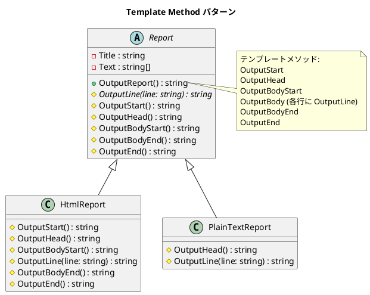

# 第 4 章: Template Method

## はじめに

レポートを HTML とプレーンテキストの 2 つの形式で出力したいとします。出力の「骨格」は同じ（タイトル → 本文 → フッター）ですが、各ステップの具体的な処理は形式ごとに異なります。

**Template Method パターン**は、アルゴリズムの骨格を基底クラスで定義し、具体的なステップをサブクラスに委ねるパターンです。

---

## パターンの構造



**登場人物**:

- **AbstractClass（Report）**: テンプレートメソッド `OutputReport` でアルゴリズムの骨格を定義する
- **ConcreteClass（HtmlReport / PlainTextReport）**: 各ステップ（フックメソッド）をオーバーライドする

---

## TDD で作る

### Red: テストを書く

```csharp
[Fact]
public void HtmlReport_ContainsHtmlTags()
{
    var report = new HtmlReport("Test", new[] { "Hello", "World" });
    var output = report.OutputReport();

    Assert.StartsWith("<html>", output);
    Assert.Contains("</html>", output);
}

[Fact]
public void PlainTextReport_ContainsFormattedTitle()
{
    var report = new PlainTextReport("Test", new[] { "Hello", "World" });
    var output = report.OutputReport();

    Assert.Contains("***** Test *****", output);
}
```

### Green: 最小限の実装

```csharp
public abstract class Report
{
    public string Title { get; }
    public string[] Text { get; }

    protected Report(string title, string[] text)
    {
        Title = title;
        Text = text;
    }

    public string OutputReport()
    {
        var result = OutputStart();
        result += OutputHead();
        result += OutputBodyStart();
        result += OutputBody();
        result += OutputBodyEnd();
        result += OutputEnd();
        return result;
    }

    protected abstract string OutputLine(string line);
    protected virtual string OutputStart() => "";
    protected virtual string OutputHead() => $"  {Title}\n";
    // ... 他のフックメソッド
}
```

### Refactor

- テンプレートメソッド `OutputReport` は変更せず、各フックメソッドのデフォルト実装を空文字列で統一
- `protected virtual` でフックメソッドのオーバーライドを任意にする

---

## 他言語との比較

| 観点 | Ruby | C# |
|------|------|-----|
| 抽象メソッド | `raise NotImplementedError` | `abstract` キーワード |
| フックメソッド | 空メソッド定義 | `virtual` + デフォルト実装 |
| アクセス制御 | `protected` (慣習) | `protected` (コンパイラ強制) |
| コンストラクタ | `initialize` | `protected` コンストラクタ |

---

## まとめ

- Template Method は**アルゴリズムの骨格**を基底クラスで定義し、**具体的なステップ**をサブクラスに委ねる
- C# では `abstract` と `virtual` を使い分けて、必須のステップと任意のフックを区別する
- コンパイラが抽象メソッドの実装漏れを検出してくれる点が動的言語との大きな違い
