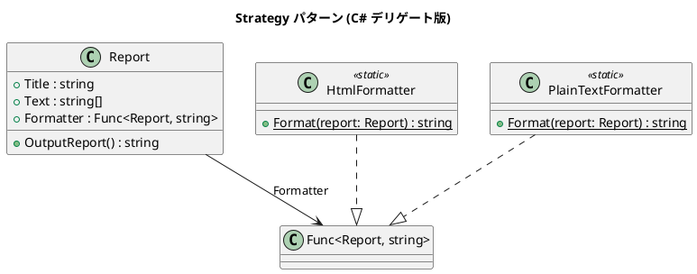

# 第 5 章: Strategy

## はじめに

Template Method ではサブクラスでアルゴリズムを差し替えましたが、**実行時に**フォーマット方法を切り替えたい場合はどうすればよいでしょうか。

**Strategy パターン**は、アルゴリズムをオブジェクト（またはデリゲート）として切り出し、実行時に差し替え可能にするパターンです。

---

## パターンの構造



**登場人物**:

- **Context（Report）**: Strategy への参照を保持する
- **Strategy（`Func<Report, string>`）**: C# のデリゲートでアルゴリズムを表現
- **ConcreteStrategy（HtmlFormatter / PlainTextFormatter）**: 具体的なアルゴリズム

---

## TDD で作る

### Red: テストを書く

```csharp
[Fact]
public void CanSwitchFormatterAtRuntime()
{
    var report = new Report("Test", text, HtmlFormatter.Format);
    Assert.Contains("<html>", report.OutputReport());

    report.Formatter = PlainTextFormatter.Format;
    Assert.Contains("*****", report.OutputReport());
}

[Fact]
public void CanUseLambdaAsFormatter()
{
    var report = new Report("Test", text, r =>
        $"Custom: {r.Title} ({r.Text.Length} lines)");

    Assert.Equal("Custom: Test (2 lines)", report.OutputReport());
}
```

### Green: 最小限の実装

```csharp
public class Report
{
    public string Title { get; }
    public string[] Text { get; }
    public Func<Report, string> Formatter { get; set; }

    public Report(string title, string[] text, Func<Report, string> formatter)
    {
        Title = title;
        Text = text;
        Formatter = formatter;
    }

    public string OutputReport() => Formatter(this);
}
```

### Refactor

- `Func<Report, string>` を使うことで、インターフェース定義なしに Strategy を実現
- ラムダ式でインラインの Strategy を記述できる

---

## C# ならではのポイント

### デリゲート vs インターフェース

```csharp
// インターフェース版（Java 的）
public interface IFormatter
{
    string Format(Report report);
}

// デリゲート版（C# 的 - より軽量）
Func<Report, string> formatter = HtmlFormatter.Format;
```

C# では単一メソッドの Strategy はデリゲートで十分です。複数メソッドが必要な場合はインターフェースを使います。

---

## 他言語との比較

| 観点 | Ruby | Python | C# |
|------|------|--------|-----|
| Strategy の表現 | Proc / ブロック | 関数オブジェクト | `Func<T,TResult>` |
| 型安全性 | なし | 型ヒント（任意） | コンパイル時検証 |
| 切り替え | 代入 | 代入 | プロパティ代入 |
| インライン定義 | ラムダ / ブロック | ラムダ | ラムダ式 |

---

## まとめ

- Strategy パターンは**アルゴリズムを実行時に差し替え**可能にする
- C# では `Func<T,TResult>` デリゲートで軽量に実装できる
- ラムダ式により、インラインで Strategy を定義できる
- Template Method との使い分け: 継承 vs 委譲（コンポジション）
