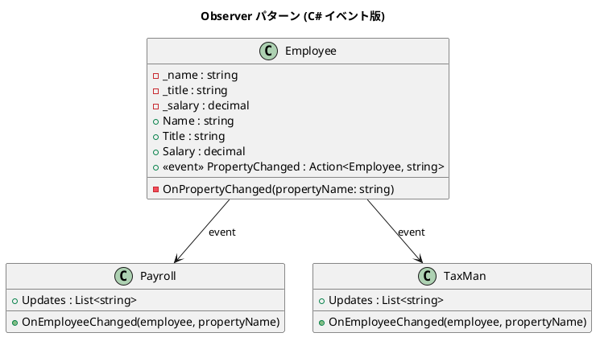

# 第 6 章: Observer

## はじめに

従業員の給与が変更されたとき、給与計算システムと税務システムの両方に通知したいとします。しかし Employee クラスが Payroll や TaxMan を直接知っていると密結合になります。

**Observer パターン**は、オブジェクトの状態変化を他のオブジェクトに通知するパターンです。C# ではイベントとデリゲートが言語レベルでこのパターンをサポートします。

---

## パターンの構造



**登場人物**:

- **Subject（Employee）**: `event` で通知を発行する
- **Observer（Payroll / TaxMan）**: イベントハンドラで通知を受け取る

---

## TDD で作る

### Red: テストを書く

```csharp
[Fact]
public void PayrollIsNotifiedOnSalaryChange()
{
    var employee = new Employee("Alice", "Engineer", 50000m);
    var payroll = new Payroll();
    employee.PropertyChanged += payroll.OnEmployeeChanged;

    employee.Salary = 60000m;

    Assert.Single(payroll.Updates);
    Assert.Contains("Alice", payroll.Updates[0]);
}

[Fact]
public void UnsubscribedObserverIsNotNotified()
{
    var employee = new Employee("Dave", "Intern", 30000m);
    var payroll = new Payroll();
    employee.PropertyChanged += payroll.OnEmployeeChanged;
    employee.PropertyChanged -= payroll.OnEmployeeChanged;

    employee.Salary = 35000m;

    Assert.Empty(payroll.Updates);
}
```

### Green: 最小限の実装

```csharp
public class Employee
{
    public decimal Salary
    {
        get => _salary;
        set
        {
            _salary = value;
            PropertyChanged?.Invoke(this, nameof(Salary));
        }
    }

    public event Action<Employee, string>? PropertyChanged;
}
```

### Refactor

- C# の `event` キーワードにより、`+=` / `-=` でのサブスクリプション管理が言語レベルでサポートされる
- `?.Invoke()` で null 安全な通知を実現

### Employee の全プロパティと OnPropertyChanged ヘルパー

`Employee` は `Name`、`Title`、`Salary` の 3 つのプロパティを持ちます。`Name` と `Title` は読み取り専用で、`Salary` のみ setter でイベントを発行します。

```csharp
public string Name => _name;
public string Title => _title;

public decimal Salary
{
    get => _salary;
    set
    {
        _salary = value;
        OnPropertyChanged(nameof(Salary));
    }
}

private void OnPropertyChanged(string propertyName)
{
    PropertyChanged?.Invoke(this, propertyName);
}
```

`OnPropertyChanged()` はプライベートヘルパーメソッドで、イベント発行のロジックを一箇所に集約しています。将来的に `Name` や `Title` も変更可能にする場合、それぞれの setter から `OnPropertyChanged()` を呼び出すだけで通知を追加できます。`nameof()` 演算子を使うことで、プロパティ名のタイプミスをコンパイル時に検出できます。

---

## C# ならではのポイント

### event キーワード

```csharp
// event なし（デリゲートフィールド）- 外部から直接 Invoke 可能（危険）
public Action<Employee, string>? PropertyChanged;

// event あり - 外部からは += / -= のみ許可（安全）
public event Action<Employee, string>? PropertyChanged;
```

`event` キーワードはデリゲートフィールドを**カプセル化**し、外部からの直接呼び出しを防ぎます。

---

## 他言語との比較

| 観点 | Ruby | Python | C# |
|------|------|--------|-----|
| 通知メカニズム | コールバック配列 | シグナル / コールバック | `event` + デリゲート |
| 購読解除 | `delete_observer` | 手動管理 | `-=` 演算子 |
| 型安全性 | なし | 型ヒント | コンパイル時検証 |
| null 安全 | `nil` チェック | `None` チェック | `?.Invoke()` |

---

## まとめ

- Observer パターンは**状態変化の通知**を疎結合に実現する
- C# では `event` とデリゲートにより、言語レベルで Observer をサポート
- `+=` / `-=` で直感的にサブスクリプションを管理できる
- `?.Invoke()` による null 安全な通知が C# の利点
