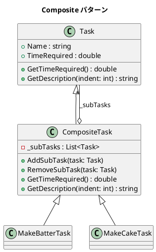

# 第 7 章: Composite

## はじめに

ケーキ作りのタスクを考えます。「ケーキを作る」は「生地を作る」「焼く」「デコレーションする」などのサブタスクからなり、「生地を作る」もさらに「材料を混ぜる」などに分解されます。

**Composite パターン**は、個々のオブジェクトとオブジェクトの集合を同一視して、ツリー構造を再帰的に扱えるようにするパターンです。

---

## パターンの構造



**登場人物**:

- **Component（Task）**: リーフとコンポジットの共通インターフェース
- **Leaf（Task インスタンス）**: 末端のタスク
- **Composite（CompositeTask）**: 子タスクを持つコンテナ

---

## TDD で作る

### Red: テストを書く

```csharp
[Fact]
public void MakeCakeTask_IncludesNestedTasks()
{
    var cake = new MakeCakeTask();
    Assert.Equal(8.0, cake.GetTimeRequired());
}

[Fact]
public void GetDescription_ShowsHierarchy()
{
    var cake = new MakeCakeTask();
    var desc = cake.GetDescription();

    Assert.Contains("Make cake", desc);
    Assert.Contains("Make batter", desc);
    Assert.Contains("Add dry ingredients", desc);
}
```

### Green: 最小限の実装

```csharp
public class CompositeTask : Task
{
    private readonly List<Task> _subTasks = new();

    public void AddSubTask(Task task) => _subTasks.Add(task);

    public override double GetTimeRequired() =>
        _subTasks.Sum(t => t.GetTimeRequired());

    public override string GetDescription(int indent = 0)
    {
        var prefix = new string(' ', indent * 2);
        var lines = _subTasks.Select(t => t.GetDescription(indent + 1));
        return prefix + Name + Environment.NewLine + string.Join(Environment.NewLine, lines);
    }
}
```

時間計算だけでなく階層表示まで入れておくと、Composite の再帰構造をコードで確認できます。

### Refactor

- LINQ の `Sum()` で子タスクの合計時間を簡潔に計算
- `GetDescription` で再帰的にインデントを増やしてツリー表示

---

## 他言語との比較

| 観点 | Ruby | C# |
|------|------|-----|
| 合計計算 | `inject(:+)` | LINQ `.Sum()` |
| コレクション | Array | `List<Task>` (型安全) |
| ツリー表示 | 文字列結合 | 文字列結合 (同様) |

---

## まとめ

- Composite パターンは**ツリー構造**を再帰的に扱えるようにする
- リーフとコンポジットを同一のインターフェースで扱うことで、クライアントコードがシンプルになる
- C# では LINQ を活用して集約処理を簡潔に記述できる
